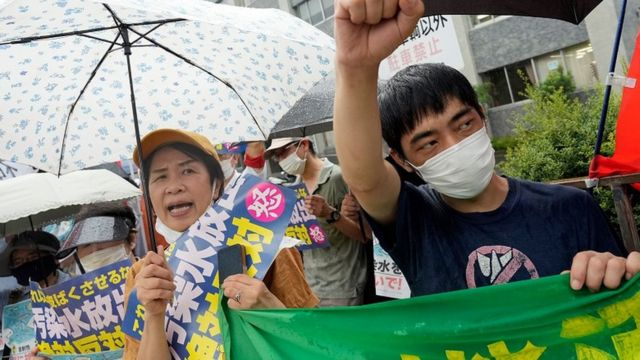
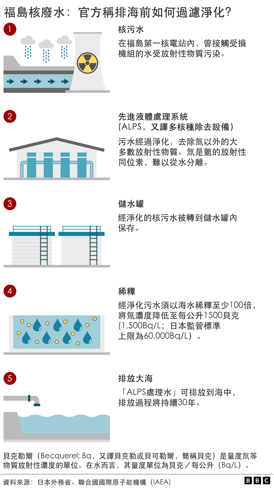

# [World] 福岛核废水：日本宣布周四起排放 北京斥“极端自私” 香港禁十都县水产进口

#  福岛核废水：日本宣布周四起排放 北京斥“极端自私” 香港禁十都县水产进口

> 图像来源，  EPA
>
> 图像加注文字，示威者周二在东京的日本首相府外抗议，要求政府放弃排放核废水。

**在邻国的反对声中，日本仍决定从周四（8月24日）起将处理后的福岛核电站放射性污水排入太平洋，预计将在30年内持续排放。**

自2011年海啸破坏福岛第一核电站以来，该地已经积累了134万吨水，足以装满500座奥林匹克标准游泳池。

国际原子能机构（IAEA）今年7月对该排放计划打开绿灯，指其符合国际安全标准。

日本首相岸田文雄在周二（22日）在内阁会议后表示，如果天气和海况适宜，当局将要求核电站运营商“迅速准备”在8月24日开始进行排水。

他表示：“今后就算需要数十年的较长时间，作为政府都将负起责任应对，直到处理水处置完毕。”

岸田文雄上周日（20日）访问了东京电力公司的福岛第一核电站视察，引发了有关排放即将开始的猜测。

在日本宣布该决定后，中国外交部发言人汪文斌指责日本政府此举是“向全世界转嫁核污染风险，将一己私利凌驾于全人类长远福祉之上”，“极端自私，极不负责任”，表示北京已提出严正交涉。

今年7月，中国海关总署已禁止输入包括福岛在内的日本10都县的水产，未在禁止名单的其余地区水产也须经过检测核格才能进口。

香港特区政府周二宣布，从周四开始禁止日本东京都、福岛县等十个都县的所有水产品，包括活生、冷冻与干燥制品，进口香港。

这十个都县包括：东京、福岛、千叶、栃木、茨城、群马、宫城、新潟、长野和埼玉。

韩国政府表示，首尔认为日本的排放计划“在科学或技术方面没有问题”，但这不代表同意或支持排放计划。

韩国反对党则抨击日本的排放计划“自私且不负责任”。

台湾外交部曾经于7月表示，考察团已三度赴日了解排放废水进程，将持续敦促日方，在符合国际标准及规范下，执行排放作业。

2011年，9.0级地震引发的海啸淹没了福岛第一核电站的三座反应堆，导致堆芯熔毁。该事件被认为是自切尔诺贝利事件以来世界上最严重的核灾难。

日本政府表示，对于福岛核电站漫长的退役流程来说，排放核废水是必要步骤。该核电站位于日本东海岸，在东京东北约220公里（137英里）处。

当地渔民表示，担心排放这些废水会影响他们的生计。

准备排放的废水包括核电厂机组爆炸后，渗入机芯的地下水，也有本来抽取来冷却机组的海水。

核电站运营商东电公司一直在对水进行过滤，以去除60多种放射性物质，但水不会完全无辐射，因为其仍然含有氢和碳的放射性同位素氚和碳-14，它们无法轻易从水中去除。

香港核学会主席陆炳林博士曾对BBC中文分析说：“现在福岛所排放的废水，除了一些核电站废水常见的放射性元素，例如氚、碳-14之外，还多了许多所谓的'超铀'放射性物质，比如钚、锶、铯。那么在一般的核电厂里是不会排出这么高毒素的放射物。”

国际环保组织绿色和平（Greenpeace）于2021年5月发表的专题文章指出，一般核电厂运行的废水不会直接接触机芯燃料棒，这就是福岛核废水与一般核电厂废水的根本分别。

文章还引用美国马萨诸塞州伍兹霍尔海洋研究所（Woods Hole Oceanographic Institution）资深科学家肯·布塞勒博士（Dr Ken O Buesseler）发表于2020年8月的论文称，据估算，现存福岛核废水内放射性氚的辐射总量高达1000太贝克。

不过，日本政府与运营福岛第一核电站的东京电力公司（TEPCO）强调，这些核废水将经过“先进液体处理系统”（ALPS，又译多核种除去设备）处理，再通过海底隧道从一公里外的近海排放出去。ALPS据称能过滤多种放射性物质，但氚除外。

专家认为，除非大量饮用，否则排放不会造成危险，因为它们释放的辐射量非常低。

东京此前表示，将释放到太平洋的废水已经与海水混合，其中的氚和碳14的含量符合安全标准。

在日本政府宣布排放决定后，东京有抗议者在首相官邸外举行集会，敦促政府停止排放。

