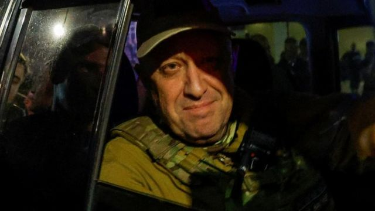
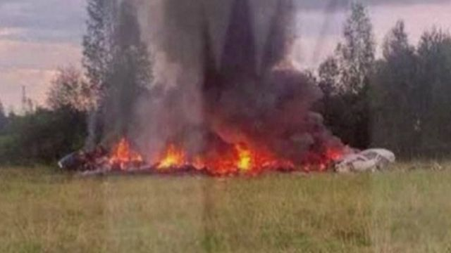
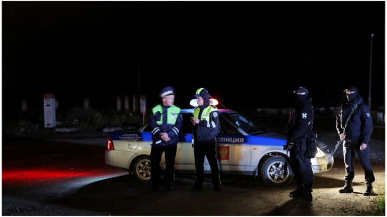
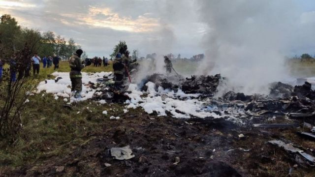

# [World] 瓦格纳首领普里戈津据报坠机死亡 有分析将矛头指向普京

#  瓦格纳首领普里戈津据报坠机死亡 有分析将矛头指向普京

> 图像来源，  Reuters
>
> 图像加注文字，瓦格纳集团（Wagner）首领普里戈津（Yevgeny Prigozhin）

**一架据报载有瓦格纳集团（Wagner）首领普里戈津（Yevgeny Prigozhin）在内的私人飞机，8月23日傍晚在俄罗斯首都莫斯科以北的特维尔地区（Tver Region）坠毁，机上10人全部罹难。**

克里姆林宫尚未证实普里戈津已死亡，但与瓦格纳有关的Telegram频道“灰色地带”（Grey Zone）已宣布普里戈津的死讯。

普里戈津曾是俄罗斯总统普京多年的亲信，其雇佣兵组织在2022年2月俄军全面入侵乌克兰后发挥关键作用。但普里戈津今年6月23日发动兵变进逼莫斯科，事败后与普京关系破裂。

在俄罗斯国内，大多数人对坠机事件并不惊讶，甚至有人很诧异没有更早发生。有民众到瓦格纳总部大楼摆放鲜花悼念。

俄罗斯问题专家Tatiana Stanovaya分析指，飞机坠毁的原因并不重要，更重要是它向其他潜在叛变者发出的信息：“每个人都会将此视为报复和报应行为......从普京以及许多军事官员的角度来看，普里戈津的死应该是一个教训。”

> 图像来源，  Reuters

##  坠机细节

涉事的私人飞机属於普里戈津名下，据报坠落时正从莫斯科飞往圣彼得堡，机上有3名机组人员和7名乘客，包括普里戈津及其副手乌特金（Dmitry Utkin）。

俄罗斯紧急救援部门表示，已找到机上10人的遗体。警方封锁坠机地点附近一带，俄罗斯航空管理局也成立特别委员会调查事件。

俄罗斯官媒称，飞机在空中飞行不到半小时就着火了。

但与瓦格纳有关的Telegram频道“灰色地带”称，飞机是被俄罗斯军方击落的。

路透社引述航班追踪网站Flightradar24的主编伊恩-佩特切尼克（Ian Petchenik）指，飞机在当地时间傍晚6时19分突然垂直向下，约30秒内，飞机从2.8万英尺巡航高度急速下降了8000多英尺，“无论发生了什么，一切都来得很快”。

他指出，飞机在最后30秒急速下降前，并没有任何故障迹象。

在社交媒体广泛流传的影片显示，一架飞机从空中坠落，伴有烟雾。BBC核实该影片，认为坠机是发生在俄罗斯特维尔地区（Tver Region）的库真基诺（Kuzhenkino）。

BBC Monitoring 的俄罗斯编辑维塔利-舍甫琴科（Vitaly Shevchenko）表示，看了一些目击者拍摄的影片，他们说听到两声爆炸声，并得出了飞机被击落的结论，“但这是未经证实的，是推测”。

涉事飞机是巴西航空工业公司制造的Embraer Legacy 600喷射机，该型号于2002年投入使用，至今生产近300架，安全记录良好，据International Aviation HQ网站报道，该机型20多年来只在2006案发生过一宗事故，事故原因是人为失误而非机械故障。

俄罗斯传媒报道，这次坠机事发前，普里戈津在莫斯科与国防部官员开会。在事发后不久，另一架与普理戈津有关联的私人飞机飞往圣彼得堡途中紧急折返莫斯科，并安全降落。

##  事发时普京在哪？

克里姆林宫表示，总统普京已得悉事件，并已采取必要措施。

坠机消息传出时，普京正在库尔斯克参加苏联战胜纳粹德国80周年的纪念活动，并发表讲话。

普京没有提及坠机事件，但他向在乌克兰“勇敢而坚决地战斗”的俄罗斯士兵致敬。

当天稍早，普京出席了在南非举行的金砖国家峰会，他在会上表示，他致力结束乌克兰战争，并指责西方挑起这场矛盾。

##  俄罗斯国内的反应

> 图像来源，  Reuters
>
> 图像加注文字，俄警方在坠机现场附近一条路上执勤。

BBC驻莫斯科记者威尔·弗农（Will Vernon）报道，俄罗斯民众对事件并不意外，大多数人甚至很惊讶事件没有更早发生。普里戈津两个月前兵变失败后，俄罗斯国内早已猜测满天飞，猜想他的命运会如何。

值得留意的是，俄罗斯联邦航空局在坠机约一小时后发表声明，确认普里戈津在乘客名单上。有关当局以往对于同类事件都反应缓慢，这次反应异常迅速，引起了人们的关注。俄罗斯官媒都没有大幅报道坠机事件，只引述政府官员称不予置评。官方控制的第一频道在其主要晚间新闻中，仅用30秒钟报道了有关事件。在俄罗斯，国家电视频道通常要等接到官方指示，才会确定报道的基调。

另一方面，与瓦格纳集团有关的Telegram频道“灰色地带”赞扬普里戈津是英雄和爱国者，称他死于“俄罗斯叛徒”之手。有部分支持者将矛头指向俄罗斯政府，另一些支持者则将矛头指向乌克兰，因为乌克兰将于周四庆祝其独立日。

入夜后，位于圣彼得堡的瓦格纳总部大楼亮出一个巨大的十字架，以示哀悼。俄罗斯媒体上的图片显示，人们在大楼附近摆放鲜花和蜡烛。

##  拜登暗示普京是幕后推手

> 图像来源，  Reuters

美国总统拜登表示，并不清楚发生了什么事，但对普里戈津可能死於空难不感惊讶，他指在俄罗斯发生的很多事情，总统普京都是幕后推手。

拜登上月与芬兰总统尼尼斯托（Sauli Niinisto）举行记者会时，曾谈到普里戈津可能面临的危险。他说：“如果我是他，我会小心我吃的东西，但玩笑归玩笑......我想我们谁也无法确定普里戈津在俄罗斯的未来是什么。”

一周后，美国中央情报局局长伯恩斯（Williams Burns）也说：“我认为普京是一个相信君子报仇，十年不晚的人......如果我是普里戈津，我不会解雇我的试菜师。”

路透社引述美国前中情局高级行动官员、曾任中情局莫斯科站站长的霍夫曼（Daniel Hoffman）指，他确信坠机事件是在普京的命令下发生的，“你想让自己的人知道，你是残酷无情的，任何背叛普京的人都将付出终极代价。”

华府智库“欧洲政策分析中心”（CEPA）专家鲁金（Pavel Luzin）则表示，事件反映出俄罗斯精英阶层的裂痕。

“克里姆林宫内部的矛盾日益加剧，俄罗斯领导层不同部门之间的协调确实很糟糕。......如果普京如此强大，他为什么不逮捕普里戈金？”

