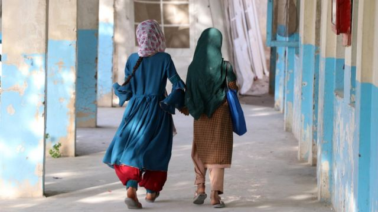
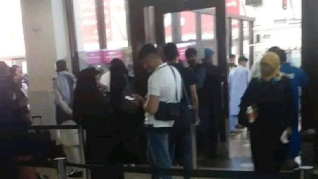
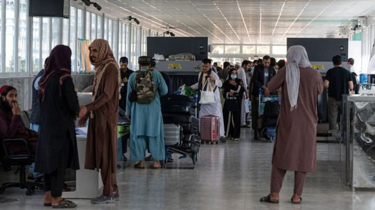
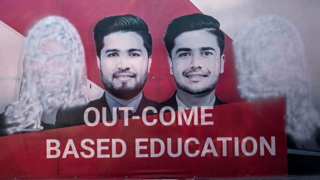
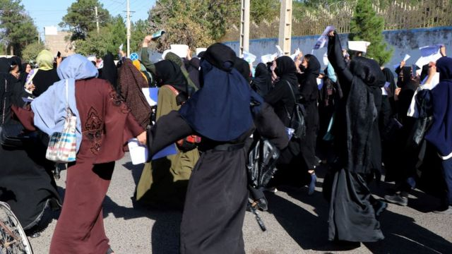
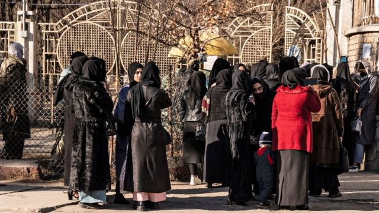

# [World] 塔利班阻止阿富汗女学生出国留学

#  塔利班阻止阿富汗女学生出国留学

> 图像来源，  EPA

**阿富汗塔利班政府继2022年12月禁止女性读大学后，近期再被揭阻止女性出国留学，BBC得悉至少60名女学生获得海外奖学金后无法出境，甚至上了飞机也被带下来。**

“塔利班不准女生读大学后，我唯一的希望就是申请奖学金，希望可以出国留学。”20岁的阿富汗学生纳特凯（Natkai）说。

为保障受访者安全，“纳特凯”是化名。

塔利班在2021年重新掌权后严厉打压女性权益。纳特凯说她在国内上大学的机会渺茫，但她坚持学习，其后申请到奖学金入读阿联酋（UAE）的迪拜大学。

该奖学金是阿联酋亿万富商哈布托尔（Sheikh Khalaf Ahmad Al Habtoor）在塔利班去年12月宣布禁止女性读大学后成立。

据BBC了解，共有100名阿富汗女学生获得奖学金，一些居于海外的阿富汗学生已赴迪拜读书。

8月23日星期三，纳特凯与家人道别，启程前往机场，但她的希望很快就破灭。

“塔利班官员看到我们的机票和学生签证，说女生不准持学生签证离境。”她声音颤抖地告诉记者。

> 图像来源，  By Arrangement
>
> 图像加注文字，喀布尔机场拍摄的录像截图，出发前往迪拜的女学生排队通过安检，但有女学生在机场受到出入境官员阻挠。

##  被禁出国

> 图像来源，  Getty Images
>
> 图像加注文字，塔利班政府禁止女性单独出境，必须有男性监护人陪同

至少有60名女学生在机场被拒出境，纳特凯是其中之一。

BBC看到的照片显示，戴着头巾的年轻女子站在行李旁，神情惊恐，深受打击。

塔利班禁止妇女单独旅行，只准她们与男性监护人（mahram），即丈夫、兄弟、叔叔或父亲等有血缘关系的男性同伴一起出国。

但这样还不够。

“飞机上有三个女孩有男性监护人（mahram）。但劝善惩恶部（Vice and Virtue Ministry）的官员也把她们带下了飞机。”纳特凯说。

其余的学生都害怕得不敢与媒体说话。

化名“艾哈迈德”（Shams Ahmad）的年轻阿富汗男子陪同妹妹到机场，他描述了当时的情况。

> 图像来源，  Getty Images
>
> 图像加注文字，女性照片甚至从大学横幅上被抹去。

“国内的大学关闭后，奖学金让我的妹妹有了新希望。她满怀希望地离开家，又哭着回来了。”他说。“她所有的权利都被剥夺了。”

艾哈迈德说，有些女生甚至借钱，为陪同她们的男性申请签证，但还是被拦了下来。

“有些女孩非常无助和贫穷。她们甚至没有400阿富汗尼（4 英镑；5 美元）来支付外交部要求的文件验证费。”

迪拜大学和奖学金创办人哈布托尔已证实这些女学生受到阻挠。

哈布托尔在社交媒体“X”（推特）发布一段英文影片，批评塔利班当局，并称在伊斯兰教下男女平等。

影片还收录了一段英文语音留言，来自其中一名在机场被阻挡的阿富汗女孩。

“我们现在就在机场，但不幸的是，政府不准我们去迪拜。”她说。“他们甚至不准那些有男性监护人（mahram）的人去迪拜。我不知道该怎么办。请帮帮我们。”

##  国际反应

> 图像来源，  Getty Images
>
> 图像加注文字，尽管面临危险，阿富汗妇女多次举行抗议活动，但即便如此，也未能改变塔利班的相关政策。

塔利班最新一轮行动，引发人权组织和外交界的不安。

“塔利班已经残酷地剥夺女童和妇女受教育的权利，现在还更进一步，是令人震惊的一步。”人权观察组织（Human Rights Watch）研究员巴尔（Heather Barr）说。

“这是在囚禁她们，并阻止其他人帮助她们求学。”

前联合国驻阿富汗青年代表扎德兰（Shkula Zadran）在网上发布信息，敦促有关大学不要放弃这些女孩。

塔利班没有发表任何声明或澄清。

劝善惩恶部（ Vice and Virtue Ministry）发言人穆哈吉尔（Mohammad Sadiq Akif Muhajir）告诉BBC，他们对事件并不知悉。

> 图像来源，  Getty Images

塔利班高级发言人穆贾希德（Zabihullah Mujahid）也拒绝置评，称自己正在旅行，不掌握任何资讯。

被拒出境的女学生纳特凯处于绝望的深谷。

塔利班于2021年8月15日夺权时，她高中毕业，正在准备大学入学考试。

纳特凯一度以为自己找到了追梦之路。她表示对塔利班无话可说，因为“他们不接受也不尊重女性”。

她呼吁全世界不要抛弃阿富汗女孩，或者她们受教育的机会。

“在这个国家，身为女性就是一种罪，我在这里错过了（求学的）机会。我很伤心，我不知道该怎么办，也不知道接下来会发生什么。”

