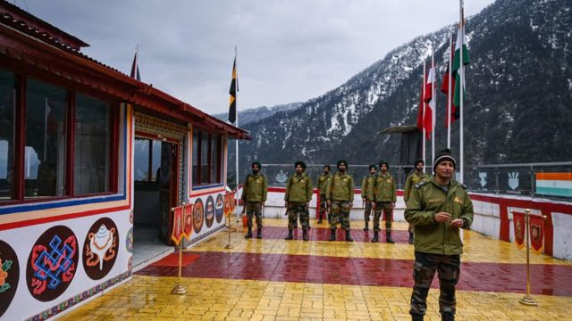
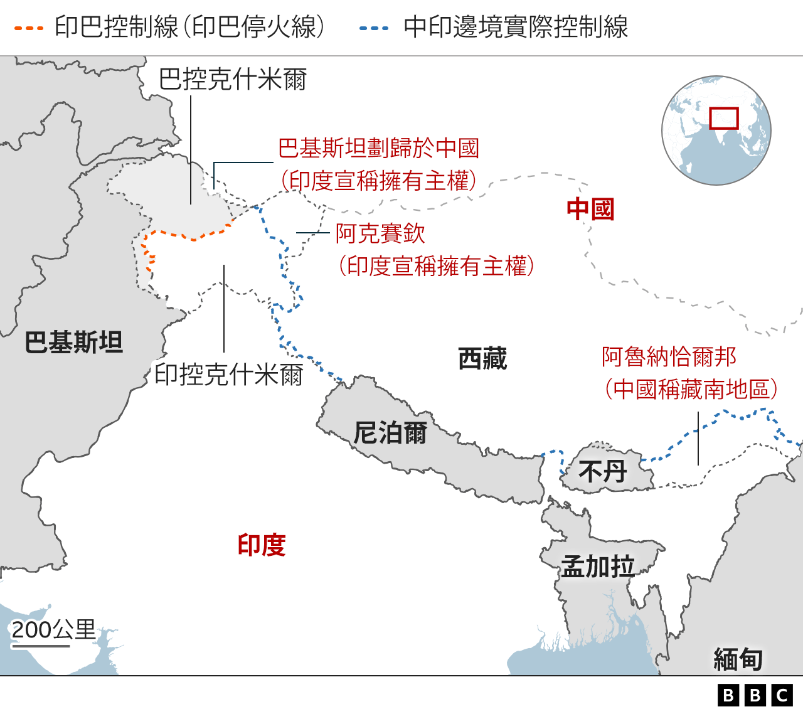
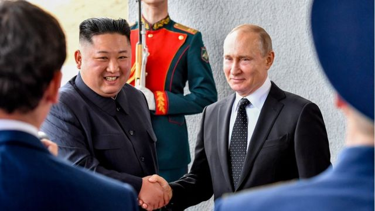
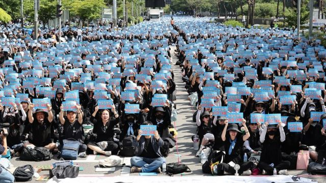

# [World] 中国官方地图引争议、香港政治难民在英国、普京会面金正恩等本周重要故事

#  中国官方地图引争议、香港政治难民在英国、普京会面金正恩等本周重要故事

> 图像来源，  AFP
>
> 图像加注文字，中印边界争议可追溯到1914年制定的麦克马洪线（McMahon Line）。

**2023年9月第一个星期，中国发布新一年度官方版图，引起多个与之有领土主权争议的国家不满，这其中包括了印度。同时间，金正恩据报将与与普京会面，引发国际关注，焦点包括两人是否会讨论武器买卖。在英国的香港政治庇护难民，向BBC中文亲诉在精神健康的挣扎过程。**

此外，中国当局计划将“伤害中华民族感情”的行为列入治安拘留范围，在互联网上引发争议。最后，韩国上万小学教师走上街头，抗议学生家长的霸凌，导致一名年轻老师轻生。

刚刚过去的一周，BBC中文有以下新闻内容受到读者的关注。如果错过了，带您一一回顾。

##  1.中印冲突与地图争端：绵延数十年的龙象边界之争

中国发布新一年度官方版图，引起多个与之有领土主权争议的国家不满，这其中包括了印度。

印度认为，中方地图涵盖“毫无根据”的印方土地，中国则反驳称其“依法行使主权”，要求印方“客观冷静看待”。

地图涉及的争议区域主要为牵涉巴基斯坦的喀什米尔（Kashmir）地区，以及中方称为藏南地区的阿鲁纳恰尔邦（Arunachal Pradesh）。中印两国对这些地区的主权争议已持续数十年，成为左右两国关系的重要议题。

##  2\. 金正恩与普京“结盟”为何会令人担忧

> 图像来源，  Getty Images
>
> 图像加注文字，金正恩与普京会结成新的同盟关系吗？

朝鲜（北韩）领导人金正恩据报计划在本月访问俄罗斯，消息引起了美国及其盟友的担忧。

美国官员较早前表示，金正恩与俄罗斯总统普京打算讨论朝鲜是否可能向莫斯科提供武器，支持其在乌克兰的战争。

从表面上看，朝鲜和俄罗斯之间达成武器协议，在交易层面上完全合理。莫斯科迫切需要武器，特别是子弹和炮弹，以支援在乌克兰的战争，而平壤在这方面有充足的供应。

##  3.香港寻求庇护者在英国面临的困境： 噩梦，无助感与生活拮据

> 图像加注文字，香港学生文妮夏（Venita）

2021年年初的一天，英国东部城市诺里奇（Norwich）天色灰暗，窗外刮起风，当时还是18岁的香港学生文妮夏（Venita）独自坐在向友人借住的房间里。大约3年前，当时还是香港中文大学学生的她参加了校园示威活动。因担心警方追捕， 文妮夏带上仅有的1000英镑逃离香港，只身来到举目无亲的英国，在等待政治庇护期间， 被迫四处漂泊借宿。

##  4.中国拟将“伤害民族感情”行为列入治安处罚法引发争议

> 图像来源，  Getty Images

中国当局计划将“伤害中华民族感情”的行为列入治安拘留范围，在互联网上引发争议。

修订的 《治安管理处罚法》 草案在近日公布，已经过中国最高立法机关全国人大常委会第一次审议，正在征求公众意见。如草案获得通过成为法律，被认定为有“伤害中华民族感情”行为者将被处以拘留及罚款。

##  5\. 韩国上万名老师为何走上街头 抗议学生家长霸凌？

> 图像来源，  Courtesy News1
>
> 图像加注文字，在过去的6周内，数以万计的韩国教师在首尔集会。他们声称现在非常害怕被称为虐待儿童者，也无法管教学生或在学生互相攻击时进行干预。

一名老师自缢的悲剧激起了韩国各地小学教师的愤怒。学校老师们开始分享自己被霸道的学生家长和不守规矩的孩子欺负的经历。

数以万计的小学老师走上街头罢课，要求在教学专业岗位上获得更好的保护。

  * 

