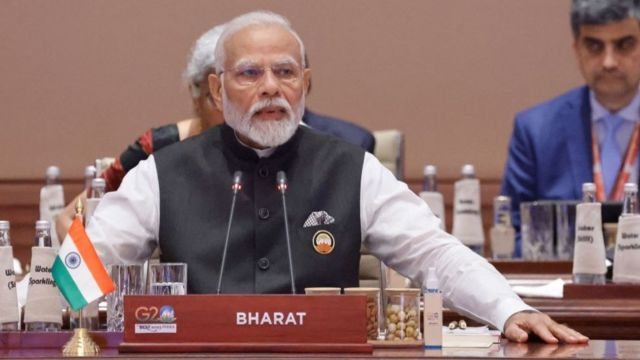
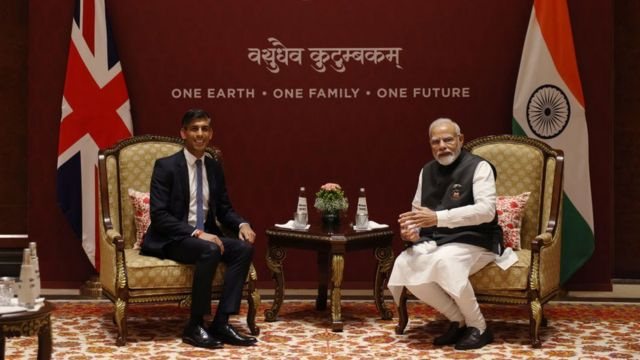
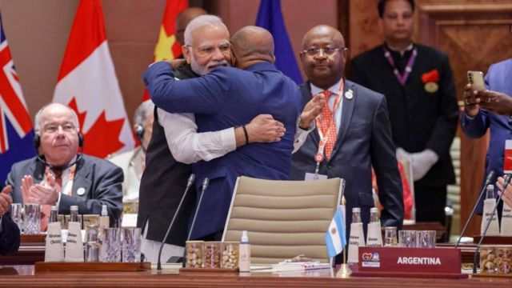
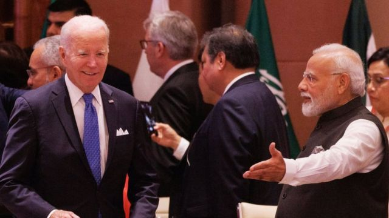

# [World] 新德里G20峰会：首脑宣言没有谴责俄罗斯侵略

#  新德里G20峰会：首脑宣言没有谴责俄罗斯侵略

> 图像来源，  Getty Images
>
> 图像加注文字，印度总理莫迪在新德里举行的G20领导人峰会第一次会议上发表讲话。

**为期两天的二十国集团（G20）峰会9月9日至10日在印度新德里举行，峰会通过的首脑宣言在乌克兰战争问题上，谴责武力夺取领土的行为，但没有直接批评俄罗斯。**

对此，乌克兰政府指这个结果“没有什么值得骄傲”。

由于与会各国在俄乌问题上分歧严重，此前分析认为宣言难以敲定。印度总理莫迪（Narendra Modi）在峰会首日宣布首脑宣言取得共识，让外界感到意外。

BBC周五获得一份宣言草稿显示，有关乌克兰战争的段落留白，表明谈判在最后一刻仍在进行。去年巴厘岛峰会期间也是如此。

这次宣言的措辞，相较去年的巴厘岛宣言弱。去年，成员国“以最强烈的措辞谴责俄罗斯对乌克兰的侵略”——尽管它指出“对局势和制裁有其他看法和不同的评估”。

美国国家安全顾问沙利文（Jake Sullivan）称德里联合声明是“印度担任轮值主席国的一个重要里程碑，也是对二十国集团能够共同解决一系列紧迫问题的信任票”。

他表示，首脑宣言中有几个关于乌克兰战争的“重要”段落。 “从我们的角度来看，它很好地维护了国家不能使用武力获取领土的原则。”

世界银行行长班加（Ajay Banga）表示，“莫迪总理和他的团队非常努力地寻求共识”。

法国财政部长勒梅尔（Bruno Le Maire）表示，这一声明“是印度担任G20主席国的巨大成功”。

荷兰首相吕特（Mark Rutte）称首脑宣言文本“对所有人来说都是可以接受的”，并且“对国际社会来说是一件非常好的事情”。

一连两日在新德里举行的G20首脑峰会在星期日（9月10日）正式结束。印度总理莫迪与峰会明年主办国巴西的总统卢拉进行了交接仪式。

> 图像来源，  Getty Images
>
> 图像加注文字，9月9日，印度总理莫迪在德里新德里G20峰会期间与英国首相苏纳克举行了双边会晤。

新德里宣言没有直接批评俄罗斯发动战争。

但它谈到“乌克兰战争损害全球粮食和能源安全，造成人类受苦以及有连带的负面影响"。宣言还重申，认可“不同观点和评估”。

重要的是，今年的宣言使用了“发生在乌克兰的战争”（the war in Ukraine）的表述，而非“针对乌克兰的战争”（the war against Ukraine）。这一措辞可能更容易获俄罗斯赞同宣言。

乌克兰总统泽连斯基去年曾参与巴厘岛峰会，但今年没有获邀。

“就俄罗斯对乌克兰的侵略而言，G20没有什么值得骄傲的。”乌克兰外交部在社交媒体X上写道。

对基辅而言，避谈俄罗斯“侵略”，意味着其西方支持者在与“全球南方”（Global South， 又称“南方国家”）就如何描述战争的争论中败下阵来。

##  G20纳入非洲联盟

> 图像来源，  Getty Images
>
> 图像加注文字，非洲联盟主席、科摩罗总统阿扎利·阿苏马尼（右）和印度总理莫迪在峰会上拥抱。

峰会另一焦点，是印度总理莫迪正式邀请非洲联盟（African Union）成为G20成员。

对印度来说，提升非洲国家的声音作为其主席国地位的基础，在不久的将来，当印度与中国争夺对亚洲和非洲的影响力时，它将从这一战略选择中获得回报。

非洲拥有14亿人口，纳入非盟将使非洲大陆在20国集团这样的全球论坛上，拥有更广泛的代表性。

非盟总部设于埃塞俄比亚首都亚的斯亚贝巴（Addis Ababa），现有55个成员国，目前仅南非为G20成员国。

##  气候变化问题

> 图像来源，  Getty Images
>
> 图像加注文字，印度总理莫迪欢迎美国总统拜登出席9月9日在新德里举行的G20集团领导人峰会开幕会议。

气候问题迫在眉睫，峰会前各国分歧严重，但现在，官员们说已达成“100%共识”。首脑宣言未承诺放弃化石燃料，但称G20国家将“通过现有目标和政策，致力将全球可再生能源产能增加三倍”。

20国集团的温室气体排放量占全球75%以上。

而发展中国家过去一直抵制发达国家提高可再生能源目标、逐步减少化石燃料和减少温室气体排放。在温室气体排放达到峰值（达到峰值后排放量需要下降）方面，发展中国家一直在争取时间。

宣言指出，“达到峰值的时间框架可根据可持续发展、消除贫穷的需要、公平以及不同的国情来决定”。

专家还强调《绿色发展公约》（Green Development Pact）的重要性，这是一项在未来十年通过全球合作应对环境危机的计划。G20国家还承诺，会共同努力为发展中国家提供低成本融资，支持它们向低排放转型。欧亚集团南亚负责人乔杜瑞（Pramit Pal Chaudhuri）表示，印度在绿色金融方面做得“相当不错”。

“绿色金融现在主要从富裕国家流向其他富裕国家。私人资本是这种融资的核心，即使是新兴经济体也得不到它。印度一直努力改变这现状，让多边开发银行开始降低绿色领域的私人资本流动风险，”他说。

##  印度改名争议

印度总理莫迪在开幕致辞时提到梵文“婆罗多”（Bharat，又译“巴拉特”），他桌上名牌的国名也是“婆罗多”，再次引起外界猜測印度是否有意改国名。

“Bharat”（婆罗多）是印度的印地语名称，可以追溯到梵文书写的古代印度教经文，在印度国内被广为使用。“India”（印度）则拥有更高的国际知名度，它源自印度河。

两个名称在公众和官方场合可以互换使用。印度宪法开篇就写道：“印度，即婆罗多，应为联邦制。”

多年来，印度各届政府一直试图通过重新命名道路或地名来消除英国殖民时代的痕迹，莫迪政府加速推进这一进程，并呼吁民众摒弃殖民心态。

印度有14亿人口，印度教徒占绝大多数，但也有超过2亿穆斯林，这些宗教少数人士担心莫迪想把印度变回印度教国家。

