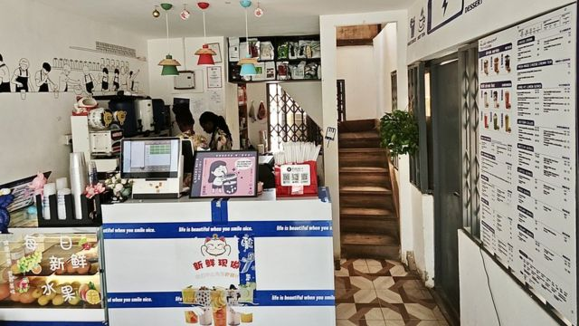
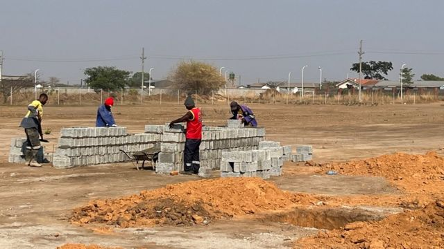
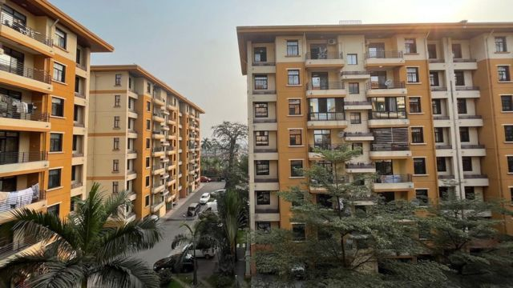
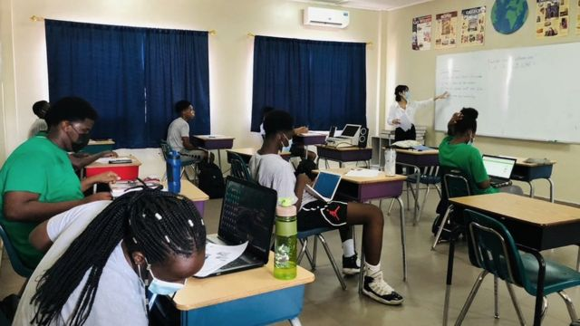
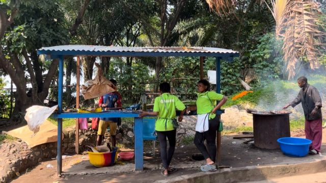

# [World] 中国年轻人走进非洲： 掘金，逃避和叛逆

#  中国年轻人走进非洲： 掘金，逃避和叛逆

  * 常思颖 
  * BBC中文 

> 图像来源，  Getty Images

**今年20岁的陈卓出生在中国中部地区一个农村家庭，下面有一个弟弟。为了给家里减轻负担，他选择毕业后马上工作，而不是考研继续求学。**

他从去年秋天校园招聘时就开始找工作，半年内陆陆续续向国内企业投出了1000多份简历，但临近毕业也没有落实一份合适的工作。

尽管家人担忧，权衡之后，他最终接受了一份远在非洲的工作。

在中国经济不景气、青年失业率高企的情况下，职场竞争激烈，对于陈卓这些毕业于普通高校的年轻人来说更是如此。他就读于重庆一所普通大学的国际贸易专业，截至毕业，班上50多位同学中，仅有十几位工作有了着落。

而随着中非经贸往来日益频繁，大批中资企业进驻非洲多国，越来越多大学毕业的年轻人把目光投向非洲，试图在那里找寻出路。

今年6月，陈卓怀着忐忑不安情绪到了非洲西部国家加纳（Ghana），但后来发现，并没有他想象的那么糟糕。

“来之前我对非洲还是有一定的担心，担心吃不好饭、会经常生病、有很多蚊子什么的，但到了之后发现，并不存在这些事情，”陈卓在BBC的访问中说。

过去，除了法语专业的学生，到非洲工作基本不是中国应届毕业生的考虑，语言障碍、安全问题、文化差异等因素令他们望而却步。但慢慢地，随着职场竞争日益激烈，非洲进入了越来越多中国年轻人的视野，有人看重中国在非洲不断增长的投资带来的机遇，以及当地蓬勃发展的华人社区，思考着未来的创业前景； 还有一些新生代年轻人希望到非洲体验多元文化，提升外语能力。

> 图像来源，  Chen Zhuo
>
> 图像加注文字，在加纳首都阿克拉，一家中国人开的奶茶店。

##  不断增长的兴趣与需求

中国年轻人去非洲工作的人数和区域分布至今没有可靠的统计。但在中国社交媒体上，对外派非洲工作的兴趣正在增长。

在微博上，话题标签“年薪20万你会考虑外派非洲吗？”在今年7月底一度飙至热搜榜第一位，相关文章阅读量达到2亿，有近30万人参与互动。在年轻人聚集的社交平台小红书和哔哩哔哩上，一些博主拍摄的非洲工作经历吸引了上百万人观看，在评论区，许多留言询问怎样去非洲、如何选择公司、当地是否安全等等。

“越来越多中国年轻人到非洲工作，他们不仅到大型国有企业工作，还以较小的团体、甚至个人形式到非洲寻找创业机会”， 美国乔治亚州立大学国际传播副教授玛利亚·列普尼科娃（Maria Repnikova）说。她研究非洲语境下的中国。

“这种需求很大程度上来自中国的大型项目，尤其是在基础设施和技术领域”。

> 图像来源，  Bilibili
>
> 图像加注文字，在社交媒体哔哩哔哩上，一些博主拍摄的非洲工作经历吸引了上百万人观看。

“这种趋势不是均衡发展，而是取决于特定非洲国家的安全和经济状况”，列普尼科娃教授指出。根据她对非洲东北部埃塞俄比亚的研究经验，过去的四年里，由于新冠疫情和战争，那里的华人社区已经萎缩。但有趣的是，一些中国人离开后并没有选择回国，而是移居到非洲其他国家。

过去十年里，中国一直是非洲第一大贸易伙伴国。据官方统计，2022年，中非贸易额达到2820亿美元，同比增长约11%；与此同时，中国在非洲的企业数量几乎翻了一番，达到约3500家。

抵达加纳首都阿克拉后，陈卓说，是惊喜不断。在市中心一家购物中心，有相当多的中国零售品牌入驻，附近还有中国人开的火锅店、KTV、奶茶店、酒店等等。他甚至吃到了中国北方口味的猪肉大葱包子、还有河南小吃胡辣汤。

“如果不是看到了黑皮肤的当地人，我还以为我在中国”，他觉得这种情境让人恍惚。

过去，在非洲的中国企业大多以劳务输出的方式大量招聘合同工人，并倾向于招聘有经验积累的人来担任管理职位，而现在，一些在非洲的中资企业似乎开始青睐那些有技术和管理潜力的年轻人。

刚毕业的陈卓已经是加纳一家中资重型建筑设备公司的销售部经理。

##  高薪吸引

许多中国年轻人提到，吸引他们到非洲工作的其中一个重要原因是——高薪。

首先是包吃包住，大部分年轻人都有一个自己的小单间，公司会提供适合中国人口味的饭菜，负担往返机票、签证费等等。其次，除了基本工资，许多企业还会给员工发放高额的外派补贴和艰苦补助，以及奖金、提成等。

在陈卓所在的公司，以他大学应届生的身份，所有费用加起来，一年至少能赚20万人民币。一般外派合同是每一年或三年一签，那么三年下来，扣除支出，“起码能攒下50万”。

陈卓来自农村家庭，这样的工资水平很大程度上减轻了家里的负担。他拿出第一个月的工资给妈妈买了一条项链寄回老家，给成日担惊受怕的母亲带去许多安慰。

而对比之下，以他普通大学应届生的资历，在大城市工作顶多每月能赚1万左右，扣除房租、交通等费用，几乎所剩无几。

不过，高薪的背后有无尽的孤独。即便有不少中国人开的娱乐场所，但舒适性和技术含量赶不上国内。刚来几个月的陈卓还没想好怎样利用大段的业余时间对抗孤独。

偶尔，当他在工作时受到老板指责，会在夜晚写下日记抒发内心的落寞。但除此之外，他对这里的生活和工作大体满意。对于他来说，一份好的收入更重要，合同期结束后，他还是会考虑留下来继续工作。“毕竟还年轻”，他说。

美国圣母大学（University of Notre Dame）政治学副教授马佳士（Joshua Eisenman）说，中国多年来一直希望经济崛起，吸引海外青年回国发展，但现在却有人愿意去那么远的地方工作，或者认为必须走那么远才能找到机会，“实在令人惊讶”。

“可以肯定的是，这是中国经济形势非常糟糕带来的结果，”他说。

自解除新冠疫情期间的严格封锁以来，中国经济的复苏速度远远低于预期，人民币汇率创下 16 年新低。今年4月以来，中国青年失业率连续数月屡创历史新高。最新数据表明，在16至24岁的年轻人中，每五个就有一个没有工作。8月中旬，国家索性不再发布失业数据。

##  “去非洲也算是一种逃避”

除了追求高薪之外，一些年轻人还表示，希望逃离当前“内卷”的中国社会，到非洲寻找更广阔的空间。

23岁的杨帆今年毕业于中国山东一所普通大学，国际经济与贸易专业的他，拿到了几家银行和会计事务所的录取通知，但综合考虑后，他还是放弃了，选择到非洲赞比亚一家国企工作。

> 图像来源，  Yang Fan
>
> 图像加注文字，23岁的杨帆不喜欢中国的加班文化，他说"走到非洲也算是一种逃避"。

在中国，加班是许多企业的常态。杨帆的工作尤其如此，通常需要加班到半夜一、两点，甚至为了跟客户沟通要倒时差。

“我不太喜欢那样的工作节奏，所以说走到非洲也算是一种逃避，”他说。

他的公司里不仅有中国人和非洲人，还有来自印度、阿拉伯等地方的人。与不同国家的人打交道能让他了解不同文化，开拓视野。 “这是在国内接触不到的，”他说。

杨帆选择去非洲工作，还有一部分是原因是受到曾经参与援建非洲的老师影响。自上世纪六十年代，中国各省市开始派遣医疗队和技术专业人员到非洲，支援当地的基础设施建设。

不过，与过去一辈人的想法不同，新一代年轻人似乎更看重非洲的多元文化，期待未来回国或到发达国家有更好的发展。

“目前在非洲的中国年轻人大部分来自中产家庭，思想更加开放，不像他们之前的那拨人，是那种吃苦耐劳的来自发展中国家的人”，南非国际事务研究所（South African Institute of International Affairs）高级研究员劳伦-约翰斯顿（Lauren Johnston）说。

她表示，过去那一辈到非洲的中国人当中，一部分是在共产主义战略基础上提供援助的政治传教士类型的人，而现在去非洲的中国年轻人更像是当前西方国家或者日本、韩国、新加坡等亚洲发达国家的年轻人，他们希望看看世界，积累一些资金和国际工作经验。

> 图像来源，  Yang Fan
>
> 图像加注文字，一些非洲工人在杨帆公司负责的项目中忙碌着。

在非洲的生活挑战性也不乏挑战性。赞比亚的扬帆第一天上班就被交警带到了派出所。

起因是他的师姐在开车途中看手机，被警察拦下。由于贿赂在当地比较普遍，原本花50克瓦查（赞比亚货币）就可以被放行，但他们没有这样做，反而被带到警察局。后来经过了一番复杂的交涉，支付了200克瓦查才被放出来。

杨帆在整个过程中非常紧张，全程紧握手机。后来他反思，或许有时贿赂也是必须的：“这个地方的生存之道相对于国内来讲要野蛮一点，如果采用一种不太正规的处理方法，我觉得也是可以接受的”。

在那里工作一个月后，杨帆发现与他之前想象的工作节奏有落差。他时常因为公司人手不够而不得不身兼数职。作为一位应届毕业生，初入公司两个星期就要负责对数千吨的货物进行规划，跟踪千万元级别的项目。

即便如此，他还是愿意把这样的生活当做一种挑战。他利用业余时间在自己的小红书账号上开设了“小于勇闯非洲小记”，记录他在赞比亚的所见所闻。他希望积累一些粉丝，或许有朝一日也能像那些具有开拓精神的前辈一样，成为市场经济下新的弄潮儿。

##  “叛逆之路”

> 图像来源，  Siao Yu
>
> 图像加注文字，27岁的小鱼今年4月来到刚果（金）首都金沙萨，她时常在业余时间跳绳健身。

基于安全考虑，许多初入职场的中国年轻人倾向于通过官方渠道应聘国企外派岗位。但也有人主动请求熟人介绍工作，或者直接与当地的私企联系工作。

27岁的小鱼今年4月来到刚果（金）首都金沙萨（Kinshasa），为一家大型中国私企做财务专员，她是通过企业内部员工推荐应聘过来。

她居住的地方由公司分配，位于一个较为高档的别墅小区，住户大多是中国人，还有一些较为富裕的非洲人。在通往小区的大马路上设有关卡，对每一个进出的车辆进行检查。进入小区后，拐角处有持枪的保安驻守；小区内每个区域设有大门，也有保安把守。

> 图像来源，  Siao Yu
>
> 图像加注文字，小鱼住的地方由公司分配，位于一个较为高档的别墅小区。

作为一名女性，小鱼将自己走到非洲的经历形容为“叛逆之路”，很大程度是为了逃避家庭生活的琐碎。

小鱼来自广东省的一个小县城，“男大当婚，女大当嫁”的传统思想渗透在家庭里，父母不断催促她赶紧稳定下来，但她向往自由自在的生活。

在国内，大城市的生活压力让她觉得反感，但她又不甘心回到家乡小县城，一辈子生活在那里。于是家人越唠叨，她越抗拒，索性远走非洲。

小鱼2019年毕业于中国一所普通大学的法语专业，这已经是她第二次进入非洲。她毕业后曾通过学校在刚果（布）首都设立的项目，成为一名中文老师，两年后回国。

回国后的她曾顺应家人意愿准备考研。但近年来考研人数大增，竞争激烈，她最终失利。之后小鱼再次萌生了重返非洲的想法。

“回到非洲的想法一直都有，毕业之前就感觉可能会在非洲长期待下去，来了之后就更坚定了我的想法。”

吸引她的是八小时工作后大段可以自由支配的时间。她学会了画画和花式跳绳，也会在下班后换上无袖衫，蹬上球鞋，到操场上和当地非洲人一起打篮球。在干燥的金沙萨夏日吹着刚果河畔吹来的晚风，对她来说也是一种美。

“很简单，很快乐，”她说。

> 图像来源，  Siao Yu
>
> 图像加注文字，小鱼曾在刚果（布）一所学校任中文老师。

对于像小鱼这样法语专业毕业生来说，大部分人把非洲当做一个跳板，工作几年后到法国或其他发达国家工作，或者回国发展；有少部分人把非洲当做第二个家乡，一待就是十几年。

小鱼也希望到法国留学，但如果没有机会留在那里，她可能重新回到非洲，长久地居住下去。回国对她来说已经不再是一种选择。

“就像大家说的，可能在非洲待久了就回不去了”，她说。 一是适应不了国内的工作节奏和要求，工资待遇也未必能达到要求；二是自己掌握的业务也许只适用于非洲的环境。

不过，非洲也并不是一些媒体所称的“就业天堂”。有报道指出，有中国毕业生在应聘期间被骗。

小鱼就曾遇到一位法语专业毕业的女生，应聘到一家中国私企做翻译。她在去非洲前没有与对方签订合同，后来公司无法给出承诺的高额薪水。疫情期间，由于业务停止，这位女生无法正常工作，被迫在老板家帮助照顾小孩。

“非洲生活也不是完美的，也会有很多不好的事情发生，”小鱼说。

_（为保护受访者身份，陈卓、杨帆、小鱼为化名。）_

> 图像来源，  Siao Yu
>
> 图像加注文字，在刚果河边，小鱼在与公司同事团建。

