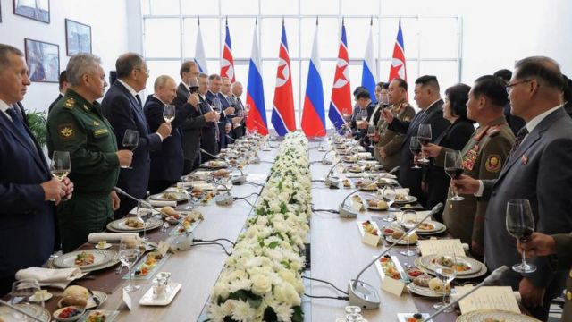
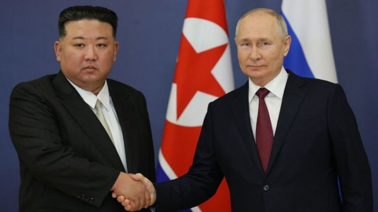

# [World] 普京与金正恩会晤：他们究竟谈了些什么

#  普京与金正恩会晤：他们究竟谈了些什么

  * 黄晓恩（Tessa Wong） 
  * BBC亚洲数字记者 

**在与俄罗斯总统普京（Vladimir Putin）就可能的武器交易进行会谈后，朝鲜领导人金正恩继续在俄罗斯进行备受外界关注的访问。**

金正恩周三（9月13日）乘私人装甲列车抵达俄罗斯远东的阿穆尔州，与普京在东方航天发射场会面。

普京后来表示，他与金正恩讨论了军事合作的“可能性”，并暗示其将帮助平壤发展卫星。

美国表示，俄罗斯正试图向朝鲜购买武器以支持其对乌克兰的战争。华盛顿还警告，莫斯科向平壤卫星计划提供任何帮助都将违反联合国安理会的决议。

普京还接受了金正恩的邀请访问朝鲜。很少有国家元首访问过这个封闭的国家。

朝鲜和俄罗斯都处于制裁之下，两国与西方的关系处于历史最低点。双方的高级官员也参与了周三的会晤。

在这次为期两天的高调访问中，金正恩乘专列来到俄罗斯远东地区，受到普京的热情接待。俄罗斯官方媒体的画面显示，两位领导人在握手时露出微笑，随后普京亲自陪同金正恩参观了东方航天发射场。

普京提及苏联和朝鲜之间的历史关系，用俄罗斯谚语“一个老朋友胜过两个新朋友”来欢迎金正恩到访。

据俄罗斯媒体报道，当被问及俄罗斯是否会帮助朝鲜建造卫星时，普京表示：“这就是我们来到东方航天发射场的原因”。

当被问及是否会与金正恩讨论武器交易时，普京表示他们将“讨论所有话题”。

与此同时，金正恩似乎对普京在乌克兰发动的战争表示支持。

“俄罗斯已经开始了一场对抗西方霸权势力的神圣斗争，以保卫其主权和安全。”他对普京说。

“我们将始终支持普京总统和俄罗斯领导层的决定……我们将共同反对帝国主义。”

预计金正恩稍后将参访俄罗斯军舰和几家工厂，并于回程在远东城市符拉迪沃斯托克（Vladivostok）停留。目前还不知道他将在俄罗斯待多久。

> 图像来源，  KCNA/Reuters
>
> 图像加注文字，周三下午，两国领导人在宴会上互相敬酒。

平壤曾誓言要开发一颗间谍卫星来增强其军事侦察能力。但今年早些时候，朝鲜两次尝试发射间谍卫星均以失败告终。

美国认为，朝鲜的卫星计划也旨在提高其弹道导弹能力，因为技术相似。

周三，美国国务院发言人马修·米勒（Matthew Miller）在回答记者提问时承认，俄罗斯在卫星技术方面的帮助将积极改善朝鲜的导弹计划，这的确令人担忧。

他表示，“这非常令人不安，可能违反联合国安理会多项决议”，而俄罗斯自己过去也曾投票支持这些决议。

普京周三似乎承认了这一点，称俄朝军事合作“存在一定的限制”。

美国还警告称，它将“在必要时毫不犹豫地采取行动追究责任”，对此，克里姆林宫回应称，对其而言重要的是俄罗斯和朝鲜的利益，“而不是来自华盛顿的警告”。

此次会晤标志着金正恩自2019年以来首次外访。他上一次出国是朝鲜与时任美国总统特朗普（Donald Trump）的核裁军谈判破裂后，他与普京会面。

许多人原以为金正恩此次会前往符拉迪沃斯托克，因为普京之前在那里参加了一个经济论坛，但其专列却缓慢向北驶向东方基地。周三上午，当金正恩接近目的地时，朝鲜向其东海岸附近海域发射了两枚短程导弹，这是朝鲜在进行一系列违背联合国决议的导弹试射后的最新之举。

在金正恩与普京会晤之前，俄罗斯代表团曾于七月访朝。金正恩向俄罗斯国防部长绍伊古（Sergei Shoigu）展示了包括“火星”洲际弹道导弹在内的朝鲜导弹。

专家表示，莫斯科可能热衷于朝鲜的武器，因为它们与俄制武器系统兼容。

冲突研究中心（Conflict Studies Research Centre）研究俄罗斯军事的专家瓦列里·阿基门科（Valery Akimenko）说，俄罗斯尤其渴望得到火炮和炮弹，因为在前线，火炮是“俄罗斯崇拜之神”。

北韩大学院大学（University of North Korean Studies）教授金东烨（音译，Kim Dong- yup）表示，平壤可能会提供这些武器和子弹，“甚至更老型号的导弹”。

峨山政策硏究院（Asan Institute for Policy Studies）研究员梁旭（Yang Uk）表示，朝鲜也有可能提供短程弹道导弹等新型武器，如所谓的“超大型”火箭炮KN-25。

一些分析人士认为，朝鲜可能储备了大量武器，因为自1953年朝鲜战争停战以来，该国未再打过一场战争。但也有人认为，鉴于朝鲜相对匮乏的资源，它也可能不愿交出太多武器。

但观察人士表示，朝鲜的武器只会在短期内助力俄罗斯在战场的表现。他们指出，莫斯科的弹药已严重耗尽，只能依靠更旧、更不可靠的炮弹库存。

阿基门科指出，在俄罗斯加足马力生产的同时，朝鲜的武器可以“作为权宜之计”。

然而，鉴于俄罗斯消耗其武器供应的速度之快，协议在战略上不会产生太大影响。他补充道：“这会导致更多乌克兰人死亡，但不会导致乌克兰死亡。”

作为回报，外界认为金正恩会要求俄罗斯为其贫困的国家提供粮食援助。

朝鲜政权长期以来一直在制裁下艰难挣扎，在新冠疫情期间因边境封锁再遭严重打击，直到最近才开始放宽旅行限制。

> 图像来源，  Getty Images

除了粮食援助，平壤还可能要求俄罗斯提供更先进的潜艇和弹道导弹技术。但一些观察人士认为，普京可能会对此有所保留。

位于首尔的梨花女子大学（Ewha Womans University）教授莱夫·埃里克·伊斯利（Leif Eric Easley）说：“即使是一个绝望的战争机器，也不会用其军事皇冠上的珠宝来换取老旧的弹药。”

此次会面带来的一个更深层次的问题是，对俄罗斯和朝鲜的严厉制裁是否真的奏效。

亚洲协会政策研究院（Asia Society Policy Institute）执行总监罗里·丹尼尔斯（Rorry Daniels）表示，他们的会面表明，国际制裁已经建立了一道“防火墙”，而两国“可以在不担心进一步惩罚的情况下进行交易”。

“受到严厉制裁的国家越多，美国就越不能利用制裁作为解决潜在冲突的筹码。”

梨花女子大学朝鲜研究系副教授朴元根（音译，Park Won-gon）指出，这种情况对平壤来说也并非没有风险。

如果有任何证据表明俄罗斯在乌克兰使用了朝鲜的武器，“这可能会导致朝鲜转而与整个北约联盟对抗，进而引发更多制裁。”

**具酉娜（Yuna Ku）在首尔补充报道。**

