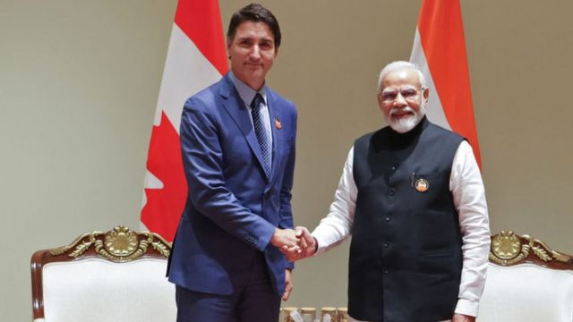
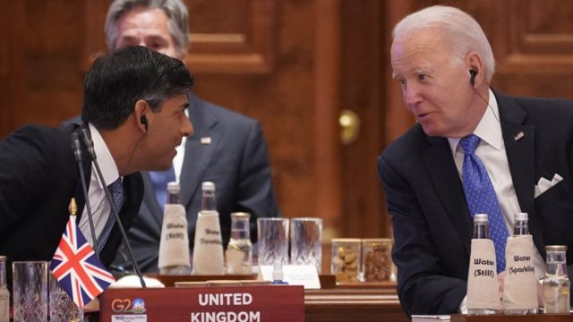
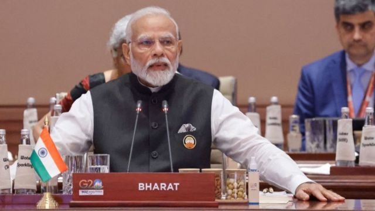

# [World] 印度加拿大外交风波升级：为何西方国家担心要选边站

#  印度加拿大外交风波升级：为何西方国家担心要选边站

> 图像来源，  Getty Images
>
> 图像加注文字，特鲁多（左）和莫迪最近在新德里举行了会晤。

**印度和加拿大的外交争端白热化，加拿大锡克教领袖6月在卑诗省遇刺，加拿大总理特鲁多指控是印度政府特工所为，印度否认，两国随后互逐外交官。**

BBC外交事务记者詹姆斯·兰代尔（James Landale）分析指，美国和其他西方国家不希望与印度交恶，正努力确保这场外交风波不会波及到其他国际关系。

部分西方英联邦国家也担心，事件会牵动其国内的锡克教社群，引发内部政治动荡。

在宏观地缘政治棋局中，印度扮演着关键角色，它不仅是世界第五大经济体、全球人口最多的崛起大国，对西方来说也是对抗中国的潜在堡垒。

这在刚刚结束的新德里G20峰会上显而易见，乌克兰的西方盟友在首脑宣言中并未点名谴责俄罗斯入侵。他们为了维护与印度的关系而避免激起矛盾，此举引起基辅不满。

让西方外交官担心的另一个问题是，各国开始在加拿大和印度之间选边站队的风险。

近几个月以来，印度试图将自己定位为发展中国家的领导者，这些国家也被称为“全球南方”，当中多国拒绝谴责俄罗斯入侵乌克兰。

美国和欧洲部分国家一直用外交手法争取这些国家的支持，并告诉他们这场战争对他们及其经济的重要性。

外交官们不希望白费以往的努力，他们担心加拿大和印度的外交争端会被解读为两个英联邦国家之间的南北对抗、大西洋大国与发展中国家之争。

##  英联邦国家的尴尬

> 图像来源，  Getty Images
>
> 图像加注文字，苏纳克与拜登。

加拿大外交部表示，特鲁多已与美国总统拜登和英国首相苏纳克（Rishi Sunak，辛伟诚）商讨事件。加拿大的盟友至今仍然忠诚，但也保持谨慎。

白宫指美国政府对谋杀指控深表关切，并表示“加拿大必须继续进行调查，把凶手绳之於法”。

而在英国和澳洲，当地有庞大的锡克教社群，这场外交争端很可能牵动国内政治。

英国外交大臣克莱弗利（James Cleverly，祁湛明）表示，英国将“非常认真地倾听加拿大提出的严重问题”。

他对BBC指出，他已在周一与加拿大外长乔美兰（Melanie Joly）讨论了这些指控，并表示英国“非常认真地对待加拿大的说法”。

他拒绝透露英国会否暂停与印度的贸易谈判，但表示英国将待加拿大完成调查后再决定进一步行动。

“加拿大和印度都是英国的紧密朋友，它们是英联邦伙伴。”克莱弗利说。

澳洲外交部发言人表示，堪培拉对相关指控“深感关切”，并已经“对印度政府高层传达了我们的关切”。

> 图像来源，  Getty Images
>
> 图像加注文字，印度总理莫迪在新德里举行的G20领导人峰会第一次会议上发表讲话。

到目前为止，西方国家将等待并留意调查进展。

加拿大情报部门可能会对部分西方盟友分享内幕，若有关指控证据确凿，西方国家将被迫在加拿大和印度之间做出选择，一边是支持法治原则，另一边是现实政治。

西方国家以往曾谴责俄罗斯、伊朗或沙特阿拉伯等国家发动的涉外刺杀行为。

他们并不希望印度加入那个名单。

被暗杀的哈迪普·辛格·尼贾尔（Hardeep Singh Nijjar）来自印度旁遮普邦（Punjab），1997年抵达加拿大，是当地锡克教独立组织的重要成员。

他主张锡克教徒应建立“哈利斯坦国”（Khalistan），被锡克教组织视为人权活动家，但印度政府认为他是“恐怖分子”。

9月18日，特鲁多向加拿大国会指出，据安全部门的“可靠情报”，印度特工与这宗谋杀案有关。

