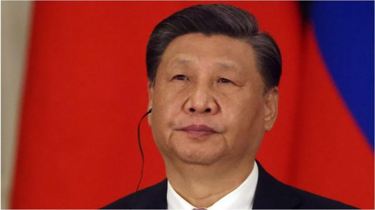
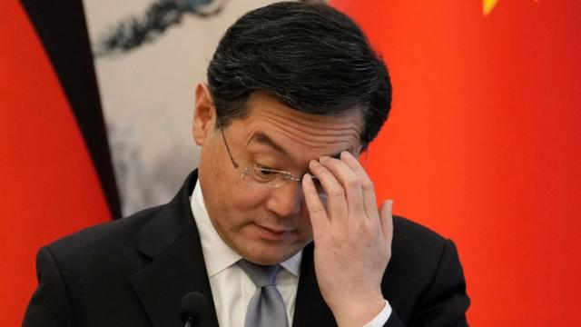

# [World] 中国防长李尚福：军事高官“失踪” 习近平遇到麻烦了吗

#  中国防长李尚福：军事高官“失踪” 习近平遇到麻烦了吗

  * 黄晓恩（Tessa Wong） 
  * BBC亚洲数字记者 

> 图像来源，  Getty Images

**他们曾受到习近平的信任和青睐。现在，他们似乎正在消失。**

近几个月来，中国多位高级官员的“失踪”引发了外界的强烈猜测：领导人习近平是否正在展开一场大清洗，尤其是与军队有关的人士。

最近一名似乎“落马”的官员是国防部长李尚福，他已经有几周没有在公开场合露面了。

虽然他的缺席起初并未被视为不寻常的讯号，但当一位美国高级外交官指出这一点时，人们开始关注这一迹象。路透社随后报道称，曾负责监督中国人民解放军武器采购的李尚福正因装备采购问题接受调查。

在他“失踪”几周前，解放军火箭军（控制核导弹的军事部门）的两名高级将领和一名军事法庭法官被免职。

现在又有新的传言称，解放军的领导机构——中央军委的一些干部也正在接受调查。

除了“健康原因”之外，官方几乎没有对这些免职做出任何解释。在信息真空状态下，各种猜测层出不穷。主要猜测是当局正在打击解放军中的腐败现象。

中国军队一直处于被严格审视的状态。在七月，军方发出了一次不同寻常的呼吁，要求公众举报过去五年中的腐败线索。根据BBC国际媒体观察部（BBC Monitoring）统计，习近平还启动了新一轮视察，自四月以来，他对各大军区的部队进行了五次视察。

研究中共与军队关系的新加坡南洋理工大学研究员蔡志祥（James Char）指出，腐败问题长期以来一直笼罩着解放军，尤其是自1970年代中国进行经济改革以来。

中国每年的军费开支超过千亿元人民币，其中一部分用于采购交易。但出于国家安全的考虑，这些交易往往无法完全公开，而中国的一党集权体制又进一步加剧了这种透明度缺乏的情况。

> 图像来源，  Getty Images
>
> 图像加注文字，李尚福

Skip podcast promotion and continue reading

* BBC 時事一周 Newsweek (Cantonese)   **

BBC國際台粵語節目，重溫一周國際大事，兩岸四地消息，英國境況。並備有專題環節：〈記者來鴻〉、〈英國生活點滴〉和〈華人談天下〉。

分集

End of podcast promotion

蔡志祥博士指出，与其他国家的军队受到公众监督不同，中国军队完全受中国共产党监督。

他补充说，虽然习近平在遏制军队的内部腐败和在一定程度上恢复军队声誉方面取得一些成果，但“根除腐败即使不是完全不可能，也是一项极为艰巨的任务”，因为这需要“系统性的重新设计，而这恐怕是威权国家所不愿意做的”。

“除非中共当局愿意建立一个不再受到其自身约束的适当的法律体系，否则此类清洗将会不断发生。”

但这些官员的“消失”也可能源于北京在处理与华盛顿的棘手关系时，日益加深的疑虑与不安。

今年七月，中国修订后的《反间谍法》生效，其赋予了当局更大的调查权力和范围。不久之后，中国国家安全部公开鼓励公民帮助他们打击间谍活动。

李尚福的“失踪”与外交部长秦刚的“消失”如出一辙。今年七月，秦刚的”消失“也引起了人们广泛的猜测，他最终在七月被免去外交部长职务。《华尔街日报》本周报道称，秦刚因涉嫌婚外情并导致其在美国诞下一名孩子而接受调查。

“在（共产党）精英的圈子里，有婚外情并不能成为免职的原因，但如果与一名可能被怀疑与外国情报机构有联系的人有婚外情，并生下一个持有你的主要地缘政治对手——甚至敌对国家——护照的孩子，可能就会出事了。”中国问题分析师利明璋（Bill Bishop）指出。

还有人猜测，习近平是迫于党内压力才开始整顿行动的，因为中国正在艰难地应对后新冠疫情时期的经济放缓和青年失业率飙升等问题。在中国的政治体制下，习近平不仅是中国国家主席，也是军队的最高统帅。

从某种角度看，这些官员的“失踪”是习近平领导层不稳定的迹象。

观察人士注意到，李尚福和秦刚不仅是部长，还身兼更高级的国务委员职务，他们受到习近平的青睐。因此，他们的突然垮台可能被视为中国领导人用人失察。

习近平在去年的中共“二十大”上巩固了权力，成功地翦除了潜在的政敌，并在关键的政治局常委会中加入了他的盟友。因此，如果有人将这些官员的“失踪”视为一场政治清洗，那么在新领导班子上台后却不得不如此迅速地“大换血”的确是一个不好的迹象。

但另一种观点认为，这是习近平又一次进行实力展示。

观察人士表示，作为一名曾被清洗的中共官员之子，习近平以公开打击腐败而闻名，这也是旨在扫除敌人的政治肃清运动。

自毛泽东以来，没有其他中国领导人对官场的整顿行动规模能与习近平相提并论。据估计，从他2013年上台后不久就发起同时针对低级和高级官员的“打虎拍蝇”运动开始，其肃贪行动已导致数千名干部“落马”。

> 图像来源，  Pool
>
> 图像加注文字，秦刚

2017年，他将矛头指向军队，查处了100多名高级军官。国家通讯社新华社当时在一篇文章中说，这个数字“远远超过枪林弹雨中为缔造新中国而牺牲的将军数量”。

但最大的问题在于，近期官员“失踪”事件会发出什么信号，以及将产生怎样的影响。

观察人士表示，这些事件将在军队和政府中制造一种恐惧气氛。虽然这可能是整肃军纪的预期结果，但也会打击士气。

多年来，习近平有计划地铲除那些失去他信任的人，并将自己的亲信扎堆安排在高级职位上，这可能意味着他身边都是唯唯诺诺的官员。

蔡志祥指出，群体思维的风险是习近平领导层的“真正不稳定因素”，因为它可能对中国的国家安全和外交政策产生不利影响。

事实上，这些官员的“失踪”发生在台海局势紧张之时，最近几周中国向台湾海域派遣了更多军舰和军机。

智库卡内基中国（Carnegie China）的非常驻研究员庄嘉颖（Ian Chong）表示，外交政策和国防外交沟通出现任何中断都将“特别令人担忧”，因为“可能发生意外，控制事态升级可能变得更具挑战性”。

也有人认为，中国的军事领导层足够强大，能够经受住一些高官被撤换的局面，并指出中国一直谨慎地在战争门槛以下行事。

还有一些人认为，官员“失踪”不太可能对习近平领导层的稳定性产生长期影响。亚洲协会政策研究所（Asia Society Policy Institute）研究中国精英政治的专家尼尔·托马斯（Neil Thomas）指出，迄今为止成为目标的干部都不属于他的核心圈子。

大多数观察人士都一致同意，这些事件凸显了中国体制的不透明性。庄嘉颖表示：“这进一步加剧了人们对政策执行的连续性、以及任何工作层面的承诺或保证可信度的质疑。”

最终，这些官员的突然“消失”加剧了“由此产生的担忧”。
 BBC国际媒体观察部（BBC Monitoring）  **补充报道。**

