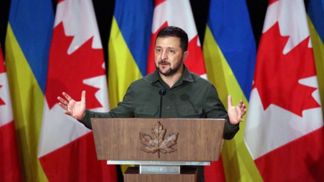
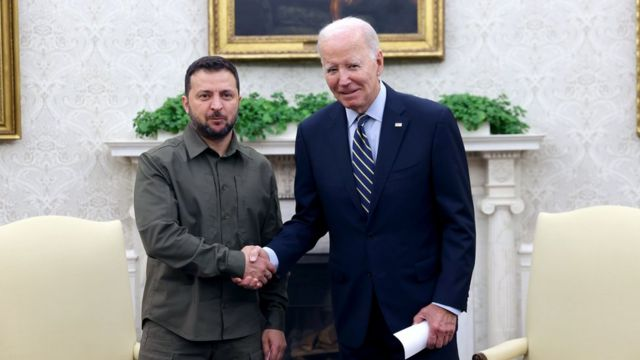
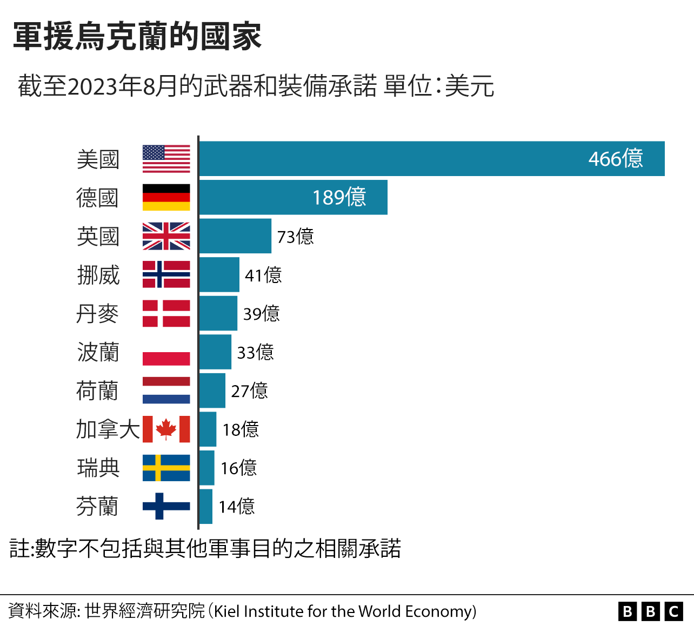

# [World] 乌俄战争：盟友自顾不暇 乌克兰如何面对空前外交挑战

#  乌俄战争：盟友自顾不暇 乌克兰如何面对空前外交挑战

  * 詹姆斯·沃特豪斯（James Waterhouse） 
  * BBC驻乌克兰记者 发自基辅 

> 图像来源，  Getty Images
>
> 图像加注文字，而即将举行的波兰、斯洛伐克和美国等盟友的大选正在让情况变得更加混乱。一些候选人正在优先考虑国内问题，而忽略了对乌克兰的军事支持。

**虽然他们的关系可能很亲密，握手可能很很坚定，但乌克兰总统泽连斯基在访问美国和加拿大期间，却要挽起袖子加码工作。**

确实，跟美国相比，加拿大的问题容易处理多了。加拿大总理贾斯汀·特鲁多已经承诺，“只要需要”就将继续支持乌克兰对抗俄罗斯的入侵，并在加国得到了跨党派的支持。

而美国能提供的援助更多，但政治情势却更复杂。泽连斯基总统刚从白宫收到新的一笔3.25亿美元军援，但这不是他一直期望的240亿美元的大款项。而且，这项军援提案在美国国会中因为预算分歧而陷入僵局。

美国财力雄厚，但其政治却复杂得多。

乌克兰总统泽连斯基从白宫获得了另一笔价值3.25 亿美元（约2.65亿英镑）的军援方案，但这并不是他一直希望的240亿美元的大笔资金。

该提案因预算分歧而在美国国会陷入困境。

而困难还不止于此。

> 图像来源，  EPA
>
> 图像加注文字，华盛顿宣布向乌克兰提供3.25亿美元（2.65亿英镑）的军事援助。

除了与美国总统拜登会谈，乌克兰领导人还与美国共和党政界人士见了面，后者正努力遏制党内不断增长的对继续支援乌克兰的疑虑。

基辅的一位政府顾问告诉我说：“我们正在保护自由世界，这应该会引起共和党人的共鸣。”

他说：“其实战争开始时更加困难，因为当时情况是一片混乱。现在，我们可以更具体地提出我们的要求，因为我们知道我们的盟友拥有什么，以及他们将其存放在哪里。我们的总统在许多国家都可以担任国防部长了！”

不幸的是，对于基辅来说，泽连斯基不是它国的国防部长，而且他面对的全球政治挑战不断增加。

Skip podcast promotion and continue reading

* BBC 時事一周 Newsweek (Cantonese)   **

BBC國際台粵語節目，重溫一周國際大事，兩岸四地消息，英國境況。並備有專題環節：〈記者來鴻〉、〈英國生活點滴〉和〈華人談天下〉。

分集

End of podcast promotion

“为什么乌克兰应该继续得到一张空白支票？胜利该是什么样子？”

这些都是这位乌克兰领导人一直试图在国际舞台上回答的问题。

这也是为何泽连斯基现在似乎是更多地在进行磋商，而非游说支持 ，原因都是为了继续得到西方盟友的帮助。

就在上周，基辅与其最忠实盟友之一的波兰，因乌克兰谷物进口的问题发生了争执。

波兰对乌克兰谷物下达进口禁令，导致泽连斯基间接指责华沙是在“帮助俄罗斯”。

这在波兰引起了极大反弹。波兰总统杜达（Andrzej Duda）形容乌克兰为“一个快要淹死的人，且也可能会拉着你一起沉入水底。”

后来，情况有所缓解。

事实上，即便是经验丰富的战时领导人，这些都是艰困的外交时刻。

而即将举行的波兰、斯洛伐克和美国等盟友的大选正在让情况变得更加混乱。一些候选人正在优先考虑国内问题，而忽略了对乌克兰的军事支持。

外交政策智库“乌克兰棱镜”的谢尔希·格拉西姆丘克（Serhiy Gerasymchuk）告诉BBC说：“在选民满意度和军事援助之间需要取得平衡，这使事情变得非常复杂。”

“乌克兰必须权衡促进其利益，使用所有可能的工具，同时考虑伙伴国家和欧盟的情况。这是一个挑战。”

这些是俄罗斯领导人普京不需要担心的类似“民主周期”问题，但这也是为何基辅试图将这场战争描述为不仅是为其主权而战，而且是为民主本身而战。

“这场战争在道德方面意涵巨大，”这位顾问说。

当下情况类似于前苏联解体后，乌克兰、俄罗斯、美国和英国在1994年签署的布达佩斯协议（Budapest Memorandum）。

彼时乌克兰同意放弃了其领土上遗留的前苏联核武器，以换取其他签署国尊重并保护其领土完整的承诺。

九年后，俄罗斯的入侵使这一切变得像是一个违背诺言的协议。

基辅还试图玩更长远的游戏，尝试更好地与巴西和南非等国家接触，这些国家对俄罗斯的入侵一直漠不关心。

这也是一种无法即时带来战果的策略。

乌克兰政府顾问告诉BBC说：“的确，我们依赖前线的成功。”

他向记者强调，媒体都过于简化了乌克兰的反攻，也就是过于关注了战争前线，但那里的战果微乎其微。他认为外界忽略了基辅对克里米亚导弹袭击，以及攻击俄罗斯战舰所取得的实质战果。

乌克兰一直声称其反攻“不会仓促”。

但是，随着这场战争的政治与战争的连结越来越高， 乌克兰的战略受到了前所未有的考验。

_**汉娜·乔若斯（Hanna Chornous），尹赛佛·阿巴斯（Insaf Abbas）和安娜·齐巴（Anna Tsyba）协同参与了这篇报导。**_

