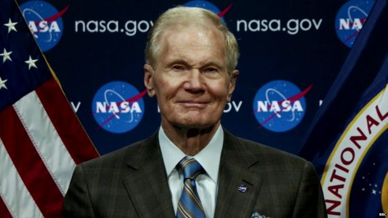

# [World] 中美竞争激发太空科技投资

#  中美竞争激发太空科技投资

  * 乔纳森·约瑟夫斯（Jonathan Josephs） 
  * BBC商业事务记者 

> 图像来源，  Getty Images
>
> 图像加注文字，SpaceX火箭被用于运载私人太空登上国际空间站

**美国太空总署（NASA）署长比尔·纳尔逊（Bill Nelson）表示，美国正在“与中国处在重返月球的太空竞赛中”。**

纳尔逊在接受BBC采访时表示，他想要确保“我们率先到达那里”。

他的言论唤起了1960和1970年代的回忆，当时美国太空总署与苏联展开太空竞赛。但是如今半个世纪过去了，美国太空总署有很多的工作已经是雇用私营企业来完成。

纳尔逊表示，这些公司至关重要，因为它们令巨额成本的分担得以实现，并且让太空总署可以利用“私营领域企业家的创造力”。

他提到伊隆·马斯克（Elon Musk）的太空探索技术公司（即SpaceX）。该公司在2021年获得了30亿美元（24亿英镑）的合同，用以建造月球登陆器，而且也开发了迄今为止最强大的火箭。

其他一些私营企业也感觉到了太空竞赛所带来的益处。今年早些时候，美国太空总署与杰夫·贝索斯（Jeff Bezos）的蓝色起源公司（Blue Origin）签署了一项34亿美元的协议——同样是要建造登陆器，但是将用于后续的月球登陆。

这只是受益于数十亿美元政府资金的其中两家公司而已。花费这些资金，至少在一定程度上是为了要在全球最大的两个经济体之间更广泛的紧张关系之下试图领先中国。

> 图像加注文字，NASA署长纳尔逊表示，美国正在与中国竞争率先回到月球

8月末，印度成为第四个在月球实现软着陆的国家，也是第一个到达月球南极地区的国家。

尽管印度取得了一些成功，但是美国太空总署最密切关注的还是中国的太空计划。

中国是唯一拥有自己太空站的国家，它已经将月球样本带回地球，并有计划抵达月球表面的两极地区。

这令纳尔逊感到担忧：“我担心的是，我们在月球南极发现了水，而中国到达那里，然后说这是我们的领地。你不能来这里，这是我们的。”

纳尔逊声称，中国通过建造人工岛来对南中国海部分区域宣示主权的举动，印证了他的担忧。

纳尔逊还指出，中国没有签署美国牵头的《阿尔忒弥斯协定》（Artemis Accords），该协定旨在成为太空和月球行动最佳的实践框架。

中国表示自己致力于 和平探索太空  ，此前曾驳斥美国对其太空计划的担忧，称其为“构陷污蔑中国正常合理的外空事业”。

这场竞争推动了美国太空总署的巨额投资。该机构称，至2021年9月底前的一年，其支出对美国经济的贡献价值为712亿美元——比之前一年增长了10.7%。

在SpaceX这样的大公司吸引媒体关注的同时，美国太空总署的支出在经济领域触及的范围要更深远得多。

“我们开支的四分之一都会流向小型企业，”纳尔逊说。

美国太空总署前工程师、哈佛商学院现任航天经济学家西尼德·奥沙利文（Sinead O'Sullivan）指，这笔资金能够加速小型企业的发展，尤其是初创企业。

她表示，政府经常会作为初创企业的首个客户，而这些合同又能够让它们接触到私人投资者，进一步筹集到更多的资金。

奥沙利文女士表示：“我们经常谈论创业投资和私募股权，但是政府同样重要，甚至可能更重要。”

##  更多关于太空探索的报道：

重返月球的竞赛或许备受关注，但是它也已经帮助带动了其他一些利润高得多的太空活动的爆炸式增长。

1957年，苏联成为第一个将卫星送入轨道的国家，当时它与美国展开了最初的太空竞赛。据欧洲空间局（European Space Agency）称，现在有超过10500颗卫星绕地球运行。

投资公司“太空资本”（Space Capital）创始人查德·安德森（Chad Anderson）将过去十年的产业发展归功于SpaceX。

“我们现在将太空作为一种投资类别来谈论，唯一的原因就是SpaceX，”他说，“10多年前，在它们第一次商业飞行之前 ，整个市场都是由政府统领的。”

根据分析公司“布莱斯科技”（BryceTech）的数据，现在处在运行轨道上的卫星当中，有大约一半是在过去三年中发射的。

这主要归功于两家公司：OneWeb和伊隆·马斯克的星链（Starlink）。

“太空经济远比只是火箭和卫星硬件广泛得多。它是我们全球经济看不见的支柱，”安德森解释说。

他说，随着上轨道运行的卫星数量不断增加，越来越多的企业不断发现卫星提供数据的新用途，包括农业、保险和海事产业。

> 图像来源，  Getty Images
>
> 图像加注文字，火箭实验室创始人彼得·贝克认为，太空探索是价值千亿美元的产业

总部位于新西兰的火箭实验室公司（RocketLab）是太空经济的另一股重要力量。

作为SpaceX的竞争对手，该公司已经为包括美国太空总署和一些美国政府机构在内的客户完成了40次发射。

该公司创始人彼得·贝克（Peter Beck）从洗碗机工程师变成将火箭送入太空的人。他表示，说到地球之外的金融商机，这还只是冰山一角。

“发射是一个价值100亿美元的机会。然后有基础设施，比如建造卫星，这是一个价值约300亿美元的机会。然后又有应用，这是一个价值8300亿美元的机会。”

他并非是唯一提出大胆主张的人。美国投资银行摩根士丹利（Morgan Stanley） 估算  ，全球太空产业到2040年可能增长至每年超过1万亿美元。

未来的太空飞行私营企业可能面临的是什么?

对于月球上的机会，特别是采矿业，贝克持谨慎态度。

“目前，去月球开采并将矿带回地球，在经济上是不可行的，”他说。

美国太空总署的比尔·纳尔逊则看到医学研究上的可能性。他提到了制药公司默克（Merck）于2019年在国际空间站上所进行的 晶体增长研究  ，该研究有助于发展癌症治疗技术。

他还表示，在零重力状态下，或许能够更有效地制造光纤。

“最终，你将会看到近地轨道上有很多的商业活动。”

