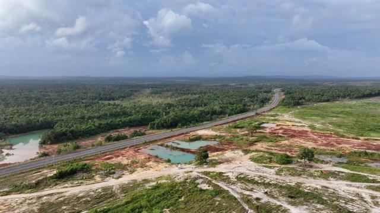
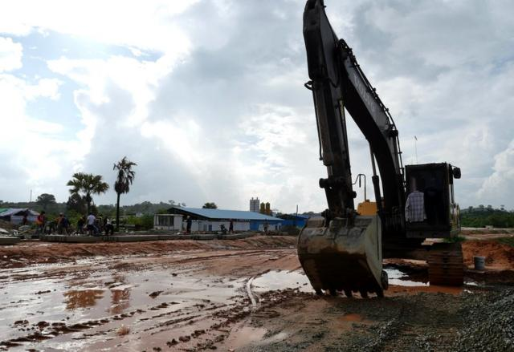
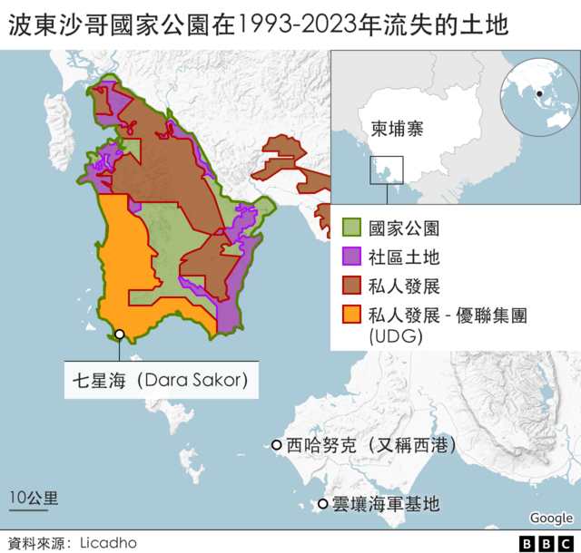
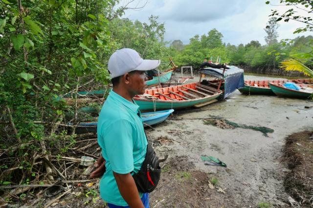
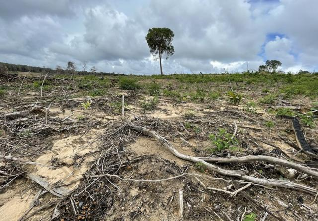
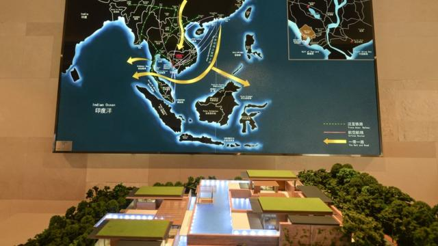
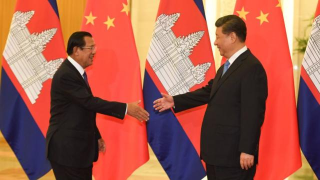
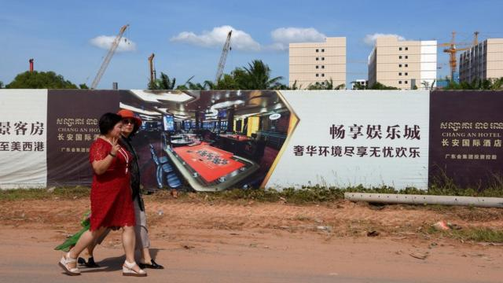
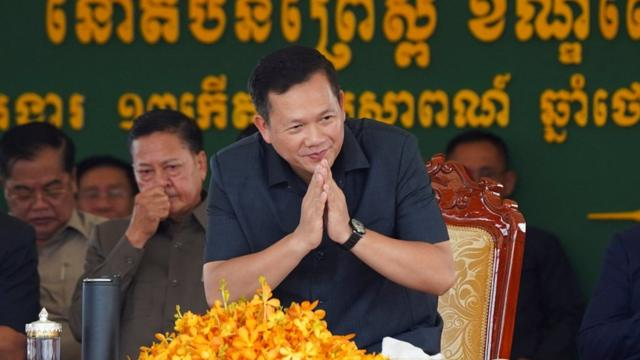

# [World] “一带一路”下的“中国租界”：柬埔寨七星海特区幕后的中国企业

#  “一带一路”下的“中国租界”：柬埔寨七星海特区幕后的中国企业

  * 曼谷分社 
  * BBC 

> 图像来源，  BBC/ Benjamin Begley
>
> 图像加注文字，柬埔寨七星海特区还是大片荒地

**柬埔寨七星海特区是“一带一路”的重点项目之一，被一些人称为“中国式殖民地”，反映了洪森政权与中国政府及企业千丝万缕的利益交织。BBC记者深入当地，发现随着中国经济出现危机和资金链断裂，该项目已经近乎停滞，但对当地居民和环境的影响难以逆转。**

高速公路穿过森林，延伸到海边，通往全球最大的旅游项目之一。

位于柬埔寨南部的七星海（Dara Sakor）滨海旅游度假特区已签约15年，仍然进展甚微。

这是一家中国公司的宏伟规划，旨在建造自成一体的旅游城市。有人称之为“中国式殖民地”，开发企业称之为“盛宴和狂欢”的场所，配有国际机场、深海港口、发电站、医院、赌场和豪华别墅。

机场还在兴建，一座结合五星级酒店和公寓的赌场孤零零地坐落在海边，旁边是尚未完工的道路，周围是建筑工地。

作为旅游项目，这里才刚刚起步，但它已经破坏了自然环境，并影响成千上万的本地居民。

中国在柬埔寨的经济足迹令其他国家相形见绌，当地一半的直接投资和大部分的对外援助来自中国。

柬埔寨积极响应中国的“一带一路”倡议，该政策由中国国家主席习近平提出，旨在把中国建设和投资的基础设施扩展到世界各地。这当中很多是有效益的，也有很多投资显得投机、仓促和规划不当。

与七星海隔海相望的西哈努克（Sihanoukville，又称西港）以前是宁静的海边小镇，在短短几年转型成规模庞大的建筑工地，以满足中国人对赌场的需求。

这助长了犯罪浪潮，博彩业在新冠疫情期间经济崩溃，镇上到处都是建了一半的空塔楼。七星海项目有充分理由会重蹈覆辙。

“这就像是没有面粉的烘焙。”亚利桑那州立大学的柬埔寨学者索法尔·亚尔（Sophal Ear）说。

“你不能依靠不可持续的做法去实现可持续发展。中国的房地产泡沫怎麽办？中国打喷嚏，柬埔寨就会感冒。”

##  洪森式发展

> 图像来源，  BBC/ Jonathan Head
>
> 图像加注文字，七星海项目进度非常缓慢

七星海是柬埔寨前首相洪森首肯的开发项目。

该项目规模庞大，但项目初期几乎完全保密。BBC发现，项目对居民或环境的影响评估极少。

参与项目的中国公司也几乎没有提供任何关于自己的信息，部分公司的记录令人生疑。该项目还让国际社会质疑中国在柬埔寨这个地区可能另有企图。

中国在援助和投资方面“无需解释”的态度吸引了洪森，洪森以强人自居，在上世纪90年代结束了柬埔寨长达30年的内战和革命后，他推动柬埔寨飞速发展，领导其赶上邻国。

但实现这种程度的经济增长很大程度是通过给予亲信和外国公司慷慨的优惠政策，特别是大片租地。

“柬埔寨没有制度规章，”《洪森领导下的柬埔寨》作者塞巴斯蒂安·斯特兰吉奥（Sebastian Strangio）说。“这个体制依靠的是保持让有权势的人满意。”

七星海项目可追溯到2008年初，当时位于天津的民营企业优联集团（UDG）以100万美元押金获得99年租约，那是柬埔寨法律允许的最长租期。该公司取得最初36000公顷的开发权後，又追加了9000公顷。

UDG在十年内无需再支付任何费用，此后每年只需支付区区100万美元——对于占据柬埔寨整个海岸线五分之一的控制权而言，如此慷慨的安排让人讶异。

由于这块土地位于波东沙哥国家公园（Botum Sakor National Park）内，且大大超出了任何单个项目都不得超过一万公顷的法定限制，如果外界知悉此事肯定会引起很大争议。

但由于当时没有公布该笔交易的资料，柬埔寨媒体也没有对此进行讨论。

> 图像来源，  BBC/Jonathan Head
>
> 图像加注文字，有12个村庄的居民因为七星海项目流离失所，包括索姆·缇的一家。

当地渔民索姆·缇（Som Thy）骑着摩托车带BBC记者穿过森林中的沙路，来到UDG占地内他以前居住的地方。大部分树木已砍伐殆尽，剩下几棵孤零零的巨树依然矗立，周围是荒芜的废墟。

非政府组织全球森林观察（Global Forest Watch）指出，自2008年以来，该国家公园已流失近两成的原始森林。千余个家庭被迫离开家园，索姆·缇的家庭就是其中之一。

“看到这里杂草丛生，我就很想哭。”他眺望着曾经的家园和稻田说。果园里还剩下几棵腰果树，那是他家过去用来帮补耕种和捕鱼收入的。

有12个村庄的居民因为七星海项目流离失所，和他们一样，索姆·缇也在2009年搬到了该公司在离海岸几公里处建造的一座小木屋。

最初几年曾发生多次抗议活动，如今，索姆·缇仍是拒绝接受企业赔偿方案的少数人之一。

他说，他们无法靠分到的小块土地谋生，该公司赔偿的金额只是他们原有土地实际价值的一小部分。

他有时会偷偷回到七星海区域开船出海捕鱼，他还曾赴泰国寻找工作机会。他抗议者的身份，让他无法像他弟弟那样在赌场周边的建筑工地找到工作。

UDG为投资者制作了华丽的宣传册，上面充满美好的画面，包括修剪整齐的高尔夫球场、整齐划一的别墅和享受海滨休闲的幸福家庭等。还有一些复杂的地图，将这个度假模范城的各个部分绘制在一起，包括科技教育新城片区、世贸城市中心和山林雅居片区。

> 图像来源，  BBC/ Lulu Luo
>
> 图像加注文字，波东沙哥国家公园自2008年开始流失了五分之一原始树林

这一切都与今天的景象相去甚远，我们看到的是荒芜的树林、流离失所的居民，以及还没建好的道路和建筑。

中国环保组织永续全球环境研究所（Global Environmental Institute, 简称GEI）曾在2016年发表关于七星海的报告，报告指出该公司未发布按照柬埔寨法律要求进行的环境影响评估。

该组织也找不到任何资料，说明受保护的森林区是如何被划定为开发区。GEI表示，它已向UDG表达了担忧。

“他们没有回应这些疑虑。”项目主任季琳告诉 BBC。

“他们还是坚称已遵守当地相关法律法规。他们还看不到问题所在。这种行事风格对中国的形象有很负面的影响，很多国家会认为中国公司只是来掠夺资源。中国企业在海外缺乏处理当地不满的意识和能力。在中国，这些不满地方政府都会帮忙处理掉，但在国外完全是两码事。对中国企业来说，这还是个学习的过程。”

##  追逐中国影响力

> 图像来源，  Getty Images
>
> 图像加注文字，七星海项目的宣传图片

该项目的庞大规模也惊动了美国。

2020年，美国财政部宣布制裁UDG，理由不仅包括驱逐村民侵犯人权，也因为中国建造的新机场可能有军事用途。对于这个偏远旅游地点来说，新机场跑道远超小型客机所需的长度。

美国已对西哈努克附近的云壤海军基地表示担忧，该基地正由中国政府出资升级改造，华盛顿认为中国海军将来可能会使用该基地。

习近平在经济规划中强调“军民融合”，以及官方要求中国海外项目达到军用标准，都让美国对中国建造的基础设施越来越不安。

制裁声明称：“中华人民共和国利用UDG在柬埔寨的项目推进其在全球展示实力的野心。”

UDG称制裁无理，指美国的行动是基于“部分势力捏造事实，散布造谣”，并称其“始终严格遵守柬埔寨相关法律法规及合同约定”。

该公司称，如此大规模地修建机场是为了使七星海成为“全球交通枢纽”。该公司还提出了一些雄心勃勃的目标，其官网称，到了2030年将拥有130万长期居民，每年有近 700万游客到访，并为100万人提供就业机会。

上述数字很惊人，目前柬埔寨全国的游客人数仍未恢复到2019年的600万人次的高峰。

UDG也很不满美国政府将其描述为国有企业，该公司强调自己是民营企业。

> 图像来源，  Getty Images
>
> 图像加注文字，2019年4月29日柬埔寨时任首相洪森在北京与习近平会面

这可能是事实，但从项目的最初阶段开始，中国政府就给予大力支持。

作为中国最高经济规划机构的国家发展和改革委员会（发改委），甚至在交易签署前就已批准项目，并继续对其进行监督。时任天津市委书记张高丽也很早就参与其中，2008年底曾到柬埔寨出席签约仪式。

张高丽后来晋升为中国最高级别的领导人之一，2015年起负责“一带一路”倡议。虽然七星海项目比“一带一路”早了五年，但官方现在称它为“一带一路”倡议的重点项目。

UDG还与柬埔寨执政党高层建立了密切关系，它曾多次向洪森夫人文拉妮（Bun Rany）管理的柬埔寨红十字会捐赠大额款项，并出资一百万美元建造一座纪念洪森功绩的纪念碑。

该公司与柬埔寨前国防部长狄班（Tea Banh）关系尤为密切，他领导该国最有势力的政治派系之一。

UDG的公开财务资料非常少，外界很难评估其运营大型项目的能力。

在七星海为数不多的已知投资，是2017年由中国国家开发银行承销的债券发行。但那只是1500万美元，与UDG承诺投资的近40亿美元相比只是九牛一毛。

而现在，UDG的主导地位似乎已被另一家公司中国城市建设控股集团（中城建）取代。2014年，出于尚不清楚的原因，中城建介入了七星海项目，当时该公司在中国之外几乎无人知晓。

中城建高层目前在UDG担任领导角色，该集团表示，是中城建而不是UDG负责“该旅游特区规划和开发总体方案的设计”。

##  泡沫爆破

> 图像来源，  Getty Images
>
> 图像加注文字，中国企业在柬埔寨西哈努克港大量兴建赌场，但这里也成为诈骗集团的犯罪天堂。

中城建是一家国有企业，也是一家问题企业。

该集团本来由中国住建部管辖，2016年突然宣布根据政府命令私有化，被知名度低的惠农投资基金接管。

这个消息在香港金融市场引起了动荡，让购买了数亿美元中城建“点心债”的投资者惊恐失措，点心债是为规避中国资本管制而在香港发行的债券。他们试图赎回债券，但中城建无法筹集足够的现金支付。

中城建财务状况持续恶化，信用评级受损，并被迫出售一些较有前景的业务。

另据披露，2016年接管中城建的基金公司惠农由财政部间接拥有，这使得中城建在严格意义上再次成为国有企业。这种不透明性让外界很难评估中城建的真实财务状况，而中城建很可能受到近期中国房地产市场崩盘的影响。

“在2014到2016年‘一带一路’倡议提出之初，中国对外投资出现了一段狂潮。”加州大学圣地亚哥分校21世纪中国中心主任史宗瀚（Victor Shih）说。“但到了2016年，中国政府变得更加谨慎。他们不再在投资上一掷千金，或者在批准项目时干脆利落。”

七星海（Dara Sakor）的另一位投资者是中国企业家佘智江（She Zhijiang），他因在泰缅边境经营赌场而声名狼藉，当地曾发生大规模人口贩卖和诈骗罪案。他目前在泰国被囚，等待引渡回中国。

有来自泰国、台湾和菲律宾的受害者说，他们被强行关押在七星海项目园区的诈骗中心，需要救援。

柬埔寨的中国投资园区有诈骗中心的消息吓怕了中国游客，这让作为当地经济支柱的旅游业复苏缓慢。

> 图像来源，  Reuters
>
> 图像加注文字，洪森之子洪玛奈接任成为柬埔寨新首相

但塞巴斯蒂安·斯特兰吉奥认为，柬埔寨新首相洪玛奈（Hun Manet）不太可能改变做法。他是洪森儿子，曾在西方接受教育。

“他将被这个体制绑架。他权力有限，即使他希望这样做，也无法控制其过度行为。”《洪森领导下的柬埔寨》作者塞巴斯蒂安·斯特兰吉奥说。

上周，洪玛奈在接替其父的首相职位仅一个月后就访问北京与习近平会面，并向他保证中柬关系坚如磐石。

事实上，七星海只是该地区几块大型土地特许经营权中的一块，当中大部分都给了与执政党关系密切的柬埔寨当地企业。

柬埔寨沿袭已久的掠夺式经济发展模式让既得利益集团拥有绝对力量，这同时也导致这种发展模式本身很难被改变

目前，这座国家公园八成的土地都在进行商业开发，环保人士一再警告却无人理睬，他们担忧柬埔寨即将失去其中一个最重要的自然栖息地。

其中一位环保人士是一位20多岁的女性，她和BBC记者同行来到七星海。她2021年因企图组织抗议另一宗土地侵占案被判囚18个月，目前正在保释中。

她冒着很大风险和我们来到UDG租赁地。她看着荒芜的森林说：“我们别无他选。”

“我们必须冒着坐牢或更糟的风险，努力保护留给下一代的东西。”

