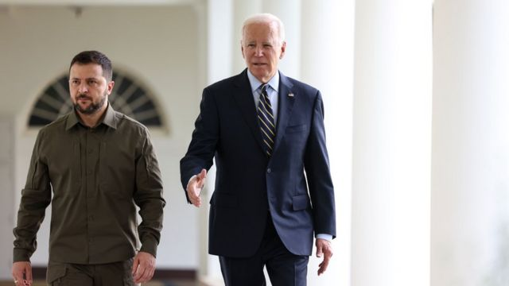
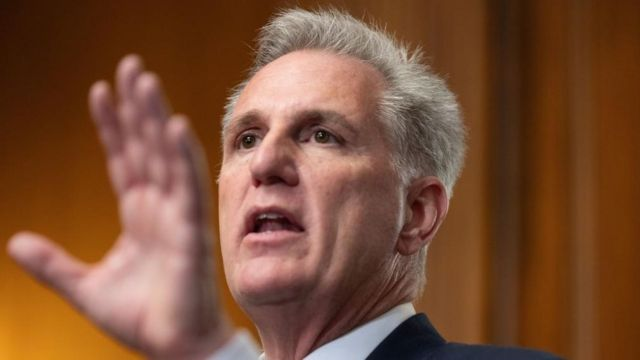

# [World] 美国国会通过临时拨款法案避免政府停摆，但剔除乌克兰援助资金

#  美国国会通过临时拨款法案避免政府停摆，但剔除乌克兰援助资金

> 图像来源，  EPA

**美国政府10月1日的停摆大限前夕，参众两院在最后一刻通过短期拨款法案，总统拜登午夜前签署生效，让联邦政府避过了关门危机。**

这项法案为期45天，让联邦支出维持在现时水平，可以运作至11月17日。拨款保留了自然灾害援助开支，但剔除了此前提出的一笔60亿美元援助乌克兰资金。

两党议员无法就乌克兰援助问题达成共识，民主党人支持援乌，但部分共和党人反对，认为强化边界等国内议题才是首要任务。自2022年2月24俄乌战争爆发以来，美国已向乌克兰提供超过750亿美元援助。

拜登在参议院投票后发表声明指，尽管众议院议长麦卡锡（Kevin McCarthy）和国会绝大多数人坚定支持乌克兰，“但在这份协议中没有新的拨款来继续体现这种支持，我们在任何情况下都不能允许美国对乌克兰的支持出现中断”。

参议院领导层的两党成员罕有地发表联合声明，承诺未来数周内确保美国政府继续向乌克兰提供支持。

一位白宫官员对哥伦比亚广播公司（CBS News）表示，“我们完全可以预见，已经表示支持拨款援助乌克兰抗击俄罗斯非法入侵的麦卡锡议长，将很快向议会提交一份单独的议案”。

> 图像来源，  EPA-EFE/REX/Shutterstock
>
> 图像加注文字，众议院议长麦卡锡面对共和党内强硬派压力

美国国会此前就拨款问题陷入僵局，若无法在10月1日新财政年度开始前通过拨款，政府就要关门，数以百万计雇员停薪及大量公共服务暂停。

共和党籍的众议院议长麦卡锡於停摆限期前一天，抵住党内强硬派的阻力抛出新提案，依赖民主党人的支持在众议院以335票赞成、91票反对大比数通过。在反对票当中，有90票来自共和党。

同日，法案送交民主党控制的联邦参议院表决，以88票对9票通过。

民主党籍参议院多数党领袖舒默（Chuck Schumer）在投票结束后说：“美国人民可以松一口气了：今晚政府不会关门。” 他指，避免政府关门的唯一方法是两党合作，很高兴麦卡锡最终听取了民主党的意见。

但麦卡锡依靠民主党的票数通过法案，此举被认为踩到共和党内红线。

部分党内极右派议员包括盖茨（Matt Gaetz）扬言会推案罢黜麦卡锡的议长职位，麦卡锡则回应指“放马过来”，“这个房间里总要有个成年人”，强调自己必须冒着丢掉工作的风险捍卫美国人民。

由于这次临时拨款的有效期只有45天，11月17日前若未能通过全年性的拨款法案，美国政府将再度面临停摆危机。分析认为，两党在政府开支政策上的根本分歧尚未解决，这场闹剧很可能在不到七周内再次上演。

美国政府自1981年开始曾停摆十次，对上一次是在特朗普任內的2018年12月21日，长达34天才结束，打破了历史记录。

