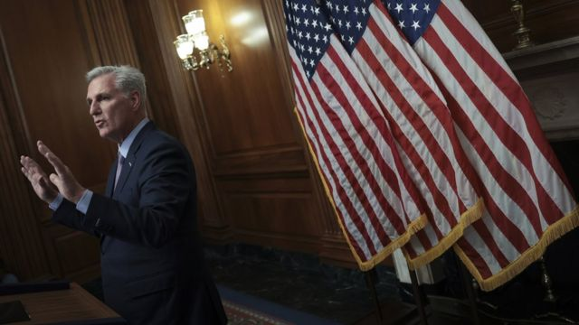
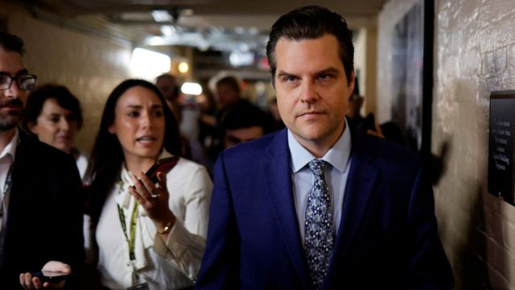

# [World] 麦卡锡议长遭逼宫：美国国会众议院历史性表决罢免共和党领袖

#  麦卡锡议长遭逼宫：美国国会众议院历史性表决罢免共和党领袖

  * 安东尼·泽克尔（Anthony Zurcher）、山姆·卡布拉尔（Sam Cabral） 
  * BBC记者 华盛顿国会山庄报道 

> 图像来源，  Getty Images
>
> 图像加注文字，麦卡锡被解职后公开斥责其政治死敌马特·盖茨“公报私仇”。

**凯文·麦卡锡（Kevin McCarthy）在一场右翼叛乱中被推翻——这是史上首次有美国众议院在不信任投票中落败。**

在共和党占多数的国会下院中，这位加利福尼亚州议员最终被以216比210票罢免。

在他与参议院民主党人于上星期六（9月30日）就政府拨款达成协议后，极端保守派策动叛变。

至于由谁来监督众议院的共和党多数，目前并无明确人选。国会只余下40多天寻求达成协议，避免又一次政府停摆危机。

星期一（10月2日）晚间，特朗普（Donald Trump）盟友——佛罗里达州联邦众议员马特·盖茨（Matt Gaetz）——提起了所谓的“罢黜动议”（motion to vacate）来逼宫麦卡锡，这是一件极少被动用的程序工具。

他指控议长在周末期间各方谈判避免政府部分关停之际，与白宫缔结秘密协议继续资助乌克兰。麦卡锡否认指控。

星期二（3日）晚间，在丢官后的一场共和党议员私人聚会上，麦卡锡告诉同僚们他不打算再次竞逐议长席位。

他继而把矛头指向其政治死敌马特·盖茨，指责他博取关注。

麦卡锡在新闻发布会上告诉记者：“你们都知道这是公报私仇，跟开支预算一点关系都没有。”

> 图像来源，  Reuters
>
> 图像加注文字，马特·盖茨（Matt Gaetz）带领共和党内激进保守派逼宫麦卡锡。

他说盖茨在内斗持续之际发出筹款电邮“不是一位国会议员的应有作为”。

麦卡锡补充说，对他逼宫的强硬派人士“并非保守派”。

经历了议事厅内艰苦的15轮表决，他才刚在1月当上议长。盖茨等右翼人士当时拒绝支持他。

星期二午间的表决中，只有八名共和党人投票支持革除麦卡锡。他获得210名议员支持，全部是共和党人。

但民主党人与共和党的叛逃者联手，逼宫议长。

反麦卡锡票中令人意外的一票，来自一位温和派共和党人南希·梅斯（Nancy Mace）。

这位南卡罗莱纳州议员事后称：“我希望看到的是一位敢于向美国人民道出真相的议长，对国会是诚实可靠的，对两党皆是如此。”

民主党众议院党团领袖哈基姆·杰弗里斯（Hakeem Jeffries）此前发函同僚称，他不会投票救麦卡锡一命。

来自西北部华盛顿州的民主党左翼议员普拉米拉·贾亚帕尔（Pramila Jayapal）在表决前告诉媒体记者：“让他们在无能的猪圈里打滚吧。”

> 图像来源，  Getty Images
>
> 图像加注文字，民主党众议院党团领袖哈基姆·杰弗里斯（Hakeem Jeffries）公开拒绝救助麦卡锡。

共和党以221人对212人的些微优势控制众议院。在议员们等待记名投票结果之际，人山人海的议事厅里鸦雀无声。

阿肯色州共和党人史蒂夫·沃马克（Steve Womack）宣告：“兹宣布众议院议长席位悬空。”他敲下法槌，场内叹息之声清晰入耳。

当天稍早，前美国总统特朗普在社交媒体发帖称，共和党人应“跟激进左翼民主党人做斗争”，而非自相残杀。

支持麦卡锡的北卡罗来纳州共和党人帕特里克·麦克亨利（Patrick McHenry）成为了代理议长。他敲响法槌，宣布众议院休会一周。他会否拥有全面职权，还是仅有行政权力与主持新议长选举的能力，目前仍不清楚。

议事规则并无定明代理议长任期可持续多久，但新议长选举目前计划在10月11日举行。

路易斯安那州共和党人史蒂夫·斯卡莱斯（Steve Scalise）与明尼苏达州共和党人汤姆·埃默（Tom Emmer）已被点名为取代麦卡锡的潜在竞争者，但两人均未表态有兴趣竞逐席位。

> 图像来源，  Getty Images
>
> 图像加注文字，南希·梅斯支持罢免麦卡锡令人意外。

白宫新闻秘书卡琳·让—皮埃尔（Karine Jean- Pierre）在一份声明中说，总统拜登希望众议院能尽早选出新议长，并指出“国家在面对着的种种挑战不会等人”。

上两位共和党籍议长——保罗·瑞安（Paul Ryan）与约翰·博纳（John Boehner）——均是在跟党内保守派同僚纠缠不清之下离开国会。

过去一个世纪里，所谓的“罢黜动议”只曾被动用过两次——2015年与2010年——以图革除议长，但直到星期二为止，从未成功。

**补充报道：凯拉** **·** **爱泼斯坦（** **Kayla Epstein** **）、麦克斯** **·** **马兹查（** **Max Matza** **）**

