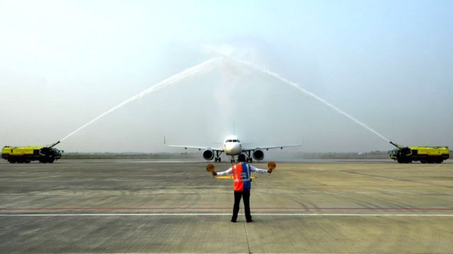
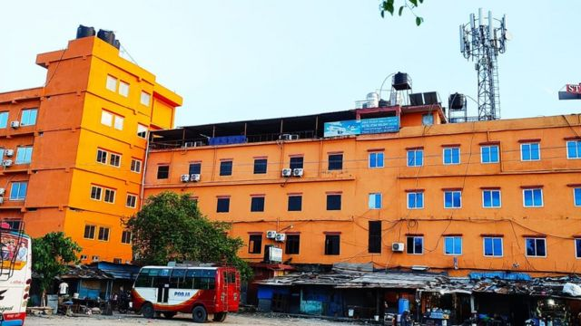
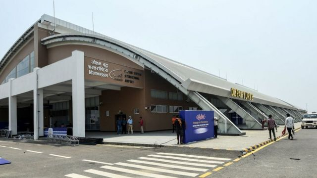

# [World] 中印交恶令尼泊尔机场难以发展国际航线

#  中印交恶令尼泊尔机场难以发展国际航线

  * 安巴拉桑·埃希拉扬（Anbarasan Ethirajan） 
  * BBC记者 

> 图像来源，  Getty Images
>
> 图像加注文字，尼泊尔的佛陀机场在2022年5月启用，但是至今到访的旅客非常少。

**这座亮橙色调的酒店，从肉眼可见的最远处就已经很醒目，但对于酒店老板比什努·沙尔马（Bishnu Sharma）来说，不幸的是，几乎就没什么人来这里欣赏它。**

这是尼泊尔的蓝毗尼（Lumbini）——佛陀的诞生地，从他的酒店可以看到美得令人窒息的山景。

可是，期望中游客人数大增的景象却没有出现，这一部分是由于尼泊尔的两个邻近大国印度与中国之间的紧张关系。

根据蓝毗尼发展信托（Lumbini Development Trust）的数据，2022年蓝毗尼接待了近100万游客——而政府斥资7600万美元（6100万英镑）兴建去年5月启用的佛陀国际机场（Gautam Buddha International Airport），正是要押注在这样的数字上。

大部分都访客是本国游客，仅有不到三分之一是来自邻国印度。

这个机场也被称为帕伊拉瓦机场（Bhairahawa Airport），它让游客可以直飞蓝毗尼，而不是从首都加德满都经过250公里（155英里）的陆路旅行才到达。

然而，预想中的旅游业繁荣却没能实现，一些旅游业专家认为这是由于早期推广和对国际航班的激励不足造成的。

“政府要求我们扩大旅游基础设施，声称会有更多的国际航班到来，可是我的酒店有三分之二的房间都是空着的。我现在偿还贷款很吃力，”沙尔马告诉BBC说，他欠下的债务有数百万卢比。

> 图像来源，  BBC/Anbarasan Ethirajan
>
> 图像加注文字，在蓝毗尼，像这座假日星酒店一样的旅游设施，曾寄望有大量游客前来。

旅游业专家认为，假如帕伊拉瓦机场有定期的国际航班编排，旅客就会增加，特别是海外的旅客。

但是，尼泊尔官员表示，德里方面已拒绝允许大型客机经过其领空西飞，这意味着飞机无法从印度上空飞越然后抵达佛陀机场。能够使用印度领空意味着航班用时更短，成本更低。

尼泊尔的一些人也认为，德里方面对佛陀机场是由中国的西北民航机场建设公司建造一事持有戒心。

机场的位置也是在尼泊尔与印度接壤边界附近——就在两个亚洲大国的军队去年12月在阿鲁纳恰尔邦地区 冲突的地方  以西，当时机场刚开放国际航班七个月。

> 图像来源，  Getty Images
>
> 图像加注文字，尼泊尔对通往佛陀出生地的机场下了重注。

2020年，印度和中国之间的一次重大冲突造成至少20名士兵死亡。争端的核心是一条未定义且划分不清的为3440公里（2100英里）长边界线，被称为实际控制线或“LAC”。

河流、湖泊和积雪等的存在意味着边界线可以变动。世界上其中两支最大的军队，士兵在许多地方出现面对面对峙。

边境局势反映出持续升级的政治紧张局势，印度总理纳伦德拉·莫迪和中国国家主席习近平之间的关系充满张力。

观察人士表示，谈判是唯一的出路，因为这两个拥有核武器的国家都有很多潜在的损失。两国之间只曾进行过一次战争，即1962年，当时印度遭受了一次令人耻辱的失败。

佛陀机场原本应是尼泊尔发展运输、减轻加德满都负担的一个关键——首都多年来一直是其唯一的国际交通门户。加德满都机场非常繁忙拥护，而且2015年曾因一次强烈地震而短暂关闭。

还有第三个国际机场在波卡拉（Pokhara）——这个能看到安纳普尔纳峰（Annapurna）壮丽景色且以探险运动著称的小镇，也面临着与帕伊瓦纳机场相似的难题。

自去年1月投入使用以来，这座凭2.15亿美元的中国贷款建造起来的机场，除了从成都来的包机航班运送中国官员和游客外，没有迎来过任何国际航班。

目前，佛陀机场和波卡拉机场每天合计有80至85个国内航班，但专家表示，这些航站楼需要有相当数量的国际航班才能维持运营。

> 图像来源，  Getty Images
>
> 图像加注文字，被认为是佛陀诞生地的蓝毗尼是尼泊尔的一处旅游热门地。

“我认为仅仅靠国内航班无法令这两个机场能够经营下去。没有定期的国际航班，还贷款可能会有困难，”尼泊尔民航总局前局长特里·拉特纳·马南德哈尔（Tri Ratna Manandhar）说。

波卡拉国际机场首席执行官比克拉姆·拉吉·高坦（Bikram Raj Gautam）表示，尼泊尔需推动“积极外交”，说服印度等国开放其领空给飞往尼泊尔的商业航班。

专家表示，既然德里目前的限制令给西边的交通带来阻碍，尼泊尔也可以考虑吸引来自东边的游客，比如来自泰国、日本和柬埔寨的游客。

尼泊尔航空公司（Nepal Airlines）刚刚开通了从帕伊拉瓦到吉隆坡的每周航班——这应该能向其他航空公司发出积极的信号，佛陀国际机场的主管迪帕克·巴杰拉查亚（Dipak Bajracharya）向BBC表示。

但是，尼泊尔旅游和民航部长苏丹·基兰提（Sudan Kiranti）仍然乐观，认为能够与德里达成解决方案——且很快有结果。

“我们与印度官员和外交官有持续的接触和对话，”他向BBC表示，“他们非常积极。”

_***苏伦德拉·普亚（Surendra Phuyal）在加德满都参与报道**_

