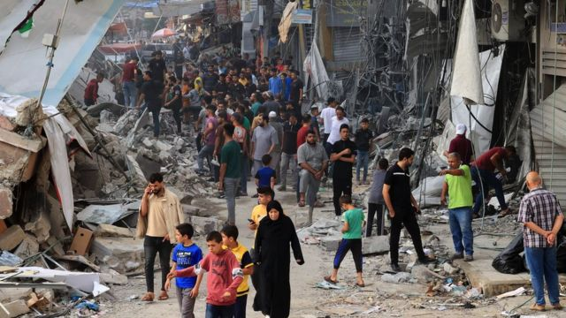
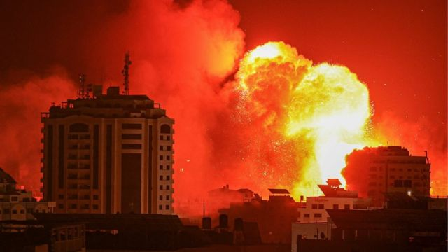
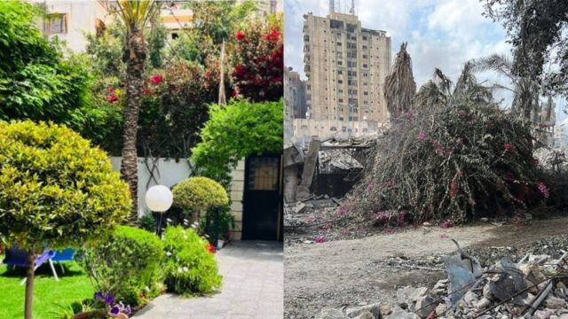
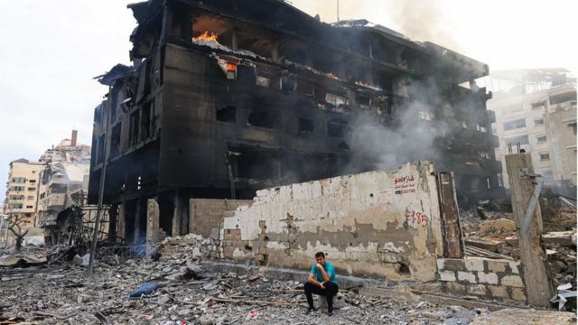
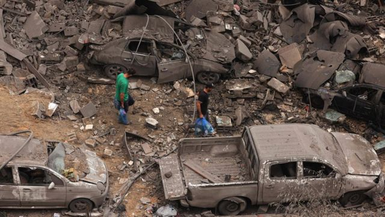
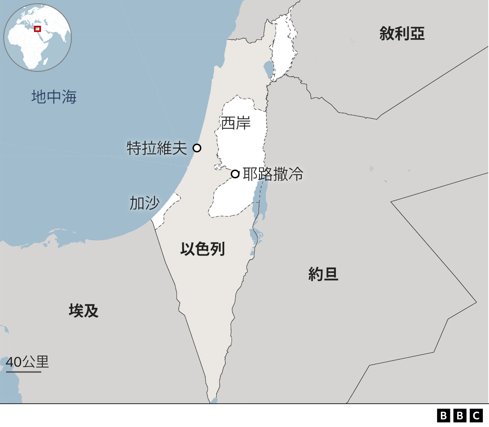
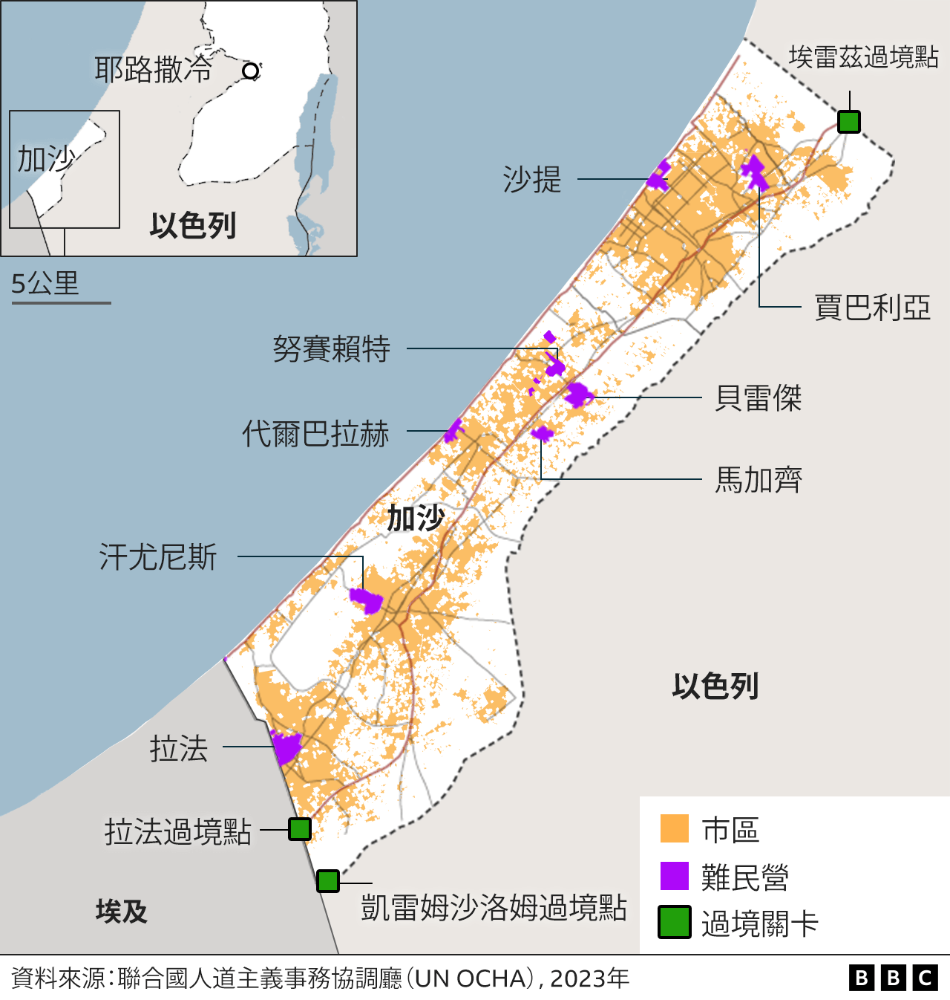
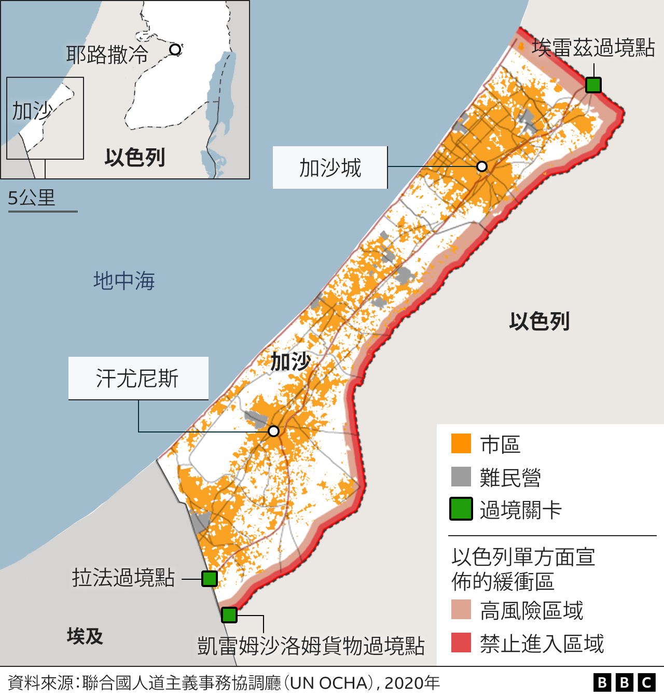

# [World] 以巴冲突：在战地加沙，“当死亡从天而降，你能躲去哪儿？”

#  以巴冲突：在战地加沙，“当死亡从天而降，你能躲去哪儿？”

  * 哈南·拉杰克（Hanan Razek）、穆罕默德·易卜拉辛（Mohamed Ibrahim） 
  * BBC国际部 

> 图像来源，  AFP

**“每一下轰炸，大楼都感觉像是在地震——我可以感觉到自己害怕得心脏直跳，全身都在颤抖，”不愿透露真实姓名的娜迪娅（Nadiya）说。**

周一早上，她被门窗破碎的声音吵醒。“轰炸从早上8点开始，一直持续到午夜，一秒钟都没有停止过。”

这是两个孩子——一个五岁，另一个三个月——的母亲，住在她一家人刚刚购买和装修好的海岸公寓里。她独自一人带着孩子，她的丈夫是一名国际援助机构医生，正在外面求助伤者。

“怎么回事？什么时候会结束？”她的大儿子问道。娜迪娅说，唯一能试着让他稍微冷静下来的方法就是告诉他“听到爆炸声的时间要比实际发生晚一点点”——所以这样他们就知道自己安全了。

这不是一个五岁的孩子应该懂得的那一类知识，但对于娜迪娅来说，这是他们目前能找到最好的应对方式。

只不过，这些爆炸的影响还是很严重。她三个月大的小儿子一直在抽搐，并且不肯进食。

> 图像来源，  AFP
>
> 图像加注文字，以色列空袭加沙城时，火球在建筑中冒起。

过去几天，娜迪娅拒绝离开家，因为这里“每个角落都有回忆”。但是在周一晚上，她听见邻居们一边跑下楼一边大喊：“疏散！疏散！”

这个年轻的母亲犹豫了几秒钟，脑子纷乱地决定着该带什么走。然后，她无助而又恐惧地放声大哭。

她带着两个孩子离开了大楼，但是她说，她认不出周围的街区了，因为周围的建筑物已经夷为平地。

她现在正试图安全地前往父母的家，但她说：“在死亡从天而降的时候，你还能躲到哪里去？”

娜迪娅和BBC采访到的其他加沙居民都说，加沙现在的破坏程度已经是前所未有的了。

##  “加沙已没有安全的地方”

> 图像来源，  Dina Faisal
>
> 图像加注文字，这是迪娜·法伊萨尔在利麦勒街区的住宅花园受轰炸前后的照片。

在高档的沿海社区利麦勒（Rimal），39岁的迪娜（Dina）和她的母亲、父亲、姐姐和两个侄子一起躲在他们带花园的别墅里，躲避以色列的空袭。这里通常是一个安静的住宅区，距离市中心约3公里（两英里）。

周一下午，这家人开始听见附近猛烈的轰炸声。

“我们以为在房子里是安全的，但忽然间，毫无征兆地，窗户被击碎了，门砰地一声飞了起来，”迪娜说，“屋顶的一部分就在我们头顶上周围塌下来。”

感到震惊的他们留在这座受损的房屋里，他们说，这个区域之后又遭受了6次空袭。

周围一开始安静下来，迪娜和家人就逃了，为了活命抛下了一切。

他们跑到医院，治疗身上的伤势，迪娜说，他们很幸运，伤口并没有很深。

当他们返回家中收拾财物时，房屋已经完全被夷为平地。他们现在临时和另一个家庭住在一起，迪娜仍然努力从“失去我们的家、我们的回忆和我们曾经觉得安全的地方”这样的震惊中恢复过来。

“在加沙没有一个地方是安全的了，”她补充道。

##  忙于拯救生命的医院

> 图像来源，  AFP
>
> 图像加注文字，加沙城的一座建筑被烧成焦黑色。

在人口稠密的加沙地带，最大的医疗设施阿尔希法（Alshifaa）医院的主席穆罕默德·阿博·苏雷马医生（Dr Mohamed Abo Suleima）表示，情况相当严峻。

“至少已有850人遇害，4000多人受伤，”他说。

由于加沙地带的电力被切断，医院一直依赖发电机。他说，他们的电力只够再维持三天。

随着以色列宣布对加沙实施全面封锁，医院的淡水也很紧缺。阿博·苏雷马医生表示，他们现在只在“救命的情况下”才使用洁净水，同时还不得不关闭医院的其他部门来帮助拯救生命。

> 图像来源，  AFP
>
> 图像加注文字，加沙城的一个难民营被轰炸夷为平地。

这名医生担心病人的安全，但也担心他的员工。他说有救护车辆受到攻击，一名医生在前往医院的路上遇害。

根据联合国巴勒斯坦难民机构（UNRWA）的数据，过去24小时内，流离失所的民众人数迅速增加，超过18.7万名加沙人现已逃离家园寻求避难。

随着猛烈轰炸接连不断，该机构已经安置了137500人，但同时担心很快会达到容量极限。

##  极度恐惧

27岁的伊沙克曾经和他的年迈母亲、父亲、嫂子以及她的五个孩子一起住在舒加艾耶（Shuja'iyya）社区。在哈马斯周六发动袭击之后，以色列总理内塔尼亚胡（Benjamin Netanyahu）向全国表示，他们将进入一场“漫长而艰难的战争”，伊舍克和他的家人预料到了即将到来的是什么。

他们收拾好最贵重的财物，每人带着一个小包，去市中心寻找避难所。

在途中，这个有20口人的家庭试着储备一些生活杂货等必须品，但是由于很多加沙人一得知周六的袭击之后就赶忙储备物资，商店几乎已空无一物。

他们最终躲藏到了市中心一个住宅楼的防空洞里，那里还有其他的家庭。

“我们在那里逗留了48小时，没有电也没有水，”伊沙克说。然后在周一晚上，他接到以色列军队的信息，要求他们在深夜撤离这栋楼。他们逃跑的去路只被空袭的闪光照亮。

“我们周围所能看到的只有建筑物的残骸。”

他们向市中心的北边走，到了一个通常较为安静的住宅区，但很快发现那里的“大多数建筑物已经被夷为平地”。

伊沙克和家人，还有另外10个家庭，躲在一个部分被毁的建筑楼底层。他们已经在黑暗中躲藏了12个多小时。

“我们活在极度恐惧当中，不知道未来几个小时会遇到什么，我们一起祈祷安全，”他说。他们还不知道接下来该怎么办，也不知道要去哪里。

_（本文中的BBC受访者均不愿意公开出镜）_

