# [World] 以巴冲突：哈马斯发动突袭后，以军战机空袭加沙试图完全控制领土

#  以巴冲突：哈马斯发动突袭后，以军战机空袭加沙试图完全控制领土

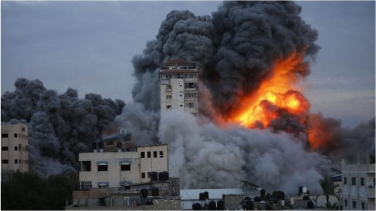

> 图像来源，  Ashraf Amra/Anadolu Agency via Getty Images
>
> 图像加注文字，10月7日，以色列空军袭击加沙地带的一座购物中心，烟雾和火焰笼罩着整个建筑物。

**在哈马斯突然对以色列展开袭击后，以色列对加沙（Gaza，加萨）发动了多次空袭。**

据加沙官员表示，自星期六（10月8日）以来，以色列的报复性空袭已造成313多名加沙人死亡，另有2000多人受伤。

以色列驻土耳其大使馆援引以色列卫生部的话称，迄今为止，至少有300名以色列人被杀，数十人被绑架。

报告称，近2000人正在医院接受治疗，其中19人情况危急。不过，有关数字尚未得到以色列的直接证实。

在来自加沙的袭击中，巴勒斯坦武装分子渗透到以色列并试图控制以色列社区。

据路透社报道，以色列军方表示，目前已有数百名巴勒斯坦枪手被杀。军方补充说，数十名枪手已被俘虏。

以色列早些时候表示，仍在八个地点与武装分子交火。

##  加沙正在发生什么？

以色列总理内塔尼亚胡告诉以色列人，他们正在进入一场“漫长而艰难的战争”。

以色列军队已要求长期封锁的加沙七个不同地区的居民离开家园，搬到市中心或在避难所避难。

目击者早些时候告诉BBC，数十个家庭已离开家园并在联合国开办的学校避难。

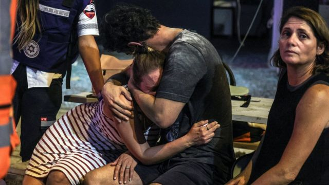

> 图像来源，  Reuters
>
> 图像加注文字，以色列军队已要求长期封锁的加沙七个不同地区的居民离开家园（图为从加沙地带发射的火箭降落在以色列特拉维夫附近地点后的情景）。

在社交媒体X（以前称为 Twitter）上，加沙网民称大规模的空袭持续。

以色列空军公布了对加沙地带多座建筑物进行袭击的视频，据称哈马斯军事目标就位于这些建筑物上。报告补充说，以军战机一直在攻击哈马斯的“作战基础设施”。

以色列政府还表示将切断对加沙的电力、燃料和物资供应。自2007年以来，以色列和埃及以安全为由对加沙地带进行了封锁。

以色列国防军表示，在发生黎巴嫩“向以色列境内开枪的事件几分钟之后”，以色列军队对黎巴嫩进行了炮击。

国际社会强烈谴责哈马斯的袭击，美国总统拜登表示美国对以色列的支持“坚如磐石、毫不动摇”。

与此同时，哈马斯告诉BBC，伊朗支持这次袭击。沙特阿拉伯呼吁立即停止升级，称其已多次警告“持续占领”带来的危险。

中国外交部发言人表示，中方对当前巴以紧张局势加剧和暴力升级“深表关切”，呼吁国际社会“增强紧迫感”，并敦促有关各方“立即停火，保护平民，防止局势进一步恶化”。

该发言人指出：“巴以冲突反复上演，充分说明和平进程长期停滞不可持续。平息巴以冲突的根本出路在于落实‘两国方案’，建立独立的巴勒斯坦国。”

他并说，中国将“推动巴以双方早日恢复和谈，寻求持久和平之道”。

##  危险时刻：内塔尼亚胡承受着巨大压力，需要采取重大行动

**BBC首席国际事务记者丽斯·杜塞特（Lyse Doucet）**

> 图像来源，  Reuters
>
> 图像加注文字，加沙南部一座清真寺在以色列空袭中被毁。

今天的关键词是“前所未有”。

这也是个非常危险的时刻。几十年来，包括本杰明·内塔尼亚胡在内的以色列领导人一直抵制对加萨地带的大规模地面攻击。更重要的是，重新占领了2005年由其军队撤离的领土。

但这是一场全新的战争，主要是因为人质数量惊人，超过了50人和以色列严重的伤亡。而极右派的以色列政府，给内塔尼亚胡带来了巨大压力，迫使他采取重大行动。而哈马斯也不会退缩，他们不会停火。

正如以色列人因为这些攻击而团结起来一样，巴勒斯坦人也在团结起来。他们厌倦了数十年来以色列设下的重重管制。巴勒斯坦人也对自己的领导层感到厌倦，尤其是巴勒斯坦政府，后者是哈马斯的竞争对手。

但问接下来会发生什么的问题之前，另一个迫切的问题是：现在该怎么办？

对于该区域似乎永无休止的苦难循环，有什么长期的解决方案呢？

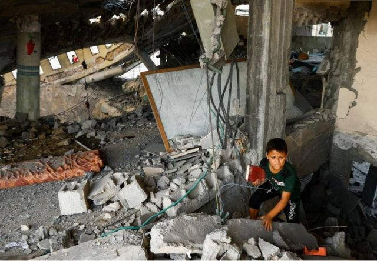

> 图像来源，  Reuters
>
> 图像加注文字，加沙巴勒斯坦当局表示，过去24小时内有256名巴勒斯坦人被杀，其中包括20名儿童。

##  安全营救人质可能需要采取地面行动

**BBC中东分社社长** **乔·弗洛托** **（Jo Floto）发自耶路撒冷**

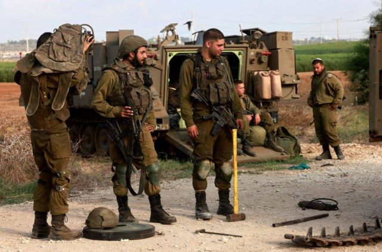

> 图像来源，  Getty Images

一夜之间，以色列人不断在社交媒体上看到平民在枪口下从家中拖出来，移往加沙，并经常在镜头前受到羞辱的帖子。

对这个国家来说，这令人十分震撼。人质安全和营救行动将是每个人最关心的问题。

过去，当哈马斯成功劫持人质时，最终都会以谈判结束——有时是在多年之后。作为回应，数千名巴勒斯坦囚犯被交换。

我们知道哈马斯现在也想这样做。哈马斯表示将确保以色列监狱中的巴勒斯坦武装分子获释，以交换这些人质。

以色列总理内塔尼亚胡警告哈马斯，如果这些人质受到伤害，将会造成可怕的后果。

很难想象他们如何在没有地面行动的情况下营救人质，也很难确保他们不会在交火中丧生。

以色列军队正在动员数千名步兵，坦克正在开往加沙。在某个时间点，地面行动将成为可能选项。

##  内塔尼亚胡：以色列面临一场“长期的战争”

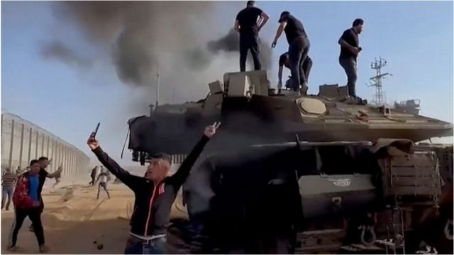

> 图像来源，  Reuters
>
> 图像加注文字，加沙城人员站在坦克上。

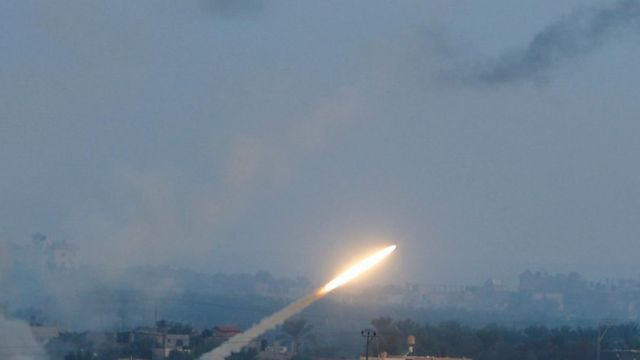

> 图像来源，  Reuters
>
> 图像加注文字，10月7日，巴勒斯坦武装分子在加沙向以色列发射火箭弹。

以色列军队和来自加沙的哈马斯武装分子的战斗仍在继续。以色列总理内塔尼亚胡告诉以色列人，他们正在进入一场“漫长而艰难的战争”。

内塔尼亚胡在星期六（10月7日）夜间表示，这场战争“是哈马斯的凶残袭击强加给我们的”，第一阶段战斗将在未来几个小时内结束，届时以色列领土上的大部分武装分子都将被消灭。

星期六，哈马斯武装分子渗透到以色列南部社区，有关冲突据报已造成250人死亡。

数百名枪手闯入以色列南部，杀害士兵和平民，并将军方所说的“大量”人质带入加沙。

据报数百名武装分子冲破加沙安全围栏，骑着摩托车，乘坐滑翔伞，或从海上进入以色列。

以色列国防军发言人康里克斯（Jonathan Conricus）表示，武装分子人数达数百人，并在当天向以色列全境发射了3000多枚火箭弹。

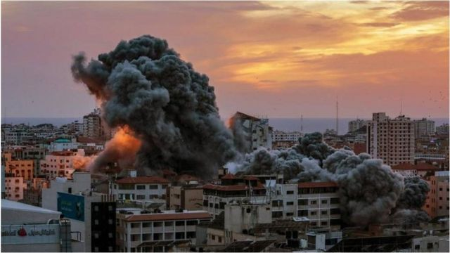

> 图像来源，  EPA
>
> 图像加注文字，以色列战机袭击加沙巴勒斯坦塔后升起浓烟。

> 图像来源，  EPA
>
> 图像加注文字，以色列空袭后的加沙街头。

该发言人说：“他们袭击了数十个以色列社区和以色列国防军基地，挨家挨户、挨家挨户地袭击。”

他指出，武装分子“在家中冷血地处决以色列平民，然后继续将以色列平民和军事人员拖入加沙。我说的是妇女、儿童、老人和残疾人。”

令人不安的社交媒体视频片段显示，参加派对活动的以色列平民在沙漠中狂奔逃命，被绑的妇女被绑架上车辆的情景。

作为回应，以色列对加沙地带进行了空袭，巴勒斯坦卫生官员称该加沙已有230多人死亡。

##  冲突升级可能搁置以色列和沙特正常化交往的协议

**BBC中东特派记者萨米尔·哈什米** **（** **Sameer Hashmi** **）** **发自杜拜**

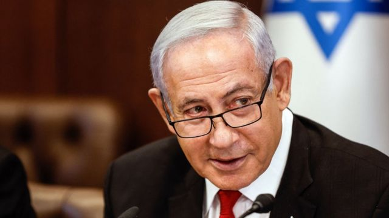

> 图像来源，  Getty Images
>
> 图像加注文字，以色列总理内塔尼亚胡此前曾表示，以色列与沙特阿拉伯的关系可能会出现“历史的转折点”。

哈马斯的突袭和以色列的回应可能搁置以色列、沙特阿拉伯（Saudi Arabia，沙乌地阿拉伯）和美国之间正在进行的三方谈判。谈判旨在实现利雅德和特拉维夫之间的关系正常化，并且在近几个月内取得了一些进展。

现在，沙特阿拉伯呼吁“立即停止巴以冲突的升级”。

沙特的声明似乎是在指责以色列升级冲突，虽然没有直接点名该国。在官方声明中，沙特外交部表示，他们已经“多次警告，由于持续占领和剥夺巴勒斯坦人民的合法权利，局势存在爆炸的危险”。

之前三方的正常化谈判围绕着沙特阿拉伯承认以色列，以换取美国提供武器销售、安全保障和帮助建立民用核计划。

沙特阿拉伯的王储穆罕默德·宾·萨勒曼上个月表示，越来越接近达成协议，但需要先解决巴勒斯坦问题，然后才能继续进行。

##  我们对哈马斯劫持以色列人质的情况了解多少？

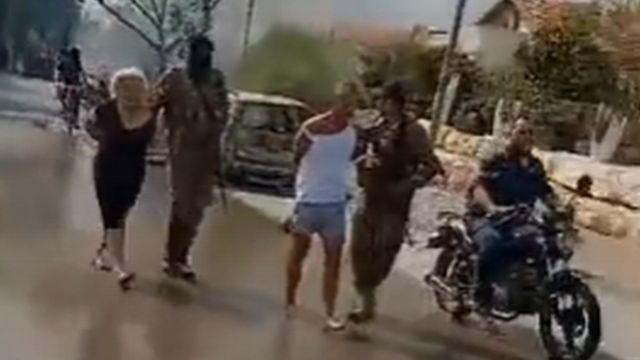

> 图像来源，  Twitter
>
> 图像加注文字，以色列平民在贝埃里基布兹被哈马斯武装分子扣为人质。

以色列军方表示，大量以色列平民和士兵被巴勒斯坦激进组织哈马斯扣为人质。被带走的人包括儿童、妇女、老人和残疾人。

以色列国防军发言人表示，有些人还活着，有些人被认为已经死亡。

许多在社交媒体上流传的视频片段声称，有以色列人落入哈马斯武装分子手中。

以色列军方发言人示，“这些数字迄今为止是难以想象的，”他说。 “这将塑造这场战争的未来。”

经BBC证实的一段发布的视频显示，一辆卡车在加沙地带驶过人群，据称载有以色列人质。

另一张位于加沙地带的照片显示，一名妇女赤着脚被人从卡车后面拖出来，血迹斑斑的双手被绑在背后。

哈马斯表示，被俘的以色列人数量是数十人的“数倍”，他们被带到加沙地带各地。

以色列总理内塔尼亚胡表示，哈马斯应对人质的安危负责，以色列将“与任何伤害他们的人算账”。

##  一触即发的冲突风险持续深化

**BBC国际编辑杰里米·鲍文（Jeremy Bowen）**

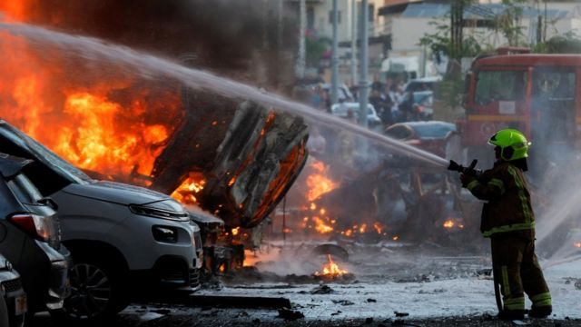

> 图像来源，  Reuters
>
> 图像加注文字，10月7日，哈马斯从加沙地带发射火箭后，以色列阿什凯隆的应急人员正在努力灭火。

这是以色列这一代人所面临的最严重的跨境袭击之一，他们对此次袭击感到惊讶。

几个月来，巴勒斯坦武装组织与以色列之间一触即发的冲突风险已经显而易见。

以色列人和巴勒斯坦人一直把焦点放在约旦河西岸，即以色列自1967年以来占领的耶路撒冷和约旦边境之间的领土。

约旦河西岸一年到头都在发生对抗和暴力事件。

巴勒斯坦武装人员，特别是那些在约旦河西岸城镇杰宁和纳布卢斯活动的巴勒斯坦人，袭击了以色列士兵和犹太定居者。

以色列军队发动了数十次空袭。以色列武装定居者将惩罚治罪的权力交到自己手上，对巴勒斯坦村庄进行了报复。

没人料到哈马斯会在加沙精心策划如此复杂且协调一致的行动。

##  以色列军队称一名指挥官在冲突中丧生

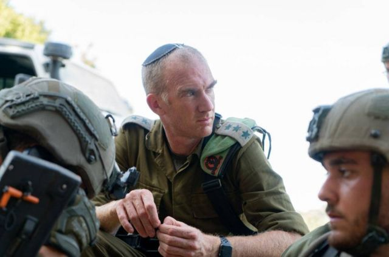

> 图像来源，  Israel Defence Forces
>
> 图像加注文字，斯坦伯格上校在前往与哈马斯战斗现场途中被杀。

以色列军队称一名旅指挥官周日被哈马斯武装人员打死。

以色列军方声明称：“纳哈尔旅指挥官乔纳森·斯坦伯格（Jonathan Steinberg ）上校今天在凯雷姆沙洛姆（Kerem Shalom）附近与一名恐怖分子发生冲突时丧生。”

凯雷姆沙洛姆是加沙与以色列唯一的商业过境点，其检查站完全由以色列军队控制。

该声明称，来自肖姆里亚基布兹（Kibbutz Shomria）的斯坦伯格上校在前往与哈马斯战斗现场途中被杀。声明称，他遭到一名武装分子的袭击并被杀。

