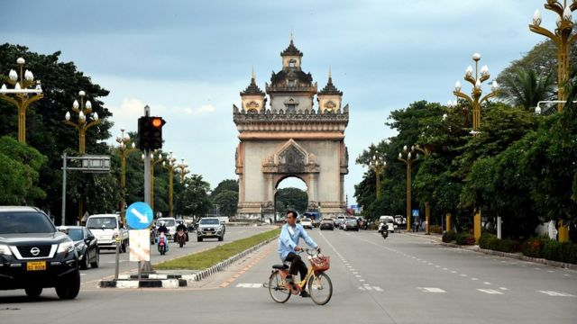
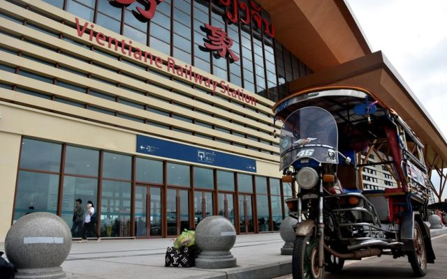

# [World] 老挝经济因债台高筑而岌岌可危，有年轻人称“我感到绝望”

#  老挝经济因债台高筑而岌岌可危，有年轻人称“我感到绝望”

  * 阿拉斯泰尔·麦克雷迪（Alastair McCready） 
  * 发自老挝万象 

> 图像来源，  Alastair McCready
>
> 图像加注文字，老挝是东南亚一个最穷的国家，欠中国大量债务。

**乔（Jo）是老挝（寮国）一所顶尖大学的毕业生，刚获得英语文学专业学位，但这位毕业才几周的22岁年轻人，表示自己已感到** ****“** ** **绝望** ****”** ** **。**

面对惨淡的就业市场，在首都万象生活的他对在国内找个工作不抱任何期望，而是想去澳大利亚当一名清洁工或水果采摘工。他的愿望很低，却反映出悄无声息蔓延在像他这样同龄人中幻灭感，原因是过去两年来老挝经历的严重和持续的经济衰退。

**“** 这一代人都不相信政府。他们想离开老挝，他们不相信政府说的任何话， **”** 他告诉BBC。 **“** 我的大多数朋友都有同样的想法，但我们只是私下谈论。如果你在公开场合说他们的坏话，不知道会发生什么。 **”**

这场经济危机始于一项为中国支持的基建项目而草率进行的政府举债计划。这场危机几乎没有缓解的迹象，公共债务飙升至不可持续的水平，迫使政府削减预算，通货膨胀率居高不下、货币贬值到历史新点，使这个东南亚的贫穷国家的许多居民生活困顿。

今年四月，活动家阿努萨· **“** 杰克 **”** ·朗苏彭遭枪击，凸显了这个一党专制国家，不惜为压制改革呼声而采取的残酷手段。这使年轻一代越来越多地将目光转移到国外。

老挝裔法国国际人权律师、人权组织 **“** 马努西亚基金会 **”** （Manushya Foundation）创始人埃米莉·普拉迪吉特（Emilie Pradichit）说： **“** （年轻人）甚至不考虑改变现状，而是觉得我该如何离开这个国家——我被困在这里了，没有未来。 **”**

**“** 如果你看到自己的国家成为中国的殖民地，你看到一个完全腐败的政府，而你又不能说出来，因为如果你说出来，你可能因此遇害——你会愿意留下来吗？ **”**

##  “债务陷阱”

老挝是一个人口稀少的内陆国家，人口约750万，也是东南亚一个最贫穷和最不发达的国家。为了改变这个以农业为主的社会，老挝政府在过去十年中推动了多个大型基础设施项目，其大多由老挝的传统盟友和邻国中国提供资金，而中国自2013年以来一直在通过 **“** 一带一路 **”** 倡议向该国提供大量贷款。

老挝利用外资修建了数十座大坝，将自己打造成 **“** 东南亚的电池 **”** ，成为该地区主要电力出口国。但供过于求导致许多大坝的电力无法消化，而老挝国家电力公司也背负着50亿美元（41亿英镑）的债务。

由于缺乏资金，老挝在2021年向一家中资公司授予了25年的特许经营权，允许其管理大部分电网，包括对电力出口的控制权。

债务缠身的大型项目还包括连接万象和中国南部的老中铁路。这条铁路于2021年12月通车，耗资59亿美元，给老挝政府带来了19亿美元的债务。北京称，这条铁路创造了一条 **“** 经济走廊 **”** ，但对一些经济学家来说，这并不合乎情理，尤其是因为中国国企持有了70%的股份。

> 图像来源，  Alastair McCready
>
> 图像加注文字，中老铁路是众多让老挝负债累累的基建项目之一。

新加坡东南亚研究所（ISEAS-Yusof Ishak Institute）高级研究员、经济学家贾扬特·梅农（Jayant Menon）在谈及这条铁路时表示： **“** 我相信人们很高兴能快速穿越老挝旅行，但以商定的成本来看，这是不合理的。 **”**

这些加剧了老挝不断膨胀的债务。国际货币基金组织（IMF）数据显示，老挝目前的债务占其国内生产总值（GDP）比例在全球位列第九，其中约一半是欠中国的。老挝现在不得不向该国的贷款人借更多的钱来度日。

**“** 老挝欠中国的债务太多，以至于他们的议价能力受到损害， **”** 梅农说。 **“** 老挝不得不借钱还债，这就是债务陷阱的定义。 **”**

老挝政府没有对此置评。梅农认为，该国曾多次拒绝其他国际贷款方而选择北京，或许是因为老挝政府内部认为中国 **“** 不会让另一个社会主义国家失败 **”** 。他补充说，中国政府也对于在斯里兰卡之后有另一个 **“** 一带一路 **”** 国家出现债务违约持谨慎态度。

目前唯一能阻止这一违约的是两国一次次签订债务延期协议，而其条件仍然非常不透明，这引发了人们对中国政府对老挝日益增长的影响力的担忧。当被问及老挝是否有成为附庸国的风险时，梅农说 **“** 开弓没有回头箭 **”** 。

他说， **“** 大量债务累积 **”** 造成的 **“** 宏观不稳定性 **”** 也导致老挝货币基普兑美元汇率持续贬值，创下历史新低。这导致物价上涨，创下几十年来的新高，而普通老挝人对此感受最深。

##  “如果我不省吃俭用，我会死去”

Skip podcast promotion and continue reading

* BBC 時事一周 Newsweek (Cantonese)   **

BBC國際台粵語節目，重溫一周國際大事，兩岸四地消息，英國境況。並備有專題環節：〈記者來鴻〉、〈英國生活點滴〉和〈華人談天下〉。

分集

End of podcast promotion

**“** 我从来没有经历过像今年这样的事情， **”** 60多岁、看上去憔悴的丰赛（Phonxay）说。她在万象的一个食品市场卖家用主食，称顾客越来越少，因为 **“** 价格每天都在上涨 **”** 。她还补充说，八月份是迄今物价最贵的一个月。她的家人不得不改变生活方式以生存。

**“** 我家需要比以往任何时候在吃上省钱。我们只吃以前一半的食物， **”** 丰赛说。 **“** 但我得这么做，否则我会死去。 **”**

未来几年，老挝年轻人在经济危机中会首当其冲。他们的未来被抵押给了这些基础设施项目，但这些项目给他们提供的实际机会少之又少。

19岁的森（Sen）在老挝北部琅勃拉邦一家酒店担任前台接待员。他说： **“** 老挝非常适合旅游，但不适合居住。 **”**

琅勃拉邦再次恢复了往日的繁华。在被联合国教科文组织列为世界遗产的老城里，络绎不绝的游客在法国殖民时期老建筑前打卡。

森表示，日子依然艰难。 **“** 对于像我这样的普通人来说，这非常艰难。只是比在印度无家可归的人要好一些，也许只是比朝鲜好一点。我是认真的，我们只是想活下去。 **”**

他在酒店工作的月薪只有125美元。他认为上大学或申请政府工作没有任何意义，因为没有家庭背景，他必须向腐败的官员 **“** 支付大量金钱 **”** 才能获得任何职位。

**“** 现在，几乎所有像我这样的学生都不想上大学 **”** ，他说。 **“** 他们学习日语或韩语，然后申请到这些国家的工厂或农场工作。 **”**

联合国开发计划署（UNDP）常驻老挝副代表凯瑟琳·芳（Catherine Phuong）表示，这种 **“** 老挝年轻人的沮丧感 **”** 正是亟需关注的。

她指出，在18至24岁的年轻人中，未在接受教育、就业或培训（NEET）的比例高达38.7%，是东南亚地区迄今为止最高的。

**“** 就老挝来说，我们尤其担心的是，由于债务情况，我们看到对包括卫生和教育在内的社会行业的投资减少， **”** 她对BBC说。 **“** 我相信你可以想象这对这一代人的影响，不仅仅是在未来几年，而是在未来十到二十年。 **”**

但由于自1975年以来一直统治老挝的老挝人民革命党不能容忍异议声，年轻人不得不求助于社交媒体来表达他们的不满。

2022年3月，随着通货膨胀和生活成本开始上升，阿努萨· **“** 杰克 **”** ·朗苏彭创建了名为 **“** 键盘力量 **”** 的Facebook专页。这是越来越多批评当局的社会评论页面之一。

4月29日，这位25岁的年轻人在万象一家咖啡馆遭到袭击，当时他的粉丝已达数万人。闭路电视画面显示，一名蒙面男子向杰克的脸和胸部开枪。警方几天后发表声明，指责这是一起商业或情感纠纷。杰克幸免于难，但对他的追随者来说，罪魁祸首显而易见。

万象的大学生乔关注着杰克的Facebook页面，他说： **“** 我真的很难过，政府竟然开枪打他，他们竟试图这样控制我们。 **”** 他补充称： **“** 杰克是老挝民众的代言人，他说出了普通人不敢说的话。 **”**

但是，这些要求改革的呼声只会被忽视或压制，没有人比失踪的老挝公民社会倡导者宋巴·宋蓬（Sombath Somphone）的妻子吴惠铭（音译；Shui- Meng Ng）更清楚这一点。

自2012年12月宋巴在万象被警方拘留以来，他便杳无音信。当时他的影响力越来越大，人们希望推动改革。

吴惠铭在万象市中心的手工艺品店是她最后一次见到丈夫的地方，也是他被绑架的地点。吴惠铭在那里对BBC说，像杰克和宋巴这样的声音之所以被压制，是因为在 **“** 老挝政治精英焦头烂额 **”** 之际，他们的 **“** 追随者人数上涨太多 **”** 。

**“** 每次发生像（杰克枪击案）这样的事情，你就会看到这种情况 **，** **”** 她抿了抿说。 **“** 人们沉默了。 **”**

林赛·杜昂禅（Lamxay Duangchan）对本文有贡献。

