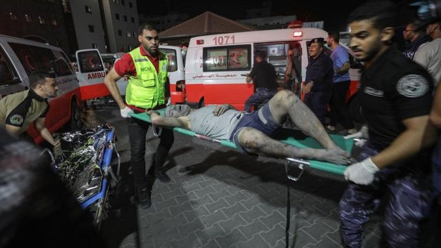
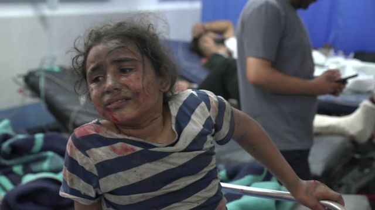
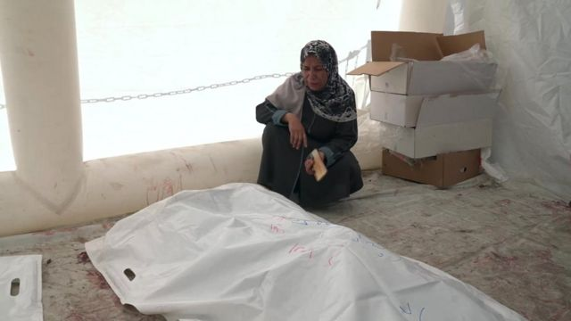
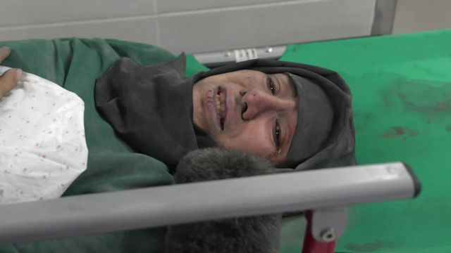
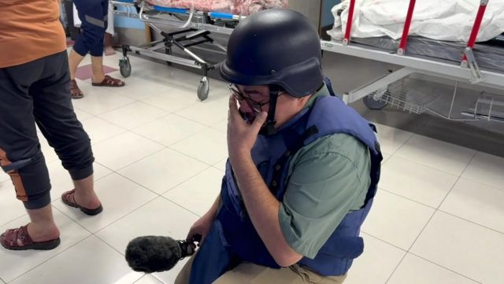
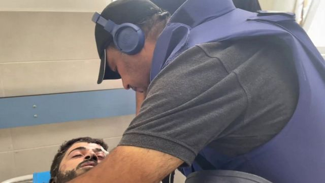

# [World] 以巴冲突：电力随时耗尽，加沙医院濒临崩溃“恐变停尸间”

#  以巴冲突：电力随时耗尽，加沙医院濒临崩溃“恐变停尸间”

  * 阿德南·艾尔布什（Adnan Elbursh） 
  * BBC阿拉伯语记者 

> 图像来源，  EPA

**加沙城最大的希法医院（Al-Shifa Hospital），已经爆满。**

医院外的地上摆放着大量尸体，走道和庭院也堆积了数百具尸体，这是因为数量太多，停尸间的冷柜装不下。

医院里数以百计严重受伤者挤满了走廊，当中有妇女和儿童，医护人员承受着巨大的压力。

以色列切断加沙的供电，当地唯一发电厂也因燃料耗尽而关闭，如果连备用发电机也停止运作，医疗服务很快会停摆。

红十字国际委员会（ICRC）警告若电力耗尽，“医院可能变成停尸间”。

这恐怕是一场巨大灾难的开端。

> 图像加注文字，这个年轻女孩的家被炸毁之后，她被送到医院

一名年轻女孩被送到医院，她因为剧痛和受惊而尖叫着，哀求医生救治她，解除她的痛苦。

她的家被以色列军队意外炸中，她几个亲戚已遇难。

但医生们在与时间赛跑，而且只能优先治疗最严重的伤者。

> 图像加注文字，一名妇女坐在亲人遗体旁边，他们都在以色列的轰炸中遇难

一名女子坐在她亲戚的尸体旁，他们也在以色列的猛烈轰炸中丧生。轰炸行动以加沙一个人口稠密的社区为目标，幸存的家庭成员正陆续抵达医院。

“我们当时在睡觉，他们和其他人一样轰炸我们的房子，” 她说。

“他们在我们睡觉的时候击中我们的房子。我们（楼里）没有任何战斗人员。整栋楼都是平民——120个人住在那里。”

> 图像加注文字，医院的病房和走廊都满是伤者

一名躺在担架上的女子说：“他们推迟了我的手术，说其他人更紧急……你可以等一下。我能怎么办？这里受伤的人那么多。”

我们采访到另一名女子，她知道躺在担架上的女人的情况：“她们从废墟中救了她出来，但他们找不到她的女儿。希望他们会找到她。”

医院的负责人穆罕默德·阿布·萨尔米亚医生（Dr Muhammad Abu Salmia）告诉BBC，如果希法医院被迫停运会有什么后果：

“没有电力，医院就无法运作。超过120人正在重症监护室（ICU；又译加护病房或深切治疗部）、新生儿病房和其他病房中插着呼吸机；（如果停运）整个医院所有科室和服务都将崩溃，我们将无法再救治病人。”

> 图像加注文字，BBC记者阿德南·艾尔布什在震惊中无法压抑住情绪

BBC采访团队拍摄这个报道期间，我们震惊地发现，几十个我们的邻居、亲戚和朋友就在死伤者当中。

事情离我们如此之近，我们不得不暂时停下工作，以消化这种震惊。

> 图像加注文字，摄影师马哈莫德·阿吉拉米和他的朋友

摄影师马哈莫德·阿吉拉米（Mahmoud al-Ajrami）发现，一位朋友受重伤送院，并且他大部分亲属已经遇难。摄影师不胜压力，眼泪顺着脸颊流下来。

巴勒斯坦卫生部门指，他们正在巨大压力下工作。他们明白眼前的风险——加沙的医院快将因为电力中断而无法正常运作。

