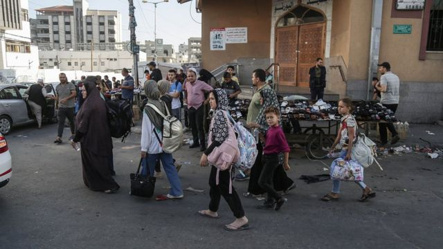
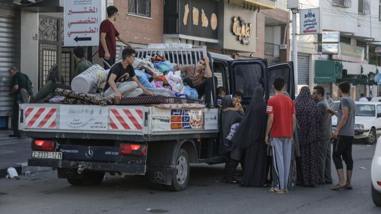
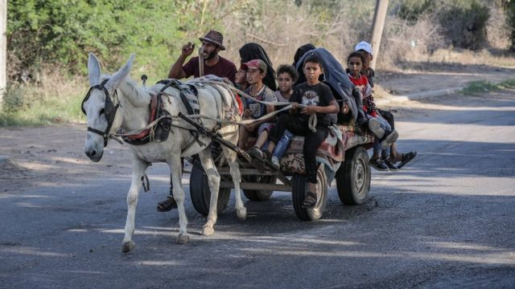
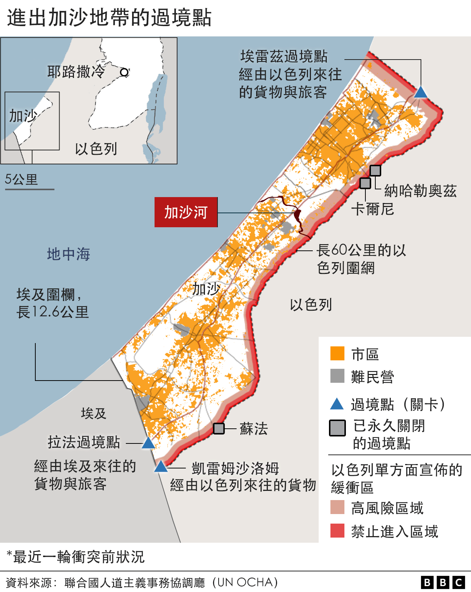
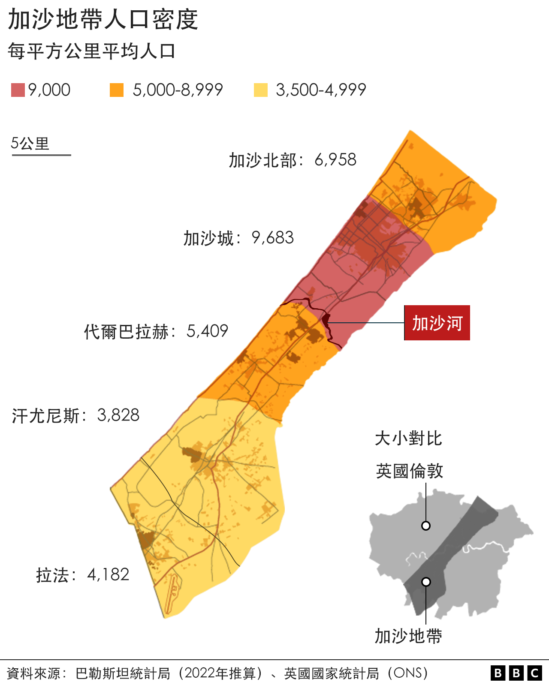

# [World] 以巴冲突：以军要求百万加沙居民24小时内南撤 联合国批评称“强人所难”

#  以巴冲突：以军要求百万加沙居民24小时内南撤 联合国批评称“强人所难”

> 图像来源，  EPA
>
> 图像加注文字，联合国认为要110万加沙城居民在24小时撤离根本不可能。

**以色列国防军要求加沙城（Gaza City）所有巴勒斯坦平民为自己安全着想，在24小时之内撤离至加沙地带（Gaza Strip）南面。以方坦克目前已开至加沙边界，似有准备对加沙发动地面攻势。**

控制并管治加沙的巴勒斯坦哈马斯（Hamas）武装上星期六（10月7日）突袭以色列并劫持人质后，以军对加沙实施“全面围堵”，以连番空袭报复。以军星期五（13日）公告，将于“未来数天”继续在加沙有“大动作”。

联合国表示已接获以色列通报撤离命令，但“强烈呼吁”以方收回该命令。一名发言人称，这等同于要约110万加沙城居民撤离——相当于加沙总人口的一半——加沙巴勒斯坦人无法彻底服从命令。

哈马斯一方以“虚假的政治宣传”来形容以方的命令，并促请加沙民众不要离开。

不过，无数加沙北部居民还是听从警告南撤。BBC记者鲁什迪·阿布·阿卢夫（Rushdi Abu Alouf）目睹加沙河（Wadi Gaza）河畔公路上数以百计的汽车、摩托车与卡车满载家当前行。

记者说，还有许多家庭沿着公路徒步撤离，一些人还带上了牛、骆驼、羊和驴等牲畜。

> 图像来源，  EPA
>
> 图像加注文字，哈马斯执政当局呼吁加沙城居民无视以军命令，但还是有不少居民收拾家当涌上公路撤离。

> 图像来源，  Anadolu Agency/Getty Images
>
> 图像加注文字，一些居民带着牲口撤离，或是依赖驴等拉车。

加沙卫生官员表示，以色列空袭当地至今，已造成超过1400人死亡；以色列称有1300人死于哈马斯突袭，至少150人被哈马斯劫走。

以色列国防军声称，“哈马斯恐怖分子”躲藏在加沙城地下的隧道网络内，隧道上方是“住满无辜平民百姓”的各式楼房。

以军公告称：“为了你的安全，还有你家人的安全，跟把你当成人盾的哈马斯恐怖分子保持距离。”

> 图像来源，  Reuters
>
> 图像加注文字，撤离命令意味着以军准备对加沙哈马斯据点策动地面攻势，大批以军坦克已开至加沙边界周边待命。

但巴勒斯坦红新月会发言人内巴尔·法尔萨赫（Nebal Farsakh）说，要让百万加沙城居民在24小时内安全撤离根本不可能。她对BBC说：“关键是他们没地方能去。”

联合国世界卫生组织（WHO）发言人塔里克·贾萨瑞维奇（Tarik Jasarevic）也说，那些需要依靠呼吸机等维生仪器的严重病患同样无法撤离。

他说：“搬动这些人犹如执行死刑，要求卫生人员这样做远超麻木不仁。”

联合国近东巴勒斯坦难民救济和工程处（UNRWA）称，已将加沙主要运营中心和国际职工撤至南部。工程处同时促请以色列保护所有栖身联合国避难设施内的平民安全。一些在加沙的联合国雇员表示，以军联络官是在星期四（12日）将近午夜之际送达撤离警告。

在一场例行新闻发布会上，以色列国防军发言人丹尼尔·哈加里海军少将（Rear Adm Daniel Hagari）回答BBC提问说，以方明知民众撤离需时。

哈加里少将说：“这是战区，我们在试着给他们时间，我们在尽一切努力，我们理解不用费上24小时。”

“问题我们是明白的。可悲的是什么？这都是哈马斯的责任。”

以色列常驻联合国代表吉拉德·艾丹（Gilad Erdan）称联合国呼吁撤回命令“可耻”，指控联合国多年来对哈马斯的作为“视而不见”。以方要求联合国专注于争取哈马斯手上人质获释，而非对以色列说教。

加沙哈马斯执政当局媒体办公室主席萨拉马·马鲁夫（Salama Marouf）称，以军发布这道撤离命令，是要“广播并传达虚假的政治宣传，意图在公民之间散播混乱，破坏我们的内部团结”。

BBC追问英国国防大臣格兰特·沙普斯（Grant Shapps，夏博思）到底英国政府是否支持以军颁布撤离令，沙普斯并未正面回答。

沙普斯告诉BBC广播电台第四台晨间新闻栏目《今日》（Today）：“英国政府支持以色列保卫自己的权利，以色列预警了他们的军事行动，让人们让开。我想这样做完全是正确的。”

