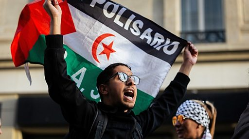

# [World] 以巴冲突：法国禁声援巴勒斯坦集会 欧洲忧反犹太主义抬头

#  以巴冲突：法国禁声援巴勒斯坦集会 欧洲忧反犹太主义抬头

**以巴冲突：法国禁声援巴勒斯坦集会 欧洲忧反犹太主义抬头**

5 小时前

以巴战火蔓延之际，法国政府宣布全面禁止支持巴勒斯坦的示威活动。

内政部长达尔马宁（Gérald Darmanin）警告，违反禁令者将被逮捕，而外国公民将被驱逐出境，因为“他们会扰乱公共秩序”。

尽管如此，10月14日仍有大批支持巴勒斯坦示威者在巴黎共和广场抗议，约3000人参与。示威者高呼“以色列杀人犯”和“巴勒斯坦将获胜”等口号，并挥舞巴勒斯坦国旗。

警方动用催淚瓦斯和高压水枪驱散示威者，并拘捕10人。

此前，法国总统马克龙（Emmanuel Macron）呼吁法国人保持团结，指“我们不要在国际分歧的基础上增加国内分歧”，他又形容哈马斯为“一个希望以色列人死亡的恐怖组织”。

当地亲巴勒斯坦团体认为，政府的禁令威胁到言论自由，并表示将继续举行声援巴人的示威活动。

“我们生活在一个民法国家，在这个国家里，我们有权表达立场和进行示威。”一位集会人士说。“禁止一方却放行另一方，是不公平的。”

法国有近50万犹太人口，是欧洲犹太人数量最多的国家。该国也是欧洲穆斯林数量最多的国家之一，约有500万穆斯林。

自10月7日以色列与哈马斯爆发武装冲突后，欧洲各国政府都担心引发反犹太主义（antisemitism）抬头。

德国首都柏林警方也禁止了计划中的亲巴勒斯坦示威，理由是存在反犹太主义言论和美化暴力的风险。

德国总理肖尔茨（Olaf Scholz）强调对于反犹太主义“零容忍”，将取缔亲巴勒斯坦组织萨米顿（Samidoun），该组织曾被拍到在柏林新克尔恩（Neukölln）地区派发糖果庆祝哈马斯袭击事件。

除了欧洲，全球多地也爆发支持双方的示威活动。在美国纽约，哥伦比亚大学（Columbia University）有数百名学生分成两边阵营抗议，现场气氛紧张。

而在东亚，南韩和日本都有相关集会活动。

