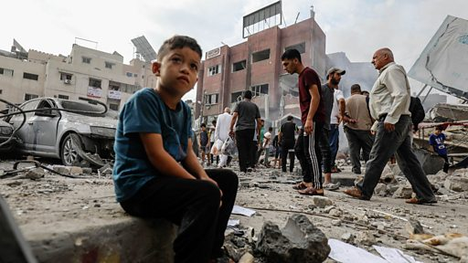

# [World] 以巴冲突：为什么加沙的领土和历史是理解冲突的关键

#  以巴冲突：为什么加沙的领土和历史是理解冲突的关键

**以巴冲突：为什么加沙的领土和历史是理解冲突的关键**

经常被称为“露天监狱”的加沙地带是世界上最密集的地区之一，长期受到以色列和埃及的封锁，对基本物资和资源的获取受到极大限制。因此，加沙人口对人道援助的依赖程度很高。

此外，该地区的地下隧道网络被用来走私货物和武器，这也是当地冲突的重要原因之一。

加沙由哈马斯控制，该组织与以色列的冲突日益激化，尤其是近期的暴力行为，对加沙已经脆弱的状况带来了潜在的影响。由于先前的谈判失败、强硬的政治立场，以及加沙的严峻生活状况导致了目前的局势，因此，以色列是否进行严厉的军事行动，并能带来任何正面效果，成为了一个重要的问题。

BBC阿拉伯语记者艾米尔·纳德尔详细介绍并解释了该地区的地理位置和历史背景，这对理解以色列和巴勒斯坦的冲突至关重要。

