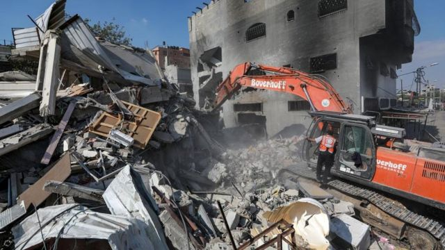
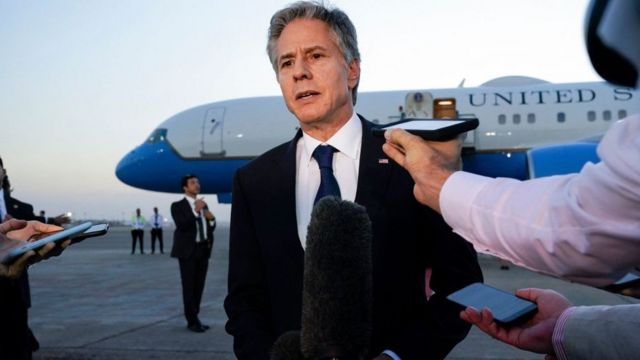
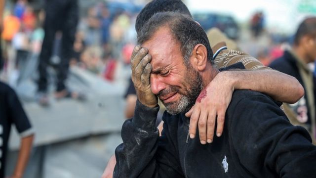
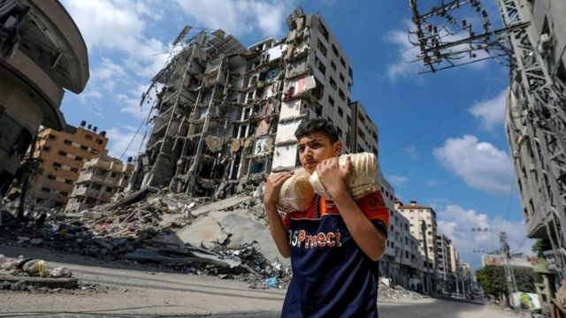
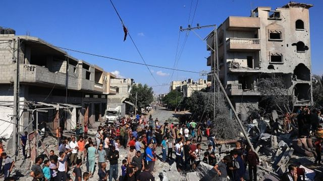

# [World] 以巴冲突：加沙地带人道危机加剧，拜登确认访问以色列

#  以巴冲突：加沙地带人道危机加剧，拜登确认访问以色列

> 图像来源，  EPA-EFE/REX/Shutterstock
>
> 图像加注文字，以色列称，这将是一场长久的战争

**美国总统拜登（Joe Biden）将于周三访问以色列，听取对哈马斯武装分子作战计划的简报。**

美国国务卿布林肯（Antony Blinken）在以色列宣布这一消息时表示，拜登此行对于以色列、整个地区乃至全世界来说，都是一个关键时刻。

据称，拜登将会了解以色列如何以“平民伤亡最小化”的方式实施其行动，同时确保哈马斯不会受益的情况下允许国际人道援助进入加沙。

较早前，哈马斯宣称向耶路撒冷及特拉维夫发射了“一连串火箭炮”攻击。

连通埃及和加沙边境的拉法过境点似乎也遭受空袭，破坏程度不明——该区域正有数以千计加沙民众聚集等候进入埃及，而各方目前仍在争取赶在以色列按计划进行地面进攻前开放该关口，让准备逃离的外国公民和国际救援通过。

布林肯表示，拜登将会“重申美国对以色列的支持”。

以色列官员则向BBC表示，以政府不会停歇，直至完全消灭哈马斯。

以色列军方公布，被劫持在加沙的人质至少有199名。

联合国称约有一百万巴勒斯坦人流离失所，正急需食物、水和燃料。

另一方面，俄罗斯提出关于以色列和加沙的人道主义决议在联合国安理会未能获得通过，美国和英国等西方国家因俄罗斯未遣责哈马斯而投下反对票。

> 图像来源，  Getty Images
>
> 图像加注文字，一周内两度访问以色列

##  拜登访问

拜登访问以色列的消息是在周一（10月16日）公布，当时布林肯和以色列总理内塔尼亚胡已经在美国驻耶路撒冷大使馆进行了长达七个小时的会议。

布林肯向媒体表示，拜登的访问是应内塔尼亚胡邀请而进行，届时拜登将会“全面了解以色列的战斗目标和策略”。

此外，拜登还将“听取以色列方面如何以平民伤亡最小化的方式实施行动”，并确保在哈马斯不受益的情况下让国际人道救援进入加沙。

他表示，拜登还会与以色列伙伴协调，以确保被哈马斯劫持的人质获得释放。

主管中东美军的中央指挥官迈克尔·库里拉将军（General Michael Kurilla）在未经宣布之下，于周二到访以色列，以“确保以色列拥有保卫自身所需要的一切”。

关于拜登访问以色列的安全问题，美国国防军发言人约翰·柯比（John Kirby）表示，这一决定并非“轻易作出的”。

他未有透露太多细节，但表示：“这将是一次非常短暂的行程”。拜登将首先访问特拉维夫，然后飞往约旦首都安曼。

> 图像来源，  Getty Images
>
> 图像加注文字，加沙的人道危机正在加剧

过去几天，访问以色列的美国外交官和议员不得不躲避哈马斯发射的火箭弹。

较早前的周一，美国国务卿布林肯被迫在特拉维夫的一个地下掩体里躲了几分钟。

“显然，如果我们不是认为有恰当的安全措施，都不会进行这次访问，”柯比在谈到拜登访问以色列时表示。

他说，这种情况与俄乌战争非常不一样——他表示基辅是受到俄罗斯的“不断轰炸”。今年早些时候，拜登在全程保密的情况下突访乌克兰。

##  哈马斯火箭炮再袭以色列

周一晚间，哈马斯的武装分支声称向特拉维夫及耶路撒冷发射了“一连串导弹”。

卡萨姆旅（Al Qassam Brigades）在声明中表示，最新一轮袭击是对以色列“以平民为目标”的回应。

身在耶路撒冷的BBC记者约朗德·奈尔（Yolande Knell）表示，在听到突如其来的火箭炮警报后，她曾寻找掩体躲避。

她说：“当警报响起时，我们BBC办公室所有人员不得不躲进一个安全室。”

> 图像来源，  EPA-EFE/REX/Shutterstock
>
> 图像加注文字，哈马斯突袭之后，以色列一直持续轰炸加沙地带

BBC核查团队分析的一段视频似乎显示，埃及边境的拉法过境点发生了一次空袭，造成了一次大爆炸。

以色列军方对哈马斯所劫持的人质数字更新为199人——他们在10月7日哈马斯突袭以色列时被带到加沙。

哈马斯武装分支的发言人则在不久前声称，他们扣押的人质为200至250人。

BBC尚未对有关声明进行独立核实。

哈马斯前领导人哈立德·梅沙尔（Khaled Meshaal）声称，被扣押的人质当中包括以色列国防军（IDF）的高级军官。

路透社引述梅沙尔声称，这些人质将会被哈马斯用作“筹码”，以解救在以色列监狱中被关押的6000名巴勒斯坦人。

以色列政府顾问阿维·海曼（Avi Hyman）较早前接受BBC电台访问时表示，以色列“不寻求任何一方的平民伤亡”。

“我们要做的是严厉打击哈马斯，”他说。

而加沙卫生部的数据显示，在以色列对加沙发起的报复性打击中已经有超过2700人死亡。

另一方面，联合国巴勒斯坦难民处表示，该机构有14名工作人员在接连不断的空袭中丧生。

联合国援助总署负责人马丁·格里菲斯（Martin Griffiths）则表示，哈马斯控制的加沙地带卫生系统和医院“正在崩溃”。

以色列情报部长吉拉·甘米利尔（Gila Gamliel）向BBC表示，以色列政府在彻底将哈马斯赶出加沙之前都不会停歇，同时形容哈马斯是“魔鬼”。

以色列国防部长在周一向美国国务卿布林肯表示，这将是一场“长久的战争，而且代价高昂”，但他表示，以色列会取得胜利。

##  千人滞留埃及边境

> 图像来源，  Reuters
>
> 图像加注文字，拥有双重国籍的巴勒斯坦人滞留在拉法过境点等候进入埃及

成千上万的加沙人聚集在与埃及接壤的拉法过境点，等候进入埃及，而各方目前仍在争取赶在以色列按计划进行地面进攻前开放该关口，让准备逃离的外国公民和国际救援通过。

但是联合国表示，重新开放口岸的谈判未有进展，而开罗方面则指责以色列“不合作”。

10月7日哈马斯实施突袭之后，以色列一直持续对其进行空袭，所有通往加沙的路线都关闭了。

美国国务卿布林肯一周内第二次到访以色列，试图推动重新开放边境，以让人道援助和外国公民通过。

以色列军方上周下令封锁了加沙，并切断了水、食品和燃料的供应。

> 图像来源，  AFP
>
> 图像加注文字，加沙地带的空袭持续

周一早上，有消息称会有短暂停火，期间拉法过境点会开放，于是数以千计平民涌向该地点。

以色列及哈马斯均很快否认有任何协议达成。

之后，一名身在南加沙的BBC记者确认，该过境点附近区域受到空袭打击，巴勒斯坦一边的一座建筑和一些道路被破坏。

BBC核查部门对一段视频的分析似乎显示，周一在过境点附近的确发生过空袭。

以色列的空袭开始以来，该过境点附近被轰炸过至少三次。

以色列已经对哈马斯控制下的其他入境点持续封锁，而拉法是加沙目前唯一有可能开放的出入口。

数十辆装载燃油和援助物资的卡车滞留在拉法边界的埃及一侧，等待许可进入加沙，与此同时，加沙的人道主义状况正在恶化。

自哈马斯袭击以来，加沙已经有约2750人死亡，超过100万人流离失所。

以色列表示，要哈马斯释放在10月7日劫持的人质，封锁才会结束。

埃及外交部长舒凯里（Sameh Shoukry）在周一表示，目前迫切需要减轻加沙巴勒斯坦平民的苦难，但是与以色列的谈判毫无结果。

开罗一直致力于向加沙送达人道主义援助。舒凯里表示，埃及可以允许医疗救援，并允许一些获得通行许可的加沙人进入。

包括英美在内的多个国家已建议其公民前往拉法过境点。

虽然埃及似乎准备开放过境点让外国公民和人道援助能行，但同时也担心巴勒斯坦难民会大规模涌入。

埃及和其他阿拉伯国家表示，这将不可接受的，因为这相当于把巴勒斯坦人从自己的土地上驱逐。

