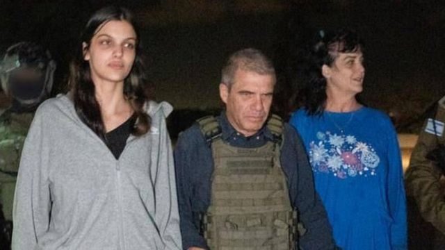
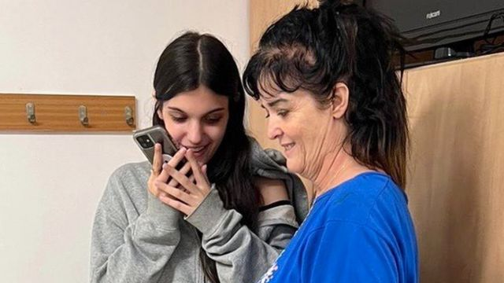
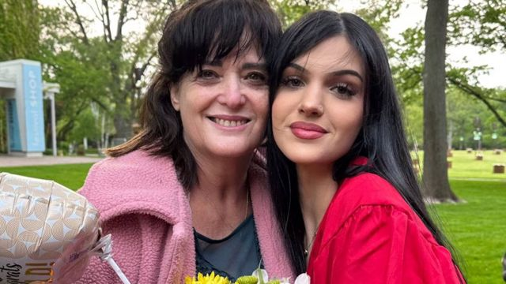
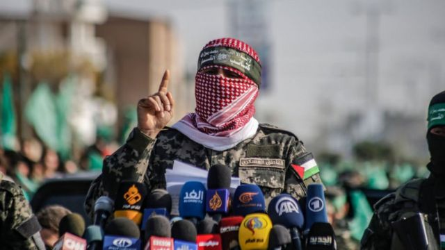
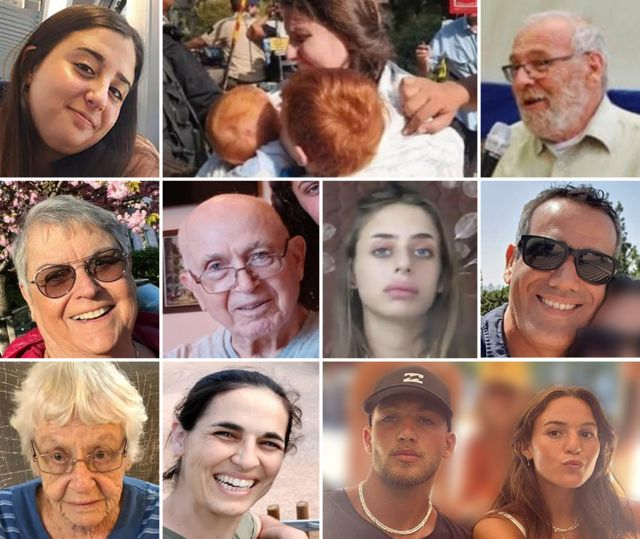

# [World] 以巴冲突：哈马斯释放两名美国人质，以色列未同意停火

#  以巴冲突：哈马斯释放两名美国人质，以色列未同意停火

> 图像来源，  Government of Israel
>
> 图像加注文字，娜塔莉（左）和她的母亲朱迪丝在获释后，由赫尔什准将（中）陪同返回以色列军事基地

**巴勒斯坦武装组织哈马斯（Hamas）基于“人道主义理由”，释放一对此前被扣押为人质的美国母女。**

这是本月以巴冲突爆发以来，首度确认有人质获释。美国总统拜登（Joe Biden）表示非常高兴，已经与拉亚南母女通过电话。

以色列总统内塔尼亚胡表示，正在努力救出更多人质，但强调以军仍然会“继续战斗直至取得胜利”。

分析指出，若以色列坚持攻入加沙，恐影响人质营救工作。

武装分子在10月7日突袭以色列，杀害1400人并绑架约200名不同国籍的人质。

巴勒斯坦官员则表示，在以色列的持续轰炸下，加沙已有4000多人死亡。

##  卡塔尔斡旋

BBC安全事务记者弗兰克·加德纳（Frank Gardner）报道指，这次有人质获释，卡塔尔发挥了关键角色。

卡塔尔既是哈马斯政治办事处的所在地，也是美国乌代德空军基地的所在地，那是美国驻海外最大的军事基地之一。

哈马斯突袭以色列六天之后，美国国务卿布林肯曾会见卡塔尔埃米尔，讨论加沙人质的困境。卡塔尔提出运用其对哈马斯的影响力协助营救人质。

随后数天，卡塔尔与哈马斯和以色列进行了微妙的谈判，尽管以色列在卡塔尔没有大使馆。

分析认为，现在以色列进退两难，若以军坚持攻入加沙，卡塔尔或其他调解人就很难通过谈判释放更多人质。

> 图像来源，  POTUS
>
> 图像加注文字，拉亚南母女在获释后与美国总统拜登通电话

##  母女探亲期间被掳

据以色列总理办公室消息，加尔·希尔什准将（Brig Gen Gal Hirsch）及其他以色列国防军（IDF）成员于周五（10月20日）晚上在巴勒斯坦飞地边界接收了这两名人质。

总理办公室表示，拉亚南母女被带到了该国中部一个军事基地，当时她们的家人已在那里等候。娜塔莉的父亲告诉美国媒体，他经历了人生中“最糟糕的两周”。

被劫持前，拉亚南母女在以色列庆祝娜塔莉高中毕业，以及她祖母塔玛尔·拉亚南（Tamar Ranaan）85岁生日。她们原本计划更早回到美国，但后来改变行程，在以色列逗留更长时间。

10月7日哈马斯进袭以色列时，她们一家身处以色列南部的纳哈勒奥兹聚居点（Kibbutz Nahal Oz），母女被掳走，祖母塔玛尔·拉亚南和她的伴侣耶希尔（Yehiel）则躲进了家中的安全室，之后被以色列国防军救出，得以幸存。

> 图像来源，  Family handout

59岁的母亲和她刚从高中毕业的17岁女儿来自伊利诺州，是芝加哥郊区埃文斯顿（Evanston）的居民。

娜塔莉的兄弟本·拉亚南（Ben Raanan）向BBC表示，对于世界各地很多不同宗教和信仰的人“将我的妹妹放在他们念想、祈祷当中的重要位置”，他“不胜感激”。娜塔莉的舅舅阿维·扎米尔（Avi Zamir）也表示，全家都感到“极为高兴”。

埃文斯顿的犹太教领袖拉比赫希特（Rabbi Meir Hecht）向BBC表示，当地的犹太社区感到“欢欣鼓舞”，而自从他们获释之后，他的手机就一直响个不停。

“我们为这样一个奇迹，感激全能的上帝，”赫希特说。他同时表示：“我们为仍然在那里的人质深感痛心。”

##  分析：值得高兴的时刻，但许多人质仍命运未卜

——BBC外交事务记者保罗·亚当斯（Paul Adams），发自耶路撒冷

经历最黑暗且充满恐惧和不确定性的两个星期，这是令人感到宽慰和喜悦的一刻。

但是，朱迪丝和和娜塔莉·拉亚南终于安全获释后发布的照片显示，两位女士看起来既疲惫又苍白，可见这场可怕的经历是有多难熬。

她们是如何被释放的呢？海湾国家卡塔尔表示，这是持续多天沟通的结果。多哈的外交部称，希望通过对话能够营救其他人质。

拜登显然相当高兴，他感谢卡塔尔和以色列在“这次工作中的合作”。

以色列总理内塔尼亚胡的高级顾问马克·雷格夫（Mark Regev）承认，外交工作发挥了一定的作用，但表示人质的释放也是以色列军事实力带来的结果。

现在人们希望让其他人质，尤其是长者和儿童，能够尽快获释。只不过，以色列对加沙地带的袭击并没有停止。

其他201名人质的命运仍然未卜。

##  各国致力营救人质

拜登感谢卡塔尔政府在两名女性获释一事中所作的调解努力，并表示美国官员日以继夜地努力解救被哈马斯劫持的美国公民。

哈马斯发言人阿布·乌拜达（Abu Ubaida）表示，释放这对母女是“出于人道主义理由”，并以此“证明拜登和他的法西斯政府的主张是虚假和无根据的”。

> 图像来源，  Getty Images
>
> 图像加注文字，哈马斯表示，释放人质是基于“人道主义理由”

美国有线电视新闻网（CNN）报道称，这名母亲的健康状况不佳，正在接受红十字会的治疗。

《芝加哥论坛报》（The Chicago Tribune）报道，朱迪丝·拉亚南出生于以色列，在美国从事美容师和人生导师工作，并且经常使用她的希伯来名字尤狄特（Yehudit）。

伊利诺州州长JB·普利兹克（JB Pritzker）发表一份声明称：“我等不及要迎接她们回家，她们在无法想象的恐怖面前展示了巨大的力量和勇气。”

据美国国务院称，本月截至周五已有32名美国公民在以色列与哈马斯的冲突中死亡，另10人仍下落不明。

美国和英国各自表示，正在与卡塔尔官员合作，寻求本国公民获释。

> 图像加注文字，被哈马斯掳走的人质包括小孩和长者

卡塔尔外交部发表声明表示：“我们会继续与以色列及哈马斯对话，希望这些努力能令从各个国籍的平民人质都能获释。”

阿根廷、德国、法国、泰国和葡萄牙等国均有公民被扣押为人质。

拉亚南母女所在的大家庭当中有很多人卷入了这次袭击事件中。现在仍有八名家庭成员在贝埃里聚居点（Kibbutz Be'eri）失踪，另有三人遇害，其中包括一名看护。

一名以色列军方发言人称，约有200名人质目前仍然被劫持，当中包括20名儿童，和10至20名60岁以上人士。哈马斯表示，他们被藏在加沙境内“安全的位置和地道中”。

较早前，哈马斯曾提出释放部分人质换取停火，但BBC获悉，以色列并未同意。

_*部分资讯来自BBC记者迈克·温德灵（Mike Wendling）、弗兰姬·麦康利（_ _Frankie McCamley_ _）和麦克斯·马兹查（_ _Max Matza_ _）的报道_

