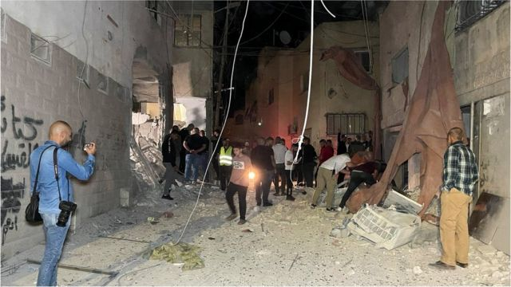
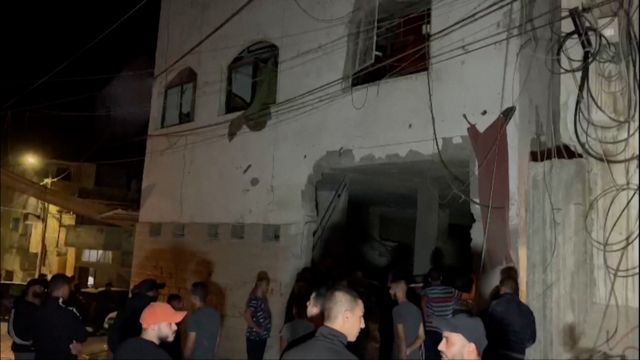
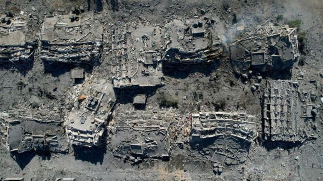
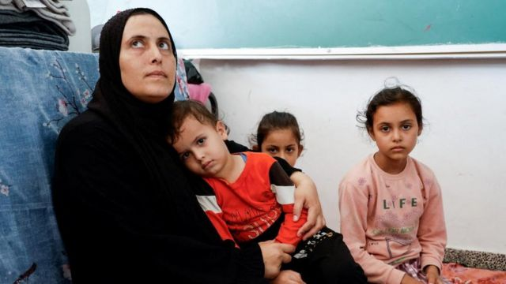
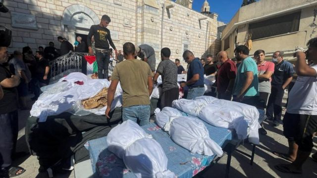

# [World] 以色列持续空袭加沙 中部社区几被夷为平地 教堂亦遭殃

#  以色列持续空袭加沙 中部社区几被夷为平地 教堂亦遭殃

> 图像来源，  Reuters
>
> 图像加注文字，以色列袭击杰宁一座清真寺下方的院落后，人们检查受损情况。

**以色列对加沙（Gaza，加萨）持续的空袭已经摧毁了该地大部分的社区，哈马斯主导的加沙卫生部官员表示，死亡人数已经上升至4300多人。他们还表示，被杀害的一半以上是妇女和儿童。**

联合国表示，超过140万加沙居民已经流离失所，其中有超过50万人居住在联合国提供的147个避难所内。在周六（10月21日），第一批救援卡车进入了加沙。

以色列军方则称，这批救援物资仅供应给加沙南部，并持续要求加沙北部一带的所有居民撤离，并且迁移到该地区中心的瓦迪加沙（Wadi Gaza）以南。

然而，以色列的空袭也在加沙地区南部持续进行，有些人拒绝离开他们的家，称没有任何地方是安全的。

在哈马斯军事部门突袭以色列，杀害了1400多人，并将超过200人劫持到加沙后，以色列便切断了对加沙的燃料、电力和水的供应。

联合国人道事务协调办公室（OCHA）表示，以色列在加沙，“密集轰炸”持续进行，巴勒斯坦武装团体也持续对以色列人口集中地区进行“不分靶向的火箭攻击”。

联合国将加沙的情况描述为灾难性。但以色列军方发言人丹尼尔·哈加里（Daniel Hagari）表示该地的人道状况“受到控制”。

**以色列与哈马斯在加沙冲突的最新进展：**

  * 据法新社报道，哈马斯表示，以色列对加沙地带的夜间空袭已造成至少55人死亡。 
  * 以色列军方发言人表示，随着以色列军队为预期的地面进攻做准备，对加沙地带的空袭将加强，几小时内有30多座房屋被毁。 
  * 以色列军方发言人丹尼尔·哈加里（Daniel Hagari）表示，这些袭击将有助于降低集结在边境地区的以色列军队面临的风险。他告诉加沙的巴勒斯坦平民，特别是居住在加沙城的巴勒斯坦平民，为了自身安全，继续向南迁移。 
  * 以色列军方发言人哈加里曾在周六的新闻发布会上表示，以色列军方将“深化”和“增加”对加沙的打击。 
  * 以色列国防军稍早表示，他们袭击了约旦河西岸杰宁的一个“恐怖分子营地”，据称该营地的一座清真寺内有一个哈马斯小组。 
  * 据联合国近东巴勒斯坦难民救济和工程机构称，以色列安全部队在努尔沙姆斯难民营的行动中，有13人在约旦河西岸丧生，其中包括5名儿童。近东救济工程处在周六发表的一份声明中还表示，一名以色列士兵也被杀，“数十人受伤”。 

> 图像来源，  Reuters
>
> 图像加注文字，西岸杰宁一座建筑遭受了导弹袭击。

  * 第一批向人口稠密的加沙地带运送援助物资的卡车于周六从埃及进入，运送巴勒斯坦人急需的食物、水和医疗用品，但不包括燃料。据一名BBC记者观看卡车进入加沙的报道，其中一辆卡车装载着棺材。 
  * 埃及总统阿卜杜勒·法塔赫·塞西（Abdel Fattah al-Sisi）表示，他反对强迫巴勒斯坦人流离失所的计划。塞西在开罗峰会上发表讲话时表示，唯一的解决方案是巴勒斯坦人独立建国。 
  * 塞西在开罗主办的“和平峰会”上发表讲话时表示，他的国家不会允许巴勒斯坦人通过拉法过境点进入埃及。 
  * 以色列表示，其在加沙军事行动的长期目标是切断与该领土的所有联系。以色列国防部长约阿夫·加兰特表示，一旦哈马斯被击败，以色列将结束“对加沙地带生命的责任”。 

##  阿尔扎赫拉社区几乎被全部摧毁

> 图像来源，  Reuters
>
> 图像加注文字，加沙中部扎阿尔扎赫拉社区几乎被全部摧毁。

以色列最新一波的空袭在加沙中部摧毁了阿尔扎赫拉（al- Zahraa）社区，超过20多座楼宇在上周五的夜间被飞弹夷为平地。在社交媒体上发布的图片和影片显示，浓烟在该社区上升，街道上满是倒塌的建筑。

当地居民告诉BBC，他们没预料到会受到轰炸，因为这个地区一直相对平静。他们说，当地时间上周四（10月19日）晚上20:30至21:00左右他们被告知撤离。

一位妇女在隔日向BBC说：“我们在街上狂奔。然后，以色列从晚上9点炸到了今天早上7点，没有停过。”

此次空袭使得成千上万的人无处可去。在上周五（10月20日），另一位居民告诉BBC，人们被困在家园的废墟下。他说：“救护车无法到达这里。人们在尖叫，但我们无法把他们拉出来。”

> 图像来源，  Reuters
>
> 图像加注文字，一名妇女和三名儿童在加沙一所联合国开办的学校避难。

此外，在加沙北部，人道组织巴勒斯坦“红新月会”（Red Crescent）表示，以色列军队下令撤离耶路撒冷医院（Al-Quds hospital）。据红新月会表示，这家医院目前有400多名患者和12000名流离失所的平民。该组织呼吁“国际社会立即行动”。

医疗人道组织“以色列医生人权协会”则表示，他们已经向以色列最高法院提交了一份请愿书，并发出警讯称，耶路撒冷医院无法撤离伤患。

该组织表示：“在回应中，政府宣布暂时不会攻击这家医院”，他们又发出警讯称，在战斗中伤害平民，是违反国际法并损害了医疗救援。

与此同时，非政府组织救助儿童组织警告说，在加沙“百万名儿童的生命岌岌可危”。他们呼吁从那里撤离生病和受伤的儿童，并警告称，由于医疗物资严重短缺和停电导致的死亡人数可能会飙升。

##  教堂遭受攻击

> 图像来源，  Reuters
>
> 图像加注文字，耶路撒冷东正教主教座对这次“袭击其教堂院区的以色列空袭”表示“最强烈谴责”。

以色列表示，正在调查10月19日一次针对哈马斯的空袭造成加沙一座教堂院区受损的事件。在加沙市的圣波尔菲里厄斯（Saint Porphyrius）教堂附近，有一栋建筑在袭击中部分倒塌。

哈马斯当局表示，该次空袭造成16人死亡，而以色列则表示他们已经得知有关伤亡的报告。

美国国会议员贾斯汀·阿马什（Justin Amash）说，他的几位在教堂院区避难的亲戚在该次以色列的空袭中丧生。他在社交媒体上写道：“巴勒斯坦的基督徒社区承受了很多苦难。我们的家人非常伤心。”

根据上周五公开的照片，主教堂的建筑受到了些损坏，但院区内的一座相邻建筑物则倒塌了。BBC的核实部门所见的照片显示大量碎片散落在道路上。耶路撒冷东正教主教座对这次“袭击其教堂院区的以色列空袭”表示“最强烈谴责”。

希腊东正教圣波尔菲里厄斯教堂是加沙仍在使用的最古老的教堂之一。其现有建筑结构可以追溯到12世纪。加沙约有1千名基督徒，其中多数人是希腊东正教徒。

哈马斯声称有多达500人在该地避难，尽管这一数字无法核实。

