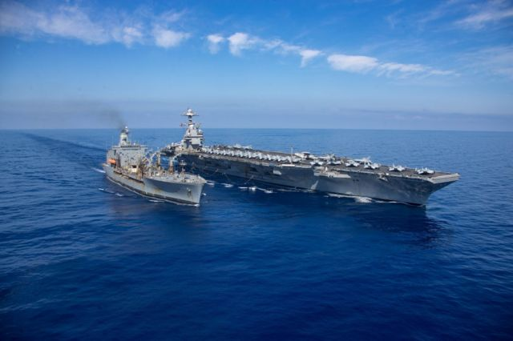
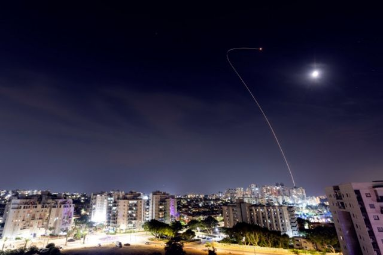
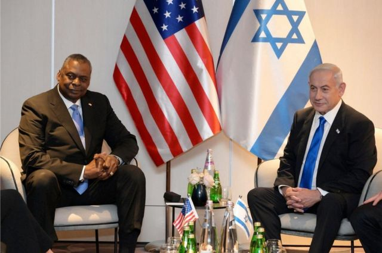

# [World] 以巴冲突：为保卫以色列，美国愿意走多远？

#  以巴冲突：为保卫以色列，美国愿意走多远？

  * 乔纳森·比厄（Jonathan Beale） 
  * BBC防卫事务记者，发自以色列阿什克伦 

> 图像来源，  Reuters
>
> 图像加注文字，美军福特号航空母舰（The USS Gerald R Ford）是美国在地中海东部所展示军事力量的一部分

**美国已承诺毫不动摇地支持以色列，并以军事援助表决心。但鉴于该地区过往的纠葛至今仍挥之不去，美国参与其中的限度会在哪里？**

在首次就哈马斯攻击以色列作出回应时，美国总统拜登明确表明了自己站在哪一边，他说：“美国是以色列的后盾。”

他还补充说：“对于任何想要借机乘虚而入的人，我只有一句：不要。”

这个警告明显是针对伊朗及其盟友的。

五角大楼表示，近日美军在伊拉克和叙利亚数次遭到袭击，美国一艘驱逐舰在红海拦截了从也门发射、“有可能”瞄准以色列的导弹。

美国已经有一个航空母舰打击群驻扎在地中海东部，很快也会有另一个该地区的航母打击群加入。每艘航空母舰上均配备70多架飞机——这是相当强的火力。拜登还指派数以千计美军人员待命，有需要时前往该地区。

美国是以色列最大的军事后盾，每年为其提供约38亿美元防务援助。

以色列用于轰炸加沙的飞机是美国制造的，目前使用的大部分精确制导弹药也是一样。以色列的“铁穹”防空系统当中一些拦截导弹也是由美国生产。

不等以色列请求，美国就已经对这些武器进行了补给。拜登上周五（10月20日）请求国会批准向其中东盟友提供140亿美元的战争基金，这是1050亿美元（870亿英镑）军事援助的一部分。

次日，五角大楼宣布将向中东调动两套最强大的导弹防御系统——包括一个末端高空防御系统（THAAD，俗称“萨德”）发射装置，加上一个爱国者导弹发射装置。

但是，美国总统会真的愿意在选举年卷入又一场战争吗？美国近年在该地区的军事行动，无论是在政治、经济还是美国人的生命方面，都已证明是代价高昂。

##  更多关于以巴冲突的报道

曾任以色列驻美大使的迈克尔·奥伦（Michael Oren）认为，通过派遣美军航母进入该地区，拜登总统已经迈出了第一步。“如果你不是有准备去使用它的话，你不会亮出这把枪，”他说。

但华盛顿战略与国际问题研究中心（The Centre for Strategic and International Studies）的国际安全主任塞斯·琼斯（Seth G Jone）表示，美国将非常不愿意在军事上直接介入加沙战争。

他说，航母打击群的存在，可能“不开一枪”也能发挥作用，因为它们至少有情报收集和提供防空保护的能力。他说，任何军事介入都将是“最后一步”。

现在令以色列和美国都担心的主要威胁，是来自以色列北部，特别是武装组织真主党（Hezbollah）。

这个由伊朗支持的组织在加沙的威胁比哈马斯大得多。它拥有约15万枚火箭炮，而且比哈马斯的火箭炮火力更强，也更准备。该组织已经与其宿敌以色列交过火。

奥伦担心，在以色列“深陷加沙战事，已全力投入且疲惫不堪”的时候，真主党可能会介入。

奥伦认为假如发生这种情况，美国就有可能动用其强大的空军力量来打击黎巴嫩境内目标，不过他并不认为美国会派地面部队踏足战场。

> 图像来源，  Reuters
>
> 图像加注文字，以色列的“铁穹”反导弹系统，在加沙拦截火箭炮

美国国务卿布林肯（Antony Blinken）和国防部长奥斯汀（Lloyd Austin）均明确表示，如果局势升级，任何美国人员或者军队成为目标，美国将会作出回应。

奥斯汀在周日（10月22日）表示，美国有权自卫，并且将毫不犹豫采取“适当行动”。

学者琼斯承认，冲突的风险在扩大，但是美国的威慑力“确实会提高伊朗及其代理人的风险成本”。

他说，如果黎巴嫩真主党要从以色列北部发起重大的攻击行动，“他们很可能会面临相当有力的回应”。他指出，美国在该地区的军队过去受到与伊朗有关系的组织袭击并不多。

以色列也未有要求美国提供直接的军事支援。耶路撒冷希伯来大学的军事历史教授丹尼·奥尔巴赫（Danny Orbach）指出，以色列的军事准则提到，它应要具备独立保卫自己的能力。

> 图像来源，  Getty Images
>
> 图像加注文字，美国国防部长奥斯汀（左）与以色列总统内塔尼亚胡见面

拜登本周访问以色列时表明，美国的支持是有条件的。他希望以色列允许人道援助进入加沙，且不希望看到以色列无限期地占领加沙地带。他向哥伦比亚广播公司（CBS）的节目《60分钟》（60 Minutes）表示，那样做会是一个“大错误”。

美国的支持可能也是有时限的。《耶路撒冷邮报》的军事分析家兼专栏作家雅各夫·卡茨（Yaacov Katz）认为，一旦以色列开始在加沙的军事行动并且平民伤亡增加，美国对以色列的支持就将面临压力。

他认为，支持可能在几周内就会减弱。“我看不到以色列在长时间持续地面进攻时还会从美国或全世界得到更多的宽容，”他说。

美国显然希望，其对以色列的军事支持以及自己加强在该地区的军事存在，能足够防止冲突扩大。

美国代表以色列直接介入的事例很少。一个罕见的例外就是1991年海湾战争，美国派遣爱国者导弹发射部队，防卫伊拉克的“飞毛腿”导弹对以色列的攻击，之后又派自己的军队进袭。

实际上，美国反而更常使用自己对以色列的军事影响力，来作为约束的手段。

