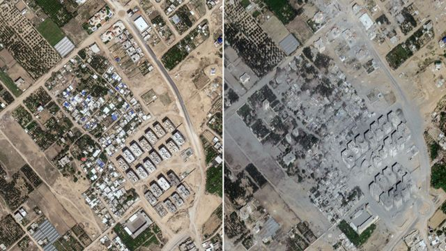
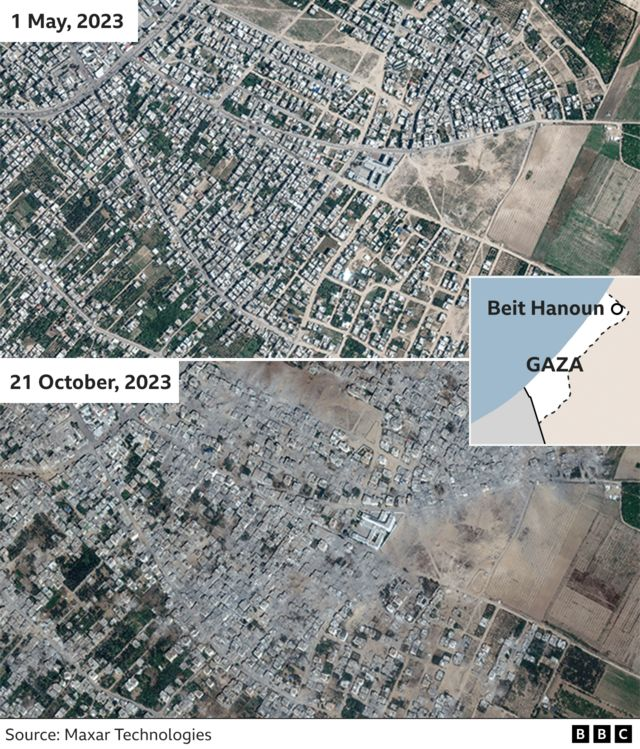
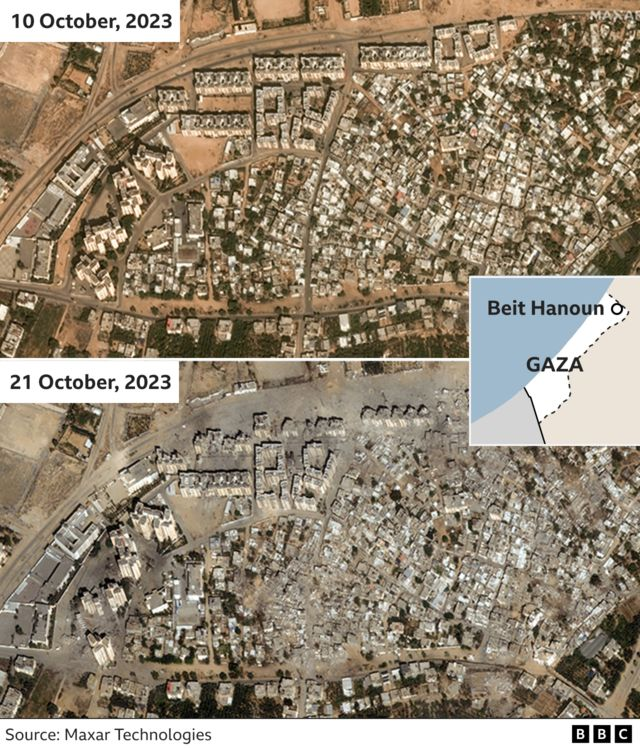
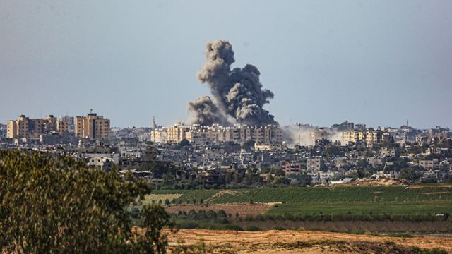
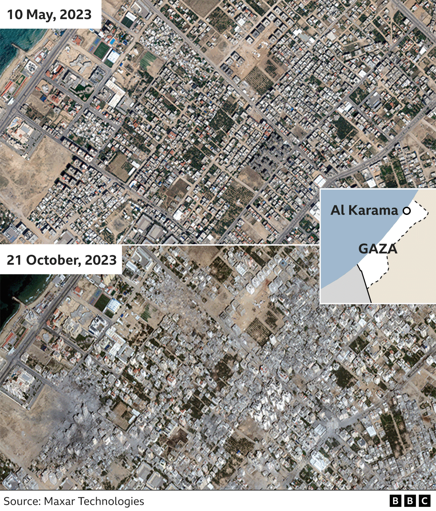
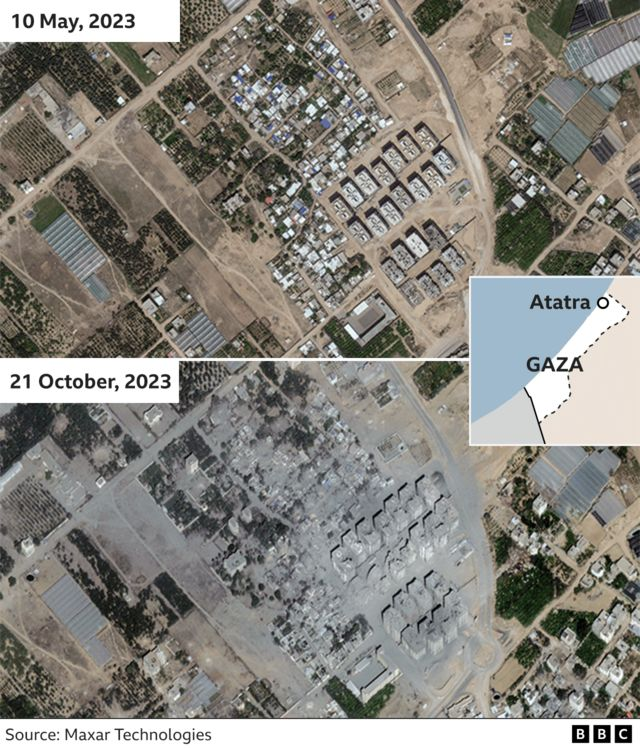

# [World] 以巴冲突：卫星图片显示加沙地带空袭前后对比

#  以巴冲突：卫星图片显示加沙地带空袭前后对比

  * BBC视觉新闻团队（The Visual Journalism Team） 
  * BBC新闻部 

> 图像来源，  Maxar Technologies

**以色列军方过去三周持续空袭加沙地带，一批新发布的卫星图片显示出该区受损程度。**

由马萨尔科技（Maxar Technologies）公司发布的卫星图片，对比了本周稍早从太空拍摄到的影像，与这轮冲突前的差异。

最新图片显示，在加沙北部的三个地区，空袭已经令数十座高楼被完全摧毁或严重损坏，大片建筑密集的区域变成了灰色的废墟堆。

**拜特哈农（Beit Hanoun）** 是加沙东北部的一个居民区，距离以色列边境仅2公里（1.2英里），是卫星图片显示受影响最严重的地区。以色列军队称，该地区是哈马斯的一个聚集地点，也是以色列最早警告居民撤离的地区之一。

下图显示的 **拜特哈农** **（Beit Hanoun）** 地区，位于通往埃雷兹（Erez）过境点的主要道路上。

仅仅两个多星期前，这里还有一些多层建筑，现在已几乎完全倒塌。

哈马斯管理的住房部门估计，该地区约45%的住宅已被完全摧毁、不能居住或受到破坏。估计区内约有140万人流离失所。

数以万计巴勒斯坦人在以军发出撤离令后，已逃离了他们在加沙北部的家园——但是一些人又已返回北部，因为南部也遭到空袭。

> 图像来源，  Getty Images
>
> 图像加注文字，10月21日，以色列空袭在拜特哈农上空造成的烟云

下图显示的是 **卡拉马社区（Al Karama）** ，位于加沙北部地中海沿岸。

在沿海主要道路后面，有好几家酒店的一些区域，已遭受以色列空袭。

**阿塔特拉（Atatra）** 位于以色列边境以南约3公里（1.8英里），那里有超过20座高层大楼和几座建筑物严重受损。

从下图可见，在高层建筑南边的一个体育设施，已被袭击所造成的灰烬所覆盖。

##  更多关于以巴冲突的报道：

