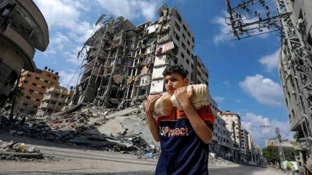
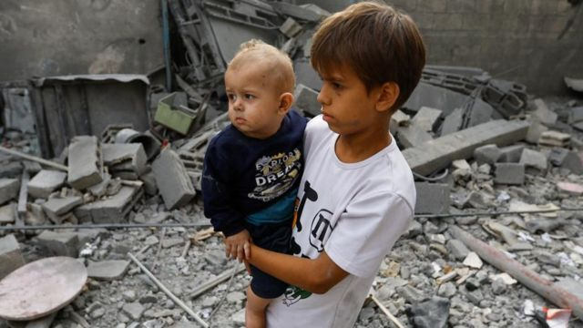
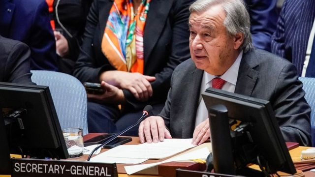
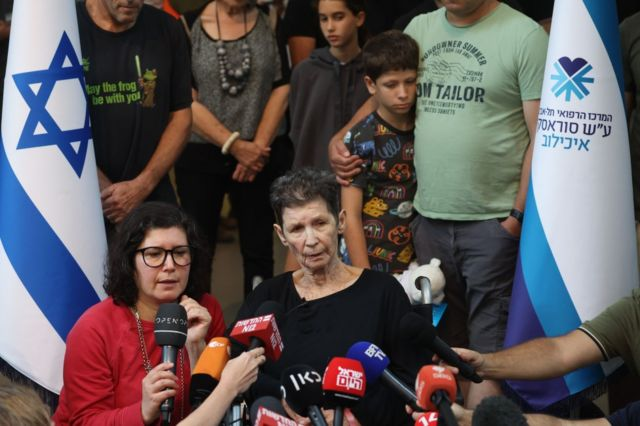
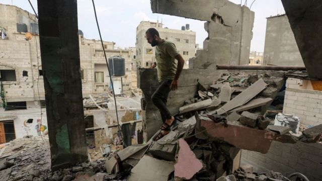

# [World] 以色列宣称进入“第二阶段”战争 哈马斯首提加沙人质交换

#  以色列宣称进入“第二阶段”战争 哈马斯首提加沙人质交换

> 图像来源，  EPA-EFE/REX/Shutterstock
>
> 图像加注文字，哈马斯突袭之后，以色列一直持续轰炸加沙地带

**以色列总理本杰明·内塔尼亚胡( Benjamin Netanyahu）表示，以色列在加萨的地面行动标志着与哈马斯的战争进入了“第二阶段” 且将会是“艰难且长期的战斗”。**

他在周六（10月28日）的电视演说中说，将会有更多的以色列地面部队进入他所称的“邪恶据点”——即加沙（加萨 Gaza）——并表示以军指挥官已部署在整个加沙地带。

当日他还会见了被哈马斯扣为人质的以色列人家属。家属对加萨地带愈演愈烈的袭击表示担忧，但内塔尼亚胡说，解救人质是军方作战核心目标的一部分。

加沙城上空再次飘下传单，警告居民该地区现在是个“战场”，要求他们必须前往南部。但加沙平民仍然与外界隔绝，因为大多数人的电话线和网路都中断了。此外，针对土耳其总统艾尔多安指责以色列犯下战争罪，内塔尼亚胡愤怒下撤出该国外交官，并称以色列国防军是一支“道德军队”。

联合国秘书长安东尼奥古特雷斯周末表示，以色列对加沙军事攻击的升级令他感到惊讶，他认为，国际社会似乎越来越一致认为需要启动调停冲突的人道行动。

古特雷斯发声明称：“国际社会似乎更加有共识，让我在过去几天感到鼓舞；至少需要出于人道主义目的暂停战斗。遗憾的是，以色列的轰炸空前地升级，造成的灾难后果，让我吃惊，损害了我们的人道目标。”

> 图像来源，  Reuters
>
> 图像加注文字，加沙人道危机持续。根据哈马斯控制的加萨卫生部表示，自以色列报复性轰炸以来，已有8000 多人丧生。

上周，联合国大会以压倒性多数呼吁以色列和哈马斯立即依据人道主义而休战，以便向加沙提供更多援助。但以色列愤怒地驳回了该决议。自从10 月7 日哈马斯突袭以来， 已导致以色列1400 人死亡、229 人被绑架。以色列一直在轰炸加沙作为报复。根据哈马斯控制的加沙卫生部表示，自以色列报复性轰炸以来已有8000 多人丧生。

**第二阶段战争是什么？** 上周，以色列国防部长约阿夫·加兰特告诉国防委员会称，战争将分为三阶段。

他说，行动的第一段旨在摧毁哈马斯的基础设施。第二阶段，以色列部队将“消除零星抵抗”；第三阶段后，以色列后，以色列将不再对加沙运作承担责任，并为以色列公民实现全新安全保障

##  哈马斯提人质交换

自10 月7 日战争爆发以来，哈马斯加沙领导人辛瓦尔（Yahya Sinwar） 首次发表评论说，表示愿意释放所有被扣押在加沙的人质，以换取以色列释放监狱中所有哈马斯囚犯。辛瓦尔在该组织官方网站上的声明中表示“我们准备立即达成交换协议，其中包括释放犹太复国主义敌人监狱中的所有囚犯，以换取我们抵抗组织手里的所有囚犯。”对此，内塔尼亚胡说以色列战时内阁已讨论过以人质换囚犯的协议，但拒绝透露具体细节。战争进入第三周，目前人质危机让以色列领导层面临新压力，亲属及各界要求确保人质安全获释。

> 图像来源，  EPA
>
> 图像加注文字，古特雷斯表示，在加沙地带有明显违反人道主义法规的事件，令他非常担忧

联合国人权事务高级专员福尔克尔·蒂尔克（Volker Türk）警告说，以色列在加沙若发起大规模地面军事行动，可能会产生灾难性后果，可能导致数千平民死亡。

他力促双方和该地区有影响力的其他国家“尽一切努力缓和冲突”。他还表示，以色列军队对加沙的轰炸和地面行动是迄今为止最密集的攻击，“这使这场可怕危机中的暴力和苦难达到了新水平”。他说，以色列对电信设施的袭击，和随后关闭互联网使加沙人无法了解正发生的事情，并切断了他们与外界的联系。 “这加剧了平民的痛苦与不幸。”以色列则回应称，其在加沙的军事行动旨在摧毁哈马斯及其基础设施，使其无法再发动攻击。

> 图像来源，  EPA
>
> 图像加注文字，被释放的85岁人质约切韦德·利夫希茨（Yocheved Lifschitz）（中），在她女儿莎朗（Sharone）身旁接受媒体采访。

##  分析：以色列人质家属的焦虑

亚当斯（Paul Adams） BBC 外交记者发自耶路撒冷

任何希望听到以色列暂停袭击加沙以确保人质获释消息的人，现在都感到失望。

内塔尼亚胡是以这样的大背景下来看待这场战斗：“一场长达 3000 年的犹太人生存之战。”

他说，以色列必须获胜。击溃哈马斯是他的主要目标，确保人质获释却是次要的。他是在会见被哈马斯扣为人质的以色列人亲属后不久，发表上述言论。人质亲友们却深感忧虑，希望得到保证，也就是在以色列宣布扩大军事行动前24小时，他们的亲友不会被哈马斯处死。而以色列总理却表示，当他见到这些家人时，心都碎了，并表示击败哈马斯和将人质带回家之间“并不矛盾”。以色列国防部长加兰特进一步表明了政府的战略，他表示：“我们对哈马斯的打击越多，我们就知道他们就更愿意达成某种协议，我们将能够让我们心爱的亲人回家了。”

> 图像来源，  Getty Images
>
> 图像加注文字，内塔尼亚胡是以这样的大背景下来看待这场战斗：一场长达 3000 年的犹太人生存之战。

