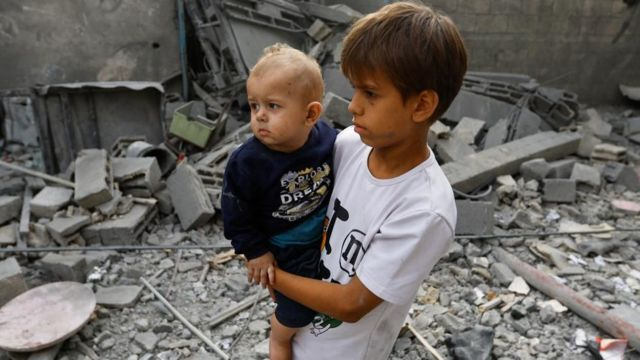
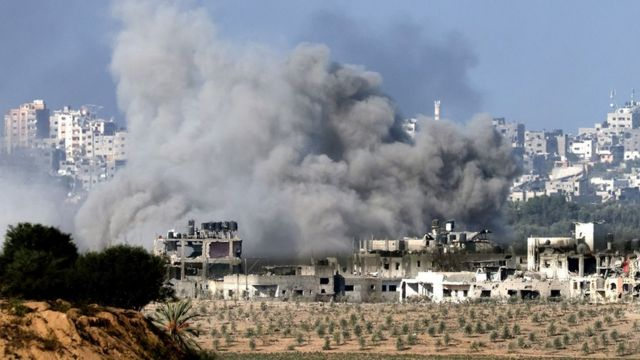
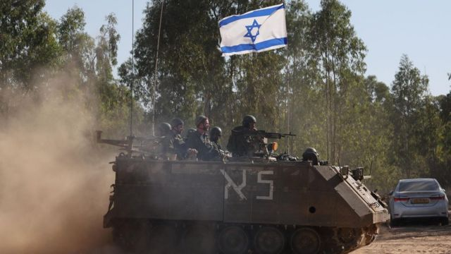

# [World] 以巴冲突：专家警告，以色列没有为战后加沙制定计划

#  以巴冲突：专家警告，以色列没有为战后加沙制定计划

  * 保罗·亚当斯（Paul Adams） 
  * BBC外交记者 

> 图像来源，  Reuters
>
> 图像加注文字，两名巴勒斯坦儿童站在加沙南部汗尤尼斯的废墟中

**以色列总理本杰明·内塔尼亚胡（Benjamin Netanyahu）誓言要“改变中东”。美国总统拜登（Joe Biden）称“没有退路”。但是，随着以色列军队对加沙地带的攻击不断升级，并向巴勒斯坦人发出新的紧急警告，要求他们让开道路，战争将何去何从？**

在10月7日的恐怖事件发生之后，以色列官员不断表示，他们打算在军事上和政治上将哈马斯从加沙地带连根拔起。

但除了运用无情的、压倒性的军事力量外，如何实现这一前所未有的雄心壮志还不清楚。

特拉维夫大学摩西·达扬中心（Moshe Dayan Centre）巴勒斯坦研究论坛负责人迈克尔·米尔施泰因（Michael Milshtein）博士说：“你不可能在没有后天计划的情况下，推动这样一个历史性行动。”

米尔施泰因博士曾任以色列军事情报局巴勒斯坦事务部部长，他担心有关规划才刚刚开始。

“需要马上行动”，他说。

西方外交官表示，他们正在与以色列就未来局势进行激烈讨论，但迄今为止一切都还不明朗。

> 图像来源，  Getty Images
>
> 图像加注文字，10月30 日，以色列继续轰炸加沙地带，建筑物冒出浓烟。

一位外交官称：“绝对没有固定的计划。你可以在纸上勾勒出一些想法，但要让它们变成现实，还需要数周、数月的外交努力。”

军事计划是存在的，比如削弱哈马斯的军事能力，或者占领加沙地带的大片地区。但对于那些在处理过往危机方面有着长期经验的人说，计划也就到此为止了。

以色列对外情报机构摩萨德的前高级官员哈伊姆·托默（Haim Tomer）说：“在我们撤军后的第二天就能为加沙找到可行的解决方案不太可能。”

以色列人几乎一致认为：必须击败哈马斯。10月7日的大屠杀实在是太骇人听闻了。不能再允许该组织统治加沙。

Skip podcast promotion and continue reading

* BBC 時事一周 Newsweek (Cantonese)   **

BBC國際台粵語節目，重溫一周國際大事，兩岸四地消息，英國境況。並備有專題環節：〈記者來鴻〉、〈英國生活點滴〉和〈華人談天下〉。

分集

End of podcast promotion

但米尔施泰因博士说，哈马斯贯彻的是一种理念，以色列无法轻易将其消灭。

他说：“这不像1945年的柏林，把一面旗帜插在国会大厦上就完事了。”

他说，2003年的伊拉克更容易比较，当时以美国为首的军队试图清除萨达姆政权的痕迹。被称为“去复兴党化”的行动是一场灾难。它导致数十万伊拉克公务员和武装部队成员失业，为毁灭性的叛乱埋下了种子。

参加过那场冲突的美国老兵正在以色列，向以色列军方讲述他们在费卢杰和摩苏尔等地的经历。“我希望他们能向以色列人解释，他们在伊拉克犯下了巨大的错误”，米尔施泰因博士说。

“例如，不要对铲除执政党或改变人们的思想抱有幻想。那是不可能的。”

巴勒斯坦人对此表示赞同。

巴勒斯坦民族倡议组织（Palestinian National Initiative）主席穆斯塔法·巴尔古提（Mustafa Barghouti）说：“哈马斯是一个广受欢迎的基层组织”。如果他们想清除哈马斯，就需要对整个加沙进行种族清洗。

这种想法——以色列暗中打算迫使数十万巴勒斯坦人离开加沙地带，进入邻国埃及——正在激起巴勒斯坦人最根深蒂固的恐惧。

对于已经在很大程度上由难民（以色列建国时逃离或被赶出家园的人）组成的人口来说，再一次大规模逃亡会让他们回忆起1948年的创伤性事件。

巴勒斯坦解放组织前发言人戴安娜·布图（Diana Buttu）说：“逃离意味着一张单程票。回不来了”。

包括前高级官员在内的以色列评论员经常提到，需要将巴勒斯坦人暂时安置在边界另一侧的西奈半岛。

以色列国家安全委员会前负责人吉奥拉·艾兰德（Giora Eiland）说，以色列要想在不杀害大量无辜巴勒斯坦人的情况下实现其在加沙的军事野心，唯一的办法就是让平民撤离加沙。

“他们应该越过边界前往埃及”，他说，“暂时或永久地。”

美国总统拜登10月20日请求国会批准拨款支持以色列和乌克兰，其中的一句话加重了巴勒斯坦人的担忧。

“这场危机很可能导致跨境流离失所，以及更高的地区人道主义需求。”

迄今为止，以色列尚未表示希望巴勒斯坦人越境。以色列国防军（IDF）一再告诉平民，只能转移到南部界限不清的“安全区”。

但埃及总统阿卜杜勒·法塔赫·塞西（Abdel Fattah el-Sissi）警告说，以色列在加沙发动的战争可能是“企图迫使平民......迁移到埃及”。

假设战争结束后加沙地带仍有加沙人，谁来统治他们？

米尔施泰因博士说："这个问题价值连城。”

他说，以色列应该支持建立由加沙人管理的新政府，并得到当地领导人的支持，以及美国、埃及或许还有沙特阿拉伯的支持。

新政府还应包括法塔赫（Fatah）的领导人，法塔赫是巴勒斯坦的敌对派别，哈马斯在2006年赢得选举一年后用暴力将其逐出加沙。

法塔赫控制着巴勒斯坦权力机构，该机构总部设在被占领的约旦河西岸的拉马拉市（Ramallah）。

但无论是在约旦河西岸还是在加沙地带，巴勒斯坦权力机构及其年迈的主席马哈茂德·阿巴斯（Mahmud Abbas）在巴勒斯坦人中都极不受欢迎。

戴安娜·布图（Diana Buttu）说，巴勒斯坦权力机构可能暗地里想重返加沙，但如果这意味着“坐上以色列坦克的后座”，那就不可能了。

巴勒斯坦资深政治家哈南·阿什拉维（Hanan Ashrawi）曾在20世纪90年代短暂供职于巴权力机构，一想到包括以色列在内的外来者将再次试图决定巴勒斯坦人的生活方式，她就不寒而栗。

“有人认为这是一个棋盘，他们可以在这里和那里移动几个棋子，最后走一步将军棋。这是不可能的”，她说。

“你可能会找到一些合作者，"她说，"但加沙人不会善待他们。”

> 图像来源，  EPA
>
> 图像加注文字，以色列军队征召了创纪录数量的预备役军人参加与对哈马斯的战斗。

在那些曾经处理过加沙战争（尽管规模没有这么大）的人当中，存在着深深的忧虑和一种几乎所有事情都已经被尝试过的感觉。

前摩萨德军官哈伊姆·托默（Haim Tomer）说，他会暂停军事行动一个月，争取先把人质救出来。

2012年，在加沙发生上一轮战斗后，他陪同摩萨德负责人前往开罗进行秘密会谈，最终达成停火协议。

他说，哈马斯代表“街道的另一边”，埃及官员穿梭其间。

他说，类似的机制应该再次使用，而以色列几乎肯定会付出高昂的代价。

“我不在乎释放几千名哈马斯囚犯。我希望看到我们的人民回家。”

他说，以色列届时可以决定是恢复全面军事行动，还是选择长期停火。

但他说，除非将加沙地带与以色列实际分离并拖入地中海，否则以色列注定要无限期地与加沙地带打交道。

“它就像我们喉咙里的一根骨头。”

