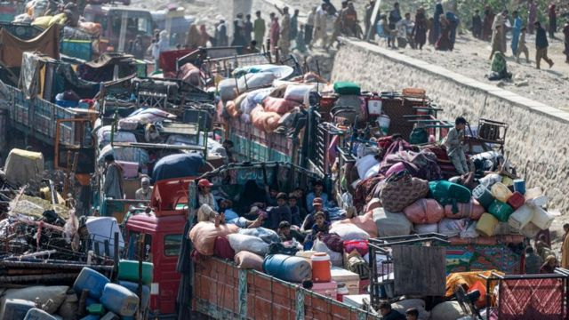
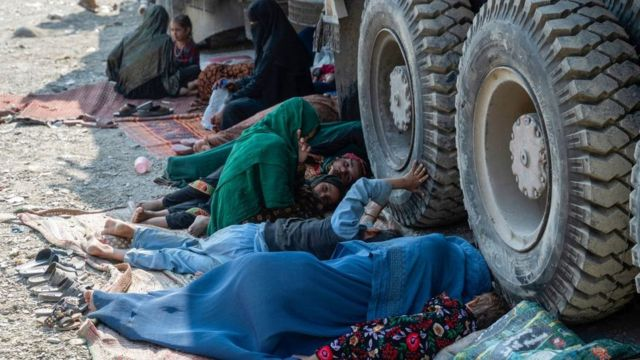
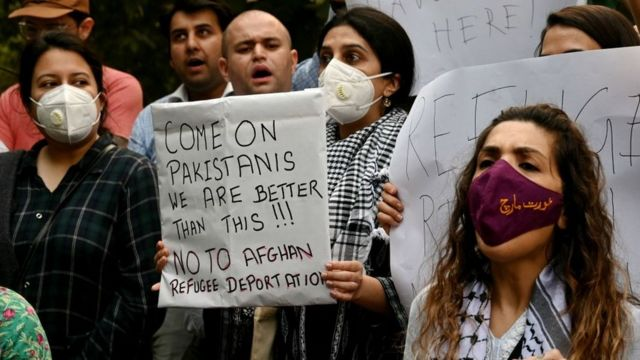

# [World] 巴基斯坦下令驱逐滞留外国人，大批阿富汗难民被迫离开

#  巴基斯坦下令驱逐滞留外国人，大批阿富汗难民被迫离开

  * 阿齐祖拉·汗（Azizullah Khan）和黃思琪（Kelly Ng） 
  * 发自白沙瓦和新加坡 

> 图像来源，  Getty Images
>
> 图像加注文字，难民乘坐卡车抵达巴基斯坦-阿富汗边境

**数以千计居住在巴基斯坦的阿富汗人争先恐后地赶往边境，希望赶在周三（11月1日）的最后期限之前离开。**

巴基斯坦称，170 万无证外国人必须在 11 月 1 日前离开，否则将面临逮捕和驱逐，其中大部分是阿富汗人。许多阿富汗人在塔利班于 2021 年重新上台后出逃，他们惊恐万分。还有一些人已经在巴基斯坦生活了几十年。

从技术上讲，离开的最后期限已于周三午夜到期。但据巴基斯坦媒体报道，那些正在离开该国的难民可以在当天继续他们的行程。

“如果我们被迫离开巴基斯坦，要去哪里呢？”一位年轻女士问道。

萨迪亚（Sadia）一直在巴基斯坦西北部的白沙瓦学习。她说，两年前，塔利班政府根据其严苛的伊斯兰法禁止女性上学，为了获得受教育的机会，她逃离了阿富汗。

“我在巴基斯坦学习，希望在这里继续接受教育。如果我们不得已要离开，我将无法在阿富汗继续学业。我的父母、姐姐和弟弟都对未来感到恐惧。”

在跨境袭击事件激增之后，两国之间关系趋紧，伊斯兰堡将这些事件归责于以阿富汗为基地的武装分子。

塔利班政权否认为针对巴基斯坦的武装分子提供庇护所，并称驱逐无证阿富汗人的举动是“不可接受的”。

周二是难民自愿离境的最后一天，大批难民乘坐满载衣物和家具的卡车赶往阿富汗边境。

巴基斯坦称，截至周一，已有近 20 万阿富汗人离境。

> 图像来源，  Getty Images
>
> 图像加注文字，巴基斯坦表示，未经许可留在该国的难民如果不在 11 月 1 日之前离开该国，将被驱逐出境。

根据联合国的一份报告，每十个离开的人中就有八个说，他们担心留下来会被逮捕。

其中许多难民是在塔利班重新控制阿富汗后逃离的，他们担心梦想和生计将再次被粉碎。

但是，近年来巴基斯坦陷入经济危机，对难民失去耐心。7 月份，巴基斯坦卢比对美元的汇率创下了自 1998 年 10 月以来的最大跌幅。

联合国人权办公室敦促巴基斯坦当局停止驱逐，以避免发生“人道灾难”。

联合国人权办公室发言人拉维娜-沙姆达萨尼（Ravina Shamdasani）说：“我们认为，许多面临驱逐的人如果被遣返回阿富汗，将面临人权受到侵犯的极大风险，包括任意逮捕和拘留、酷刑、残忍和其他不人道的待遇。”

塔利班政府完全违背了他们早先做出的给予女性工作和学习权利的承诺——在他们的统治下，对女性权利的压制是世界上最严厉的。

除了被禁止上学之外，女孩还不得进入公园、健身房和游泳池。美容院被关闭，妇女必须从头到脚穿戴整齐。

今年早些时候，塔利班政府还焚烧了乐器，声称音乐“导致道德败坏”。

阿富汗歌手索海尔（Sohail）说，2021 年 8 月塔利班控制首都喀布尔的当晚，他“只带了几件衣服”逃离了那里。

他说：“作为一名音乐家，我无法在阿富汗生活下去”。住在巴基斯坦白沙瓦的他和家人努力维持生计。

他说：“我们正面临一个关键时刻，因为没有其他选择，塔利班不接受阿富汗的音乐，我们也没有其他谋生选择。”

塔利班政府表示已经成立委员会，为返回的阿富汗人提供基本服务，包括临时住所和医疗服务。

塔利班发言人扎比胡拉-穆贾希德（Zabihullah Mujahid）在前身为推特的 X 上说：“我们向他们保证，他们可以无忧无虑地返回自己的国家，过上有尊严的生活。”

> 图像来源，  Getty Images
>
> 图像加注文字，人们抗议巴基斯坦驱逐阿富汗人。

数十年来，巴基斯坦收容了数十万阿富汗难民。据联合国统计，约有130万阿富汗人登记为难民，另有88万人获得了合法居留身份。

巴基斯坦内政部长萨尔弗拉兹-布格蒂（Sarfraz Bugti）在 10 月 3 日宣布驱逐令时说，另有 170 万人“非法”留在巴基斯坦。

联合国的数字与此不同——联合国估计有超过200万无证阿富汗人生活在巴基斯坦，其中至少有60万人是在塔利班重新掌权后来到巴基斯坦的。

布格蒂的命令是在巴基斯坦与阿富汗边境附近暴力事件激增之后下达的，这些暴力事件往往涉及巴基斯坦塔利班运动（Tehrik-e Taliban Pakistan，TTP，巴塔）和伊斯兰国武装组织等武装分子。

这位部长声称，今年在巴基斯坦发生的 24 起自杀式爆炸事件中，有 14 起是阿富汗人所为。

他引述国家媒体的报道说：“我们受到来自阿富汗境内发起的袭击，阿富汗人参与了对我们的袭击......这一点不容置疑。我们有证据”。

布格蒂周一表示，未经许可的难民如果不离开，将被驱逐出境。他强调，镇压行动并非针对特定民族，但他承认受影响的主要是阿富汗人。

9 月早些时候，巴基斯坦发生了两起自杀式爆炸袭击，造成至少 57 人死亡。尽管布格蒂称其中一名自杀式炸弹袭击者已被确认为阿富汗人，但没有任何组织声称对袭击负责，塔利班也否认参与。

