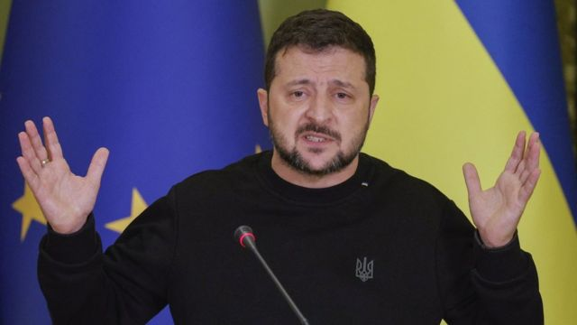
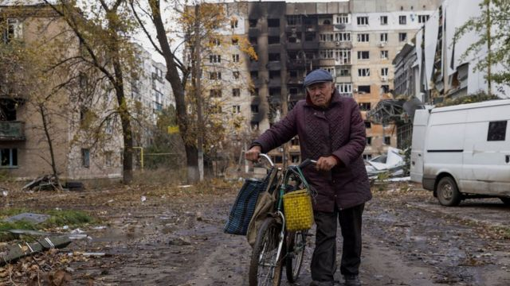

# [World] 泽连斯基：中东战争正转移对乌克兰战场的注意力

#  泽连斯基：中东战争正转移对乌克兰战场的注意力

  * 雅罗斯拉夫·卢基夫（Jaroslav Lukiv） 
  * BBC记者 

> 图像来源，  EPA-EFE/REX/Shutterstock
>
> 图像加注文字，泽连斯基表示：显然中东的战争正在将焦点转移远离了乌克兰。

**乌克兰总统泽连斯基（Volodymyr Zelensky）承认，以色列与哈马斯间的战争将“焦点转移”，影响了正在乌克兰发生的冲突。他又强调，这是俄罗斯的“其中一个目标”。**

俄罗斯在2022年2月对乌克兰发动全面入侵。

尽管乌克兰最高军事将领最近对此进行了评估，但泽连斯基否认乌克兰的战斗陷入了僵局。

目前为止，乌克兰在南部的反攻进展甚微。这引起了基辅西方盟友的忧虑。有人担忧这些盟友会因此感到“战争疲惫”，甚至有一些国家出现不愿继续向乌克兰提供先进武器和金援的迹象。

在周六（11月4日）的另一项军事冲突中，乌克兰国防部长乌梅罗夫证实，来自“外喀尔巴阡山脉”（​​Zakarpattia）第128山地突击旅的乌克兰士兵被杀，并下令对他所称的“悲剧”进行全面调查。但他也没有说明在上周五俄罗斯在南部泽波罗热日（Zaporizhzhia）地区发动的这次飞弹袭击中，有多少乌克兰士兵丧生。

乌克兰媒体和俄罗斯军事部落客（博主，bloggers）早些时候报导，在靠近前线的村庄举行的颁奖典礼上，有超过20名乌克兰军人被杀。

而乌克兰军方则表示，11月4日，他们成功击中了克里米亚一家造船厂的“海上和港口基础设施”。

克里米亚是俄罗斯于2014年非法吞并的乌克兰南部半岛。

俄罗斯国防部随后引述该国的官方新闻机构称，乌克兰向克里米亚东部城市克尔恰的一家工厂发射了15枚导弹中有13枚被击落，但有一艘俄罗斯船只受损。

> 图像来源，  Reuters
>
> 图像加注文字，英国国防情报在11月发布的最新报告中说，在东乌的阿夫迪夫卡镇的攻击中，俄罗斯可能失去了约200辆装甲车辆

在周六的记者会上，泽连斯基与正在基辅访问的欧盟委员会主席乌苏拉·冯德莱恩（Ursula von der Leyen）一同发表讲话。他表示显然中东的战争正在将焦点转移远离了乌克兰。

他又说，俄罗斯希望乌克兰战场作为焦点被“削弱”，但他强调“一切都在我们的掌握之中”。

泽连斯基还被问及，有关乌克兰部队总司令扎卢兹尼（Valery Zaluzhny）本周对外说明称俄乌战争现在已进入“势均力敌”（positional）或“静态阶段”的评论，又表示这将有助于莫斯科“重建其军事实力”的说法。据此，泽连斯基回应称：“每个人或感到疲惫，各有不同意见”。但他补充强调说：“但这不表示战争陷入僵局。”

不过，他承认，俄罗斯正在“掌握空中”，因此乌克兰迫切需要美国制造的F-16战斗机和先进的防空武器来改变局势。这位乌克兰领袖回顾道，，人们去年也曾多次谈论乌克兰庞大的战场上的僵局，但他指出基辅随后在东北部哈尔科夫（Kharkiv）地区和南部赫尔松地区取得了重大军事胜利。他并否认有媒体报导称他正在遭受越来越大的压力，要求他考虑与俄罗斯进行谈判。

他说：“今天，在欧盟、美国领导人和其他我们的合作伙伴中，没有人在施压，让我们现在坐下来与俄罗斯谈判，并向其让步。这绝不会发生的。”

上周，莫斯科也对扎卢兹尼的评估有所回应。总统普京的发言人德米特里·佩斯科夫（Dmitry Peskov）表示，目前的战场形势并不是“僵局”。他说：“所有设定的[战争目标都必须实现。” 他还补充说，乌克兰必须意识到“即使在战场上谈论基辅政权的胜利前景也是可笑的”。事实上，普京多次声称乌克兰的反攻失败，俄罗斯国防部长肖伊古（Sergei Shoigu）本周又表示，尽管来自北约盟友的新武器供应，基辅仍在输掉这场战争。

与此同时，英国国防情报部门在11月4日发布的最新报告中说，在东乌克兰的阿夫迪夫卡镇（Avdiivka）的攻击中，俄罗斯“可能失去了约200辆装甲车辆”。这份报告指出，自从2023年10月开始，俄罗斯在该镇周围可能已经有数千人的人员伤亡。“俄罗斯的领导层继续显示出愿意为微不足道的领土收益，承受沉重的人员损失，”该份报告称。

近几周，莫斯科一直试图在乌克兰东部和东北部推进，但乌克兰军方表示，所有的攻击都被击退。对双方声称都未有独立核实。

