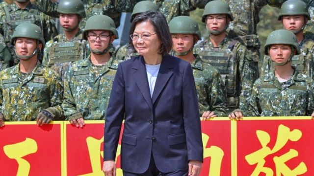
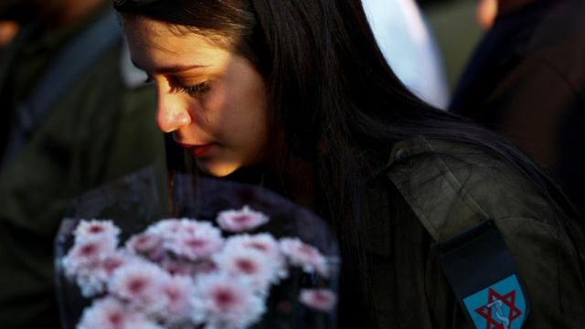
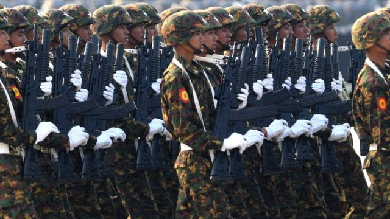
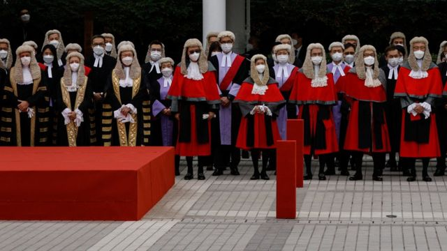

# [World] 以巴冲突新现实、缅甸的转捩点、美中台关系等本周更多重要故事

#  以巴冲突新现实、缅甸的转捩点、美中台关系等本周更多重要故事

> 图像来源，  BBC/ Lulu Luo
>
> 图像加注文字，曼谷尚未看到今年年初以来所期待的中国游客激增的情况。

**11月第二周，以巴冲突持续，我们回顾战争爆发四周后的五个新现实。**

在缅甸，军政府失去了对接壤中国边境地区的大部分控制权。

两岸关系方面，我们探索美国批准向台湾提供资金购买军事装备的考虑。

另外，泰国不再受到中国游客的青睐，这是为什么？

刚刚过去的一周，BBC中文以上新闻内容受到读者的关注。如果你错过了它们，我们带你一一回顾。

##  1\. 两岸关系：美国正低调地将台湾“武装到牙齿”

> 图像来源，  Getty Images
>
> 图像加注文字，台湾在蔡英文总统任内，对于与美国的同盟关系更加高调（图为蔡英文在嘉义县视察期间与台湾工兵部队合影。）

当美国总统乔·拜登（Joe Biden）最近批准向台湾提供8000万美元（6460万英镑）拨款用于购买美国军事装备时，北京对华盛顿的行动表示“坚决反对”。

对于漫不经心的观察者来说，这似乎不是巨大的金额。它还不到一架现代战斗机的价格。台湾已经订购了超过140亿美元的美国军事装备。再加区区8000万美元真的很严重吗？

虽说愤怒就是北京对任何对台军事支持的标准回应，但是这次却有些不一样。

##  2\. 以巴冲突：以色列加沙战争爆发四周后的五个新现实

> 图像来源，  Reuters
>
> 图像加注文字，自以色列开始加沙地面行动以来，已有 20 多名以色列士兵丧生。

自10月7日哈马斯发动袭击以来，各种报道、分析和评论纷至沓来，首先要明白的一点是，没有人知道事情的全部真相。不仅像以往一样，难以穿透战争迷雾，弄清战场上发生了什么，以色列人和巴勒斯坦人之间冲突的新形式尚未出现。

事态仍在迅速发展。战争可能蔓延的担忧非常真实。中东的新现实已经出现，但其形态和运作方式取决于，这场战争在今年余下的时间里、甚至更长时间内将如何发展。

以下是我们知道的事情，还有一些我们不知道的情况。这份清单并非详尽。有些人嘲笑2003年美国入侵伊拉克时其国防部长唐纳德·拉姆斯菲尔德（Donald Rumsfeld），因为他谈到了“未知的未知”。但在这个地区，未知因素和其他地方一样存在，而且一旦出现，就会产生巨大的影响。

##  3\. 泰国为何不再是中国游客青睐的旅游目的地

> 图像加注文字，在深受中国游客喜爱的餐厅“76 Garage”，最吸引人的环节是与赤膊男服务员一起在泳池拍照。

泰国备受赞誉的旅游业正在失去其最大的客户——中国人。

今年1月，当中国终于解除“清零”防疫的措施，允许其公民出国旅行时，泰国对此寄予厚望。泰国预计旅游业将迅速回暖，这将有助于其重夺因新冠疫情而失去的大部分客源。

泰国政府预测，到今年年底，中国游客将多达500万人次，这将不到2019年近1100万人次的一半。但与去年相比有了很大的改善，当时只有27万人。

事实证明，这一美好的前景过于乐观。2023年前九个月，中国来泰人数不到250万。

##  4\. 缅甸的转捩点：民间武装攻击下军政府节节败退

> 图像来源，  AFP
>
> 图像加注文字，夺取政权两年后，缅甸军队濒临不堪一击的边缘。

在短短几天之内，缅甸军政府失去了对接壤中国边境地区的大部分控制权。

在得到其他反政府武装的支持下，掸邦（Shan State）三支民族武装在协同攻击下，占据了数十个政府军据点，夺取了承载大多数往来中国贸易的边境关卡与公路。

这是政府军自2021年2月夺权以来所遭受的最严重挫败。在军方对抗其灾难性政变所引发的武装起事达两年半之后的今天，这支军队显得虚弱，甚至有了击败它的可能。

##  5\. 美国议员推《香港制裁法》：中国特区官员抨击指似“黑帮”作法，该法案都在说什么

> 图像来源，  Reuters
>
> 图像加注文字，被列入《香港制裁法》名单的49人中包括了中国香港特区各级法院的《国安法》指定法官。

中国香港特区行政长官李家超在立法会提出要在2024年内完成《基本法》第23条国家安全立法后不久，美国国会的一部《香港制裁法》草案引起北京与香港政界连续多天的猛烈批评。

推动法案的美国跨党派议员表明，《香港制裁法》是冲着中国《香港国安法》而来，目的是要对被指“侵害人权”的香港官员问责。49名法官、律政或执法机关官员与检察官被列为拟制裁对象。

亲北京政团连日到美国驻香港总领事馆抗议，香港特区保安局局长邓炳强形容美方议员此举旨在“保障他们在香港的‘走狗’”而作出的“很接近黑帮”的行为，多位资深亲建制政治人物警告，北京或会将《香港国安法》相关案件移送中国大陆审理。

但评论人士向BBC中文指出，美国法案才刚提交审议，目前一切都言之过早。

