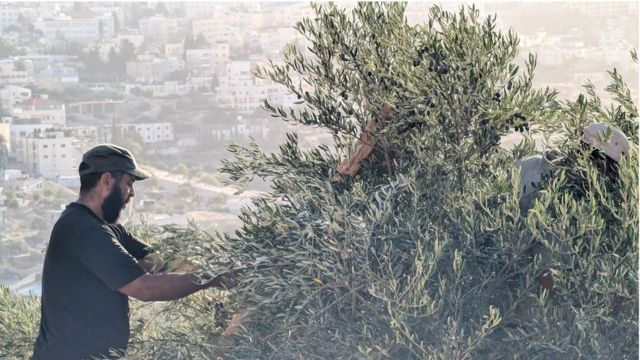
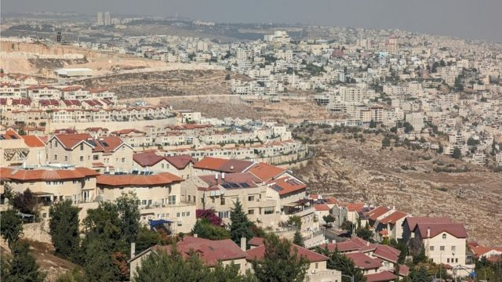

# [World] 以巴冲突：加沙的战火之外 约旦河西岸的社区正在分裂

#  以巴冲突：加沙的战火之外 约旦河西岸的社区正在分裂

**在约旦河西岸（West Bank）占领区俯瞰伯利恒的一个山坡上，三名巴勒斯坦年轻人在上演《圣经》时代的一幕——他们熟练地从树上摘下橄榄，果实晶莹剔透地堆放在地上。**

不过，这对艾哈迈德（Ahmed）来说是全新的工作。

10月7日哈马斯发动袭击前，他在以色列的建筑工地工作，每天赚到约400谢克尔（85英镑；105 美元）。10月 7 日之后，几乎所有阿拉伯人都被禁止从约旦河西岸进入以色列。

艾哈迈德和许多人一样，失去了生计。

“现在没有（像样的）工作了。” 他一边清理树枝一边说。

“我在这工作一天，在那工作一天——在田里摘橄榄。我要养家糊口。我能做什么呢？”

以色列在约旦河西岸实施的严厉管控，不仅在经济上影响到艾哈迈德。一直引起巴勒斯坦人不满的检查站，现在进一步限制了他的行动自由。

“他们关闭了道路。我现在只能在家附近走动。这些检查站让我们窒息。”

但艾哈迈德所批评的管控措施，却加强了另一批人的安全感。

性格开朗的丹尼·切斯特曼（Danny Chesterman），以前经营自行车旅行团，他住在以色列定居点（又称屯垦区）艾法瑞特（Efrat）。他数十年前搬到以色列，但一直保留着伦敦口音。

被问到外界如何看待他的社区时，他答道：“我们被描绘成偷取阿拉伯土地的非法定居者。”

“总的来说，我们没有偷走任何人的土地。”

“我们是早上上班的人。我们做生意。我们有大学教授。我们是书生，不是剑客。”

##  定居点争议

今年年初，以色列总理内塔尼亚胡的政府将约旦河西岸的九个定居点合法化，引起国际争议。

联合国和许多国家表示，根据国际法，所有定居点都是非法的。许多以色列人，尤其是居住在定居点的以色列居民对此提出强烈质疑。

很少有人不同意的一点是，10月7日的事件以及以色列的军事回应，恶化了犹太定居者与其阿拉伯邻居之间的关系。

丹尼说：“我希望并相信，我们与阿拉伯村庄近邻可以继续保持良好关系。”

“话虽如此，安全问题显然还是存在的。”

10月7日清晨，被英国和许多国家列为恐怖组织的哈马斯对以色列发动史无前例的攻击，造成约1400人死亡，约240人被掳走。

作为回应，以色列军方对加沙发动空袭，随后进入该地带。以色列表示，将不惜一切摧毁哈马斯。迄今，军事行动已造成10,800 多人死亡，包括4400名儿童。

> 图像加注文字，从艾法瑞特（Efrat）看过去的伯利恒

丹尼表示，他听说哈马斯武装分子获得加沙人的帮助，而后者曾与以色列人合作，这彻底改变了这里的人对其阿拉伯邻居的看法。

他说：“在加沙地带附近的一些基布兹（kibbutzim，犹太人的集体农业社区），他们（以色列人）与在那里工作的阿拉伯人关系很好，但后来他们发现描绘村庄的地图，上面有这些家庭的名字。”

“他们从那些关系极好的人那里，发现了非常可怕的事情。”

对此，担任埃弗拉特市长十多年的奥德·里维（Oded Rivivi）也有同感。他认为，虽然他所在的定居点与附近大多数阿拉伯村庄的关系一直很好，但现在已经彻底改变。

“要多久才能解决这个（信任）问题？只有时间才能证明。但只要你听不到阿拉伯领导人出来谴责（哈马斯）......这肯定会让重建信任的时间更长。”他说。

##  西岸局势紧张

Skip podcast promotion and continue reading

* BBC 時事一周 Newsweek (Cantonese)   **

BBC國際台粵語節目，重溫一周國際大事，兩岸四地消息，英國境況。並備有專題環節：〈記者來鴻〉、〈英國生活點滴〉和〈華人談天下〉。

分集

End of podcast promotion

在山谷另一侧的阿拉伯村庄，不信任的原因截然不同——以色列的管制行动不仅包括增设检查站。上月，以色列国防军逮捕1400 多名巴勒斯坦人，称大多数人与哈马斯有关联。

就在我们拍摄当天，巴勒斯坦民族权力机构（Palestine National Authority）称西岸有18人被杀，一个多月内被杀的总人数达到 170人。

巴勒斯坦人对此进行了暴力或和平的抗议。比如在伯利恒，店家展开大罢工。尽管巴勒斯坦人的愤怒主要是由加沙发生的事件引起，但在10月7日之前，约旦河西岸早已是火药库。

最让西岸人愤怒的，是以色列定居者的暴力行为。以色列青年男子往往全副武装，他们被指责，把巴勒斯坦家庭逐出家园。一段视频显示，一名巴勒斯坦男子被一名手持冲锋枪的定居者射中腿部。

在埃弗拉特，我质问市长奥德·里维如何回应这些问题。

“有一小撮极端分子确实采取了暴力行动，”他回答道。“这些人需要由警察来处理......但绝大多数人，生活在这里的犹太人，应该得到安全，应该被当作人来对待......因为这就是这些社区的本质。”

他称将采取行动。

“我们昨晚与总理和所有市长开会。大家一致呼吁政府确保这些极端分子被逮捕、被制止，而且越快采取行动，造成的破坏就越小。”

说到底，所有冲突都归结于土地。

双方都坚信，他们有权拥有可能是世界上最具争议的一块土地。过去数十年，国际社会一直呼吁实现“两国方案”，即西岸和加沙组成一个独立的巴勒斯坦国，并以东耶路撒冷为首都。

近年，这个可能性似乎越来越小。以色列总理内塔尼亚胡的联合政府在极右翼定居者政党的支持下，几乎不可能达成妥协。10月7日事件被许多人视为两国梦想棺材上的最后一颗钉子。

奥德市长说：“我认为，每过一天，我们都会离这一目标更远。在国际社会压力下，以色列实际上从加沙地带撤走了所有公民、平民和军事人员。而我们得到的却是哈马斯的军队。”

当然，这说法会激怒许多巴勒斯坦人，更不用说反抗了。对他们以及国际社会的大多数人来说，两国方案是唯一可接受的方案。他们说，任何其他方案都是继续剥夺数百万巴勒斯坦人的权利和自由。

回到橄榄树林时，太阳刚刚落到伯利恒主诞教堂（Church of Nativity）的下面，我问艾哈迈德对未来有何期许。

“和平与安全，”他回答。“自由地开着我们的车子，看望我们的孩子，在我们的国家无忧无虑地生活......我们不是想找麻烦。我们只想养活孩子，仅此而已。”

