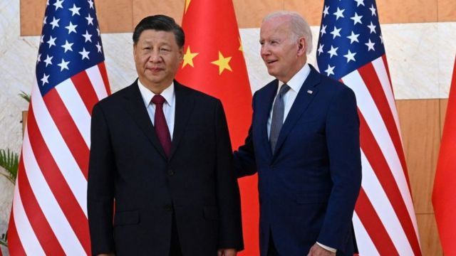

# [World] 习拜会：时隔一年美中元首再会晤看点有哪些？台湾、军事、以巴、大选

#  习拜会：时隔一年美中元首再会晤看点有哪些？台湾、军事、以巴、大选

> 图像来源，  Getty Images
>
> 图像加注文字，2022年11月，在印尼巴厘岛，美国总统拜登（右）和中国国家主席习近平（左）在 G20 峰会期间会晤。

**美中两国元首拜登和习近平将在万众期待下会晤。**

本次会晤将在于 11 月 14日至 17 日在美国旧金山主办的亚太经济合作组织（APEC）峰会期间举行。

这是拜登任期内第二次与习近平会面，也是美中双边关系自今年年初“间谍气球事件”以来首次会面。目前两国关系处于冰冻期，高层军事交流中断。有观点认为，本次会谈的意义在于，双方意识到关系继续恶化的危险性，试图为阻止恶化加剧而努力。

上次两国元首会晤是在去年11月印尼巴厘岛G20会议期间。

##  台湾问题、以巴冲突等摆上议程

美国官员表示，这次会晤涉及问题广泛，包括台湾问题、以巴冲突、乌克兰战争等。

台湾问题是中国最在意的问题。中国声称对台湾这个自治岛屿拥有主权。台湾将于明年年初举行总统大选。

不过，专家并不期待在台湾问题上有所突破。

美国巴克内尔大学（Bucknell University）国际关系教授朱志群认为，预计拜登将重申美方立场，比如“一中政策”和“不支持台独”，不会有更多的表述。 中方也会强调一惯立场，特别是“反台独”，反对“一中一台”等。

“中方对美方是否言行一致，一直持怀疑态度”，朱志群表示。

据一位美国政府高级官员称，拜登预计将强调美国对中国在台湾周边军事活动的担忧。

> 图像来源，  Getty Images

在以巴冲突上，分析认为，就像俄乌战争一样，以巴冲突为中美合作提供了一个潜在的合作机会。

朱志群教授指出，“美国可以利用其对以色列的影响力迫使局势降级，并向加沙安全运送人道主义援助，而中国则可以利用其与巴勒斯坦和以色列的友好关系呼吁立即停火。”

拜登最迫切的要求可能是希望中国限制伊朗，利用北京所拥有的影响力警告伊朗不要因以巴冲突而使中东暴力升级。

此外，预计美中元首还将讨论美国对中国的技术出口限制，以及中国在南海和东海的领土主张方面引发的紧张局势。

##  美中能否重启军事对话

美国白宫国家安全顾问沙利文指出，重新建立两国军事联系是美国的首要目标。

沙利文周日接受美国媒体访问时指出，中国基本上切断了美中两国的军事联系。拜登认为，重新建立联系符合美国国家安全利益，他将藉与习近平会晤向这个目标推进。

沙利文还指出，恢复美中军事联系，包括从高层领导到战术行动层面的每一层面，他强调美中需要沟通管道，以免发生错误、误判或误传。

去年，时任美国国会众议院议长佩洛西（Nancy Pelosi）访问台湾，引发中国极度愤怒，导致中断了两国军方之间的联系。

美国官员说，拜登“决心”恢复这些渠道，但中国似乎“不情愿”。其中一位官员说：“这已经不是五年或十年前的关系了，我们谈论的不是一长串成果。”

美国官员表示，在过去一年中，美国外交官在与中国官员的“几乎每次谈话”中都提出重建军事对话的重要性，但都没有成功。

一位官员指出，在讨论这一问题时，中方经常提出“间谍气球事件”。这位官员说：“我认为间谍气球事件凸显了我们当时在与中国政府建立高层次、有影响的沟通方面遇到的困难。”

今年年初，美国侦查到有中国“间谍气球”飞越美国领土上空，随后在拜登的指示下将其击落。该事件后，布林肯曾推迟了访华计划，称中国的行为“不可接受和不负责任的”。

在气球危机之后，拜登政府一直努力缓和紧张局势。最终，布林肯于6月前往北京，称与习近平先生进行了“坦诚的对话”。此后，美国财政部长耶伦、气候变化特使克里和商务部长雷蒙多也相继访华，试图与中国相关领域的高层重建对话。

最终，中方也发出了橄榄枝。中国外交部长王毅于10月底访问美国，为拜登与习近平在旧金山的会晤创造了条件。

朱志群教授认为，习拜会后，军事高层交流“可能会有些突破性的进展”，比如双方在恢复了经贸和气候变化等高层对话的基础上，宣布将逐步恢复军事高层交流。

“如果双方继续营造良好的氛围，中方可能会邀请美国国防部长和参谋长联席会议主席层次的官员访华，而中方也会有军事高层赴美。 当然，现在中国国防部长人选目前还不明朗，这方面的交流会有所延误。”

##  对会谈成果预期不高

分析人士认为，这次领导人会晤更多是为了管理竞争和稳定双边关系，防止对抗升级，产生对双方都不利的负面影响。但不要期望取得更多突破性进展，对所谓“重启”双边关系不应抱有期望。

其中一部分重要原因是，美中双方目前仍是竞争对手，双方都试图在军事、经济、贸易等方面的牵制对方的影响力。在人权问题、美国的印太战略、中国的“一带一路”倡议等方面上存在根本分歧。

另外，华盛顿的鹰派并不支持拜登政府与中国领导人接触。在美国即将进入大选期间，类似言论将持续充斥华盛顿政坛。

> 图像来源，  Getty Images

在中国方面，北京将关系恶化归咎于华盛顿，认为拜登政府心口不一。

美国战略与国际问题研究中心（Center for Strategic and International Studies）中国研究专家裘德- 布兰切特（Jude Blanchette）说，习近平在3月份指责美国领导西方“包围、遏制和压制中国”时明确表达了这一态度。

中国驻美大使谢锋最近称赞了中美关系改善的积极进展，但他强调了美国言行一致的重要性。

他在11月9日中美交流基金会举办的“香港中美论坛”上通过视像表示，“美国需要以行动兑现承诺，不试图改变中国的体制，不需求冷战，不支持台湾独立、两国中国或一中一台，不试图阻碍中国经济发展。”

