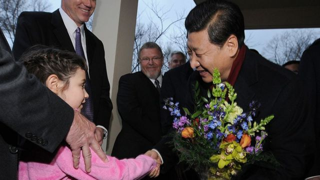
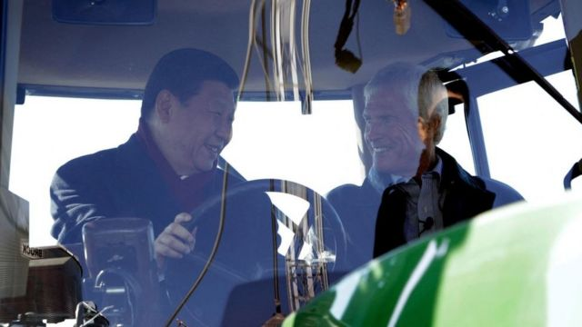
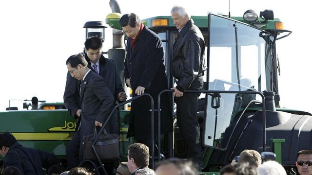
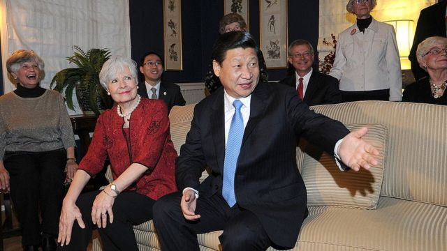
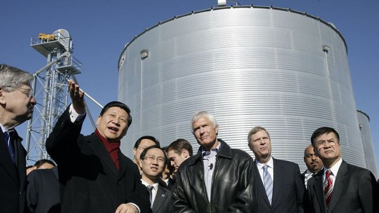

# [World] APEC: 习近平与美国爱荷华州小镇的特殊缘分

#  APEC: 习近平与美国爱荷华州小镇的特殊缘分

  * 迈克·温德林（Mike Wendling） 
  * BBC记者 

> 图像来源，  Getty Images
>
> 图像加注文字，爱荷华是美国农业大州，1985年习近平担任河北省正定县委书记时曾到小镇马斯卡廷考察农业。图为2012年习近平访问爱荷华州的资料照片。

**里克·金伯利（Rick Kimberly）至今仍不知道，这位中共的未来领导人当时是如何来到他位于美国得梅因市（Des Moines）外的农场的。**

事实上，在2012年习近平访问前夕，一支先遣团队表示对爱荷华州的农业区有特别的兴趣，而金伯利家族种植玉米和大豆的家庭农场刚好合适。

金伯利向BBC回忆说：“他们还告诉我们，他们不希望有人登上农业机械。我想他们当时应该是担心有人可能会滑倒。”

但是，那些官员低估了他们代表团中最重要的成员——时任中国国家副主席的习近平想要实际参与的热情。金伯利说：“我看到习主席在观看约翰迪尔拖拉机（John Deere tractor），我问他是否想爬上去。”

“他当然知道了。我们当时是通过一名翻译进行交谈的，但他甚至都没等翻译，就立刻明白了我的意思，直接走到了拖拉机前。”

> 图像来源，  Getty Images
>
> 图像加注文字，2012年，习近平同金伯利坐在拖拉机驾驶室交谈。

> 图像来源，  Getty Images
>
> 图像加注文字，2012年，习近平在金伯利家中看着装满大豆和玉米的花瓶，布兰斯塔德和金伯利在一旁观看。

健康和安全的担忧最终是多余的，习近平乘坐农机具既高兴又没有受伤。这是中国国家主席与这个美国中西部农业州奇特联系的另一个章节。

事实上，习近平于1985年便首次访问过爱荷华州，当时他参加了中国河北省一个农业代表访问团。

> 图像来源，  Getty Images
>
> 图像加注文字，2012年，习近平（中）在参观完金伯利（右）的农场时从拖拉机驾驶室走出。

他住在马斯卡廷（Muscatine），一个约有24,000人口的城市，四周被农田和密西西比河环绕。

中国官媒《人民日报》当时报导称该代表团“拜访了当地社区的老人，参加了一个生日派对，接受了当地媒体的六次采访，并参加了美方举办的五次欢迎宴会。”

> 图像来源，  Getty Images
>
> 图像加注文字，2012年，习近平与1985年的老朋友们重聚。

伊莲娜·德伍察克（Eleanor Dvorchak）是在那年习近平访问期间，在自己的家中接待了他。她后来向BBC解释：“我觉得他是一个非常友善、专注、有礼貌的人。 在家里有他真的是一种乐趣。”

德沃查克一家把习近平安排在他们儿子的卧室 。他们的儿子当时正在爱荷华大学上学。如果中国主席对房间的《星际争霸战》壁纸有意见，他也设法放在了心底。

在那次访问中，这位未来的中国领导人遇到的一些爱荷华州人，现在被中国媒体称为“老朋友”。尽管美中之间冷淡的关系将在本周的APEC拜习会中，被各界仔细审视，但是，习近平肯定会受到一些获邀参与美中晚宴的“老朋友”的热烈欢迎。

 在2012年访问期间，他回到了马斯卡廷  ，次年一位中国商人购买了德伍察克一家的旧宅，一度将其改建成博物馆。

不过，爱荷华州并未列入本周习近平的访美行程，但预计他将会见泰瑞·布兰斯特德（​​Terry Branstad），他是爱荷华州的前州长，在前总统特朗普（Donald Trump 川普）任内担任美国驻中国大使。

布兰斯特德没有回应BBC的置评请求，但他在卸任大使职务后告诉爱荷华州的一家报纸，尽管他与习近平主席有着热情的个人关系，但他对中国政府的一些政策深感担忧。

当时他告诉《塞达拉皮兹报》说：“他们对香港人民采取的行动......对（新疆）维吾尔人的虐待，我认为是不合情理的。”

布兰斯特德还批评了中国对新冠病毒首次爆发起源的“遮掩”，并表示：“我真的认为他们的体制是一个很大的问题。”

> 图像来源，  Getty Images
>
> 图像加注文字，金伯利（中）表示，5个人就可以耕作4000英亩的农地。对中国人来说，这么少的人可以种植那么大的土地真是令人惊叹。

现年72岁的金伯利是这个农业家族的第五代。从1860年代起，金伯利家族便在爱荷华州务农。他说，早在2012年，中国代表团的兴趣就不仅仅是拍照，他们还对现代农业的细节提出了许多问题。

而且，对他个人而言，习近平的访问是一个改变人生的事件。金伯利后来受邀访问中国，并已先后20多次访问中国，推动农业发展。

金伯利向记者表示，“我们提倡可持续农业和更好的耕种方法。5个人就可以耕作4000英亩的农地。对中国人来说，这么少的人可以种植那么大的土地真是令人惊叹。”

这也让他的农场成为一个旅游景点。金伯利说，自那以后，“成百上千”的中国人长途跋涉来到了他们的领导人曾经乘坐拖拉机的这块土地。

> 图像来源，  Getty Images
>
> 图像加注文字，2012年，马斯卡廷一家麦当劳餐厅欢迎习近平的到来。

