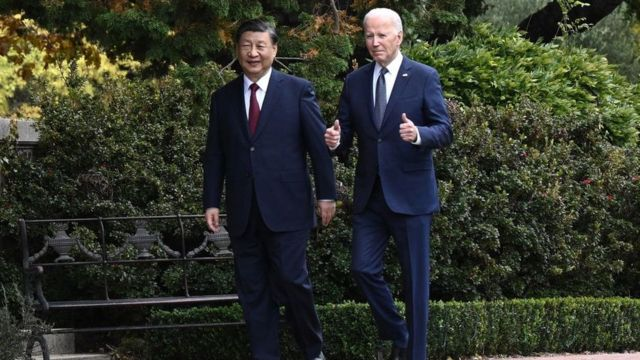
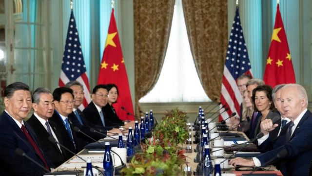
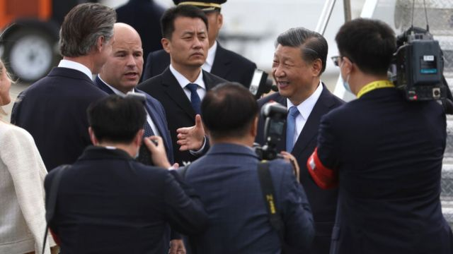

# [World] 美中峰会取得多方面进展，但争议为未来双边关系蒙阴影

#  美中峰会取得多方面进展，但争议为未来双边关系蒙阴影

> 图像来源，  Getty Images
>
> 图像加注文字，美国总统拜登（右）和中国国家主席习近平在会晤后一起散步。

**美国总统拜登（Joe Biden）与中国国家主席习近平周三（15日）在旧金山举行峰会，取得了一定成果，包括恢复两国高层军事方面的交流。**

拜登在峰会后的记者会上表示，他与中国领导人习近平的会谈是“迄今为止最具建设性、最富有成效的讨论。”

拜登说：“中美两国是竞争关系，但我的责任是使这种关系合理化、可控化，从而避免冲突。找到一个我们能走到一起、找到共同利益的地方。”

本次峰会是两国元首事隔一年后再次会晤，旨在稳定双边关系。

##  重要进展：恢复高层军事交流

拜登在当日的新闻发布会上说，两国已达成一系列协议，其中包括中国承诺重启两国军方沟通渠道。

中国官方通讯社报道也称，两国同意恢复高层军事交往。

新华社在一份新闻稿中称，中美两国元首同意恢复两军高层沟通、中美国防部工作会晤、中美海上军事安全磋商机制会议，开展中美两军战区领导通话。

报道补充说，这些沟通渠道建立在“平等和尊重基础上”。

这是华盛顿希望达成的一项成果。在2022年美国时任众议院议长佩洛西（Nancy Pelosi）访问台湾后，中国叫停了这一重要的对话机制。

拜登随后在X（推特）上写道：“我相信这是我们进行的最具建设性和最有成效的讨论。” 他称，会晤以过去数月的外交工作为基础，取得“重要进展”。

> 图像来源，  Getty Images
>
> 图像加注文字，美国总统拜登在亚太经合组织（APEC）领导人会议期间会见中国国家主席习近平。

##  台湾问题无突破

根据公开信息，两国元首在台湾问题上并没有任何突破，双方各自重申立场。

根据新华社，习近平指出，台湾问题“始终是中美关系中最重要、最敏感的问题。中方重视美方在巴厘岛会晤中作出的有关积极表态。”

他还希望美方言行如一，“将不支持‘台独’的表态体现在具体行动上，停止武装台湾，支持中国和平统一。”

习近平还措辞强硬的表示：“中国终将统一，也必然统一。”

拜登在峰会后的记者会上答复记者问题时表示，美国坚持“一个中国政策。”

路透社引述美国官员表示，拜登在峰会中“强调了台海和平与稳定的重要性。”

这位官员表示，拜登还要求习近平尊重台湾的选举程序。

> 图像来源，  Getty Images
>
> 图像加注文字，11月14日，美国加州旧金山，中国国家主席习近平（右）在亚太经合组织（APEC）峰会召开前抵达旧金山国际机场，迎接他的是加州州长加文·纽森（Gavin Newsom）。

##  实质性成果：人工智能、禁毒合作等

根据新华社，两国领导人同意就人工智能和禁毒合作建立合作。

拜登在峰会后的记者会上表示，两国领导人同意解决芬太尼从中国流向美国的问题。

“在美国，18 至 49 岁之间死于芬太尼的人数多于死于枪支、车祸或任何其他原因的人数”，拜登说，“这将拯救生命，我赞赏习主席在这个问题上的承诺。”

另外，根据新华社，两国还将扩大教育、留学生、青年、文化、体育和工商界交流。

双方还同意在明年早些时候“进一步大幅增加航班。”

美国巴克内尔大学（Bucknell University）国际关系教授朱志群认为，这些是本次元首峰会取得的“实质性进展”，有利于稳定双方关系。

不过，至于未来如何落实还是很大挑战。

“美方内部阻力不小，国会和保守派反对跟中国采取接触政策”，朱教授表示。

##  峰会中的“不和”之音

这次美中首脑峰会旨在稳定双边关系，双方的发言大致友好和谨慎。然而仍有一些不和谐之音，引发媒体关注。

拜登在与习近平会晤后召开了新闻发布会，结束之时正当拜登走下讲台，有记者追问他是否还会称呼习近平为“独裁者”。

拜登再次重申他认为习近平是“独裁者”，称因为“他管理的国家是一个共产主义国家。”

几乎可以肯定，这种言论必定遭到中方反感，有分析认为，北京很可能会再次指责美方做事“心口不一”。

中国外交部发言人毛宁周四在例会上被问到此事，她表示，这种言论是极端错误的，是不负责人的政治操纵，中方坚决反对。

她还说：总有一些别有用心的人企图挑拨离间，破坏中美关系，这也是不会得逞的。

今年六月，拜登曾称呼习近平是“独裁者”而引起轩然大波。中国外交部指责他的言论“极其荒谬”，“是公开的政治挑衅。”

不过，这种不和之音不大可能影响本次峰会取得的成果。尽管两国存在竞争和对抗，美中双方都明白，在一定程度上保持合作对大家都有好处。

##  欢呼与抗议

中国国家电视台播放了习近平车队抵达旧金山时支持者欢呼的画面，这与台湾和香港独立媒体报道的亲中人士与抗议者之间的冲突形成鲜明对比。

中国中央电视台（CCTV）的晚间黄金时段新闻节目《新闻联播》11 月 15 日称，一日前，许多华侨华人和中国留学生代表沿途守候在街头，挥舞着中美两国国旗，热烈欢迎习近平主席的到访。

据中央电视台报道，习近平在机场受到加州州长加文·纽森（Gavin Newsom）、美国财政部长珍妮特·耶伦（Janet Yellen）和其他美国代表的“热烈欢迎”。

与此形成鲜明对比的是，台湾有线电视网三立电视（SET）播放了美联社的镜头，画面显示，在习近平出席的亚太经合组织（APEC）领导人会议会场附近，亲北京支持者与举着反中共和人权标语牌及西藏旗帜的抗议者之间发生混战，遭警察驱散。

香港媒体《南华早报》称，在习近平下榻的酒店前，“数百名支持中国的抗议者和少数批评北京政策的抗议者高声对喊口号。”

