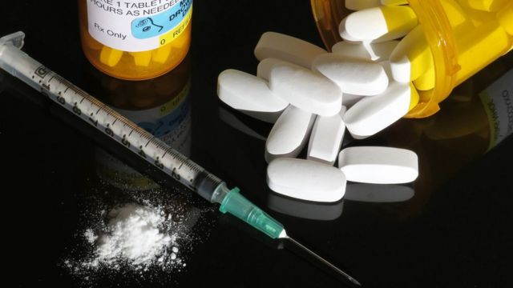
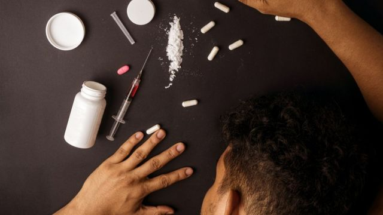
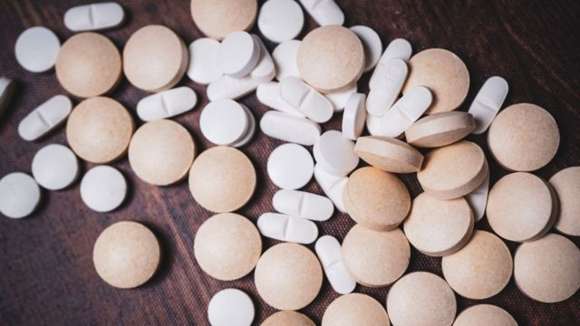

# [World] 毒品芬太尼为何成为中美关系的重要议题

#  毒品芬太尼为何成为中美关系的重要议题

> 图像来源，  Getty Images

**在刚刚过去的美中首脑峰会上，中国领导人习近平与美国总统拜登达成协议，将合作打击毒品贩运。中国同意打击化学品公司，以阻止非法芬太尼流入美国。**

这一项协议被认为是本次峰会上一项重要实质性成果。

本次拜登和习近平会晤是他们一年来首次接触，两国在贸易、军事和台湾等问题上持续紧张。

那么，为何芬太尼会成为美中双边关系的重要议题呢？

##  芬太尼与中国

芬太尼是一种合成阿片类药物，毒性比海洛因强50倍，而且越来越多地与其他非法药物混合使用，往往造成致命后果。

美国缉毒署表示，墨西哥贩毒集团对芬太尼的出口负有主要责任，而这些贩毒集团通常使用中国的原料来制造芬太尼。

当局表示，芬太尼比植物类违禁药物更容易制造和分销，植物类违禁药物需要大型企业来种植和销售。

阻止芬太尼泛滥一直是美国政府的优先事项。上个月，美国政府宣布对至少 14 家涉及向美国输入芬太尼的中国和加拿大公司进行制裁和起诉。被起诉的大部分是中国公司。

今年 7 月，美国成立了联盟组织，以应对包括芬太尼在内的合成毒品的威胁。中国最初拒绝参加发起该联盟的线上会议。

##  不断上升的死亡人数

> 图像来源，  Getty Images

美国因吸毒过量而死亡的人数激增，这个问题已经困扰了多位美国总统。前总统特朗普于 2018 年宣布与习近平达成协议，中国政府誓言将芬太尼列为管制物质。

根据美国疾病控制和预防中心（Centers for Disease Control and Prevention）的数据，美国每天有超过150人死于与芬太尼等合成类阿片相关的过量用药。

根据美国国家卫生统计中心（National Center for Health Statistics）的数据，从 2015 年到 2021 年，此类过量用药的人数增加了七倍多。

##  缺乏的国际合作

应对芬太尼的生产和分销，需要受其影响的国家之间开展国际合作。鉴于中国是全球芬太尼非法贸易的主要来源国之一，如果要采取有效的控制措施，那么与中国当局的合作至关重要。

拜登政府今年采取了遏制危机的措施，美国财政部指认了二十多个涉嫌参与芬太尼贸易的个人和实体。白宫已要求国会拨款约 12 亿美元，用于打击贩毒分子。

但如果没有中国政府的帮助，所能取得的成果有限。这一责任需要两国的执法机构和监管机构密切协调。

更进一步来说，解决芬太尼问题凸显了中美关系中对毒品管制政策和跨国犯罪预防战略的广泛关注。

通过共同应对芬太尼等非法阿片类药物带来的具体挑战，两国可以建立信任机制，同时也表明两国致力于全球打击毒品贩运。

分析指出，有效遏制芬太尼非法贸易不仅仅能够打击毒品泛滥，还可以对中美双边关系的其他方面产生积极影响。

比如，在执法等问题上进行合作可以增进相互理解，为加强网络安全或知识产权保护等各领域的合作铺平道路。

> 图像来源，  Getty Images

##  落实程度“有待观察”

布鲁金斯学会（Brookings Institution）国际有组织犯罪问题专家万达·费尔巴布·布朗（Vanda Felbab- Brown）说，该协议是“外交和政治声明”，但其实际影响仍是个问号。

“中国将如何追查这些公司还有待观察”，她说，“中国会对其中三家公司下手吗？五家？还是五十家？”

不过她说，相信中国会继续将禁毒合作作为“讨价还价的筹码”和“开展更广泛外交的工具”。

中国已经取缔了直接运往美国的毒品，这意味着大部分非法贸易已经转移到经由墨西哥的路线。美国官员说中国在阻止毒品贩运方面做得不够，而中国则反驳说阿片类药物在美国的流行是美国自己的错误。

