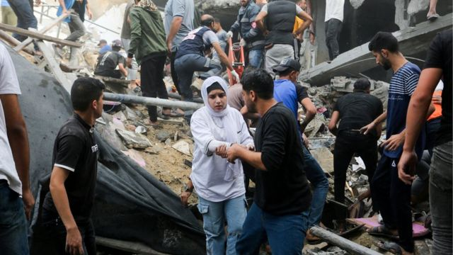
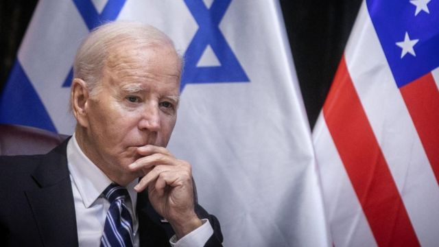

# [World] 以巴冲突：加沙人道主义状况每况愈下，拜登政府内部异议陡升

#  以巴冲突：加沙人道主义状况每况愈下，拜登政府内部异议陡升

  * 芭芭拉·布莱特.厄舍尔（Barbara Plett Usher） 
  * BBC驻美国国务院记者 

**美国总统拜登正面临越来越大的压力，内外都要求他干预以色列在加沙地带发动的军事行动。**

成千上万的平民伤亡和令人绝望的人道主义状况令阿拉伯盟国感到震惊，同时也激起美国政府内部的异乎寻常的批评。

在美国国务院任职 25 年期间曾担任阿以关系顾问的亚伦.戴维.米勒（Aaron David Miller）说：“我对(政府内部)这种紧张气氛感到震惊。”

“从来没见过这样的事情。”

美国国务卿安东尼.布林肯（Antony Blinken）已经通过越南战争后建立的渠道收到了几份内部备忘录，该渠道允许政府雇员对政策发表不满意见。

据说一封公开（请愿）信在美国国际开发署（USAID）传递。另一封公开信由代表几十个政府机构的政治官员和工作人员寄往白宫。还有一份是由国会山的工作人员寄给议员们的。

这些质疑大多不公开。同时，由于担心抗议可能影响工作，签名通常都是匿名进行的，因此其规模尚不清楚。援引泄密信息，多份报道称已有数百人签名加入反战浪潮。

一位政府官员告诉BBC，这些担忧是真实存在的，目前正在就此进行积极讨论。

至少，这些信件要求拜登总统督促立即停火，并加大力度迫使以色列允许更多的人道主义援助进入加沙。

在某些情况下，这些信件的措辞更加强硬，与年轻政治活动家的言论如出一辙，在某种程度上显然反映了代际的分歧，即现在这些人对以色列的批评更多，对巴勒斯坦人的同情更多。

这些信件谴责哈马斯在 10 月 7 日的突然袭击中实施的暴行，这次袭击造成以色列境内约1200 人死亡，其中大部分是该国平民。

根据哈马斯控制的加沙卫生部提供的最新数字，自那次袭击以来，以色列已在加沙杀害了1.2万多人。以色列表示，它正试图在加沙战争中尽量减少平民伤亡，但未能成功，并将此归咎于哈马斯。

美国前外交官、现任中东政策委员会主席吉娜.阿伯克龙比.温斯坦利（Gina Abercrombie- Winstanley）认为，巴勒斯坦人的大量死亡是美国政府“不爽的源泉”。

她说，对许多人来说，政府对以色列军事行动的支持似乎“过于片面地代表了美国政府的立场”。

温斯坦利女士在她的职业生涯中签署过不同意见的电文，在职员工也曾咨询她现在是否应该这样做。她说，这些备忘录感觉比其他备忘录“覆盖面更广”，吸引了那些不一定在处理手头具体问题的人。

> 图像来源，  Reuters
>
> 图像加注文字，巴勒斯坦人在以军空袭后寻找死伤者

##  拜登如何回应

温斯坦利女士认为，哈马斯袭击事件发生后几天，美国总统拜登在一次情绪激动的讲话中承诺坚定不移地支持以色列，之后美国的措辞和态度发生了重大转变。

在加沙遭受的破坏和阿拉伯世界日益增长的愤怒情绪的推动下，美国政府关于保护平民的言论变得更加执意。布林肯最近说，加沙“有太多巴勒斯坦人被杀害。”

他和其他高级官员现在不仅将人道主义援助视为一项道义责任，而且还是一项战略责任。

据国务院发言人马修.米勒（Matthew Miller）称，布林肯在听取员工意见时强调了这一点。他明确表示，“没有其他国家， 只有美国能够达成一项协议，让人道主义援助进入加沙”，并实施“基于人道主义的休火”。

国务卿意识到了在其办公楼内不断发酵的不安情绪，并特意进行了回应。

他在最近的中东之行归来后，在BBC获得的一封电子邮件中写道：“我们正在倾听。你们分享的信息正在为我们的政策和信息提供参考。”

但这并没有改变核心政策方针，似乎也没有对以色列的军事行动产生重大影响。

拜登政府已经更加公开地表达了其与以色列日益增长的分歧。布林肯特意为加沙的下一步制定了巴勒斯坦治理和建国原则，而以色列右翼政府拒绝接受这些原则。

> 图像来源，  EPA

总统拜登经常与以色列总理本雅明.内塔尼亚胡（Benjamin Netanyahu）通电话，高级官员也不断访问该地区，敦促以色列遵守战争法。

但没有迹象表明，拜登政府正在考虑动用其影响力，为美国向以色列提供的大规模军事援助设定附加条件。在哈马斯袭击后，这些援助进一步增加。

拜登本周表示，美国没有给以色列设定结束军事行动的最后期限。

拜登说，当哈马斯“不再有能力对以色列实施谋杀、虐待和恐怖行为”时，军事行动就会结束。

美国国务院前顾问米勒先生认为，美国和以色列的目标是一致的。双方都希望摧毁哈马斯作为军事组织的能力，使其再也无法发动像10 月 7 日那样的袭击了。

他说，考虑到这一目标，为追求和平而结束敌对行动的全面停火在行动或政治上都毫无意义。

米勒说，这只会拖延战争，“因为你不可能通过谈判结束战争......。战术可能不同，但目标不变。”

那么，究竟是什么迫使拜登总统改变路线呢？

很可能不是他的内部反对派。尽管政府内部的异议在不断发酵，但这还不是一场叛乱。只有一名国务院官员公开辞职。

米勒认为，更有可能是外部事件的影响，比如哈马斯无条件释放所有人质，或者以色列的一次行动造成大量巴勒斯坦人伤亡，尽管门槛已经定得很高了。

拜登还面临政治风险。他对以色列的声援得到了共和党人和中间派民主党人的认同，但民主党内更年轻、更左翼的成员对他的担忧与日俱增。

拜登的前竞选团队成员已经致信总统，呼吁停火。

格温.施罗德（Gwen Schroeder）是签名者之一，她在 2020 年大选期间曾在拜登先生的数字团队工作。

她说，以色列在加沙的“过度反应”表明，巴勒斯坦人的生命“不如我们以色列盟友的生命重要”。

“我并不为让拜登当选而感到羞愧”，她说，但又补充道：“我每天都在为这个问题而挣扎 —— 这还是那个我为之奋斗的政府吗？”

谈论这些情绪会如何影响拜登明年的连任竞选还为时过早，但这确实凸显了他正行走在钢丝之上。

他一直在告诉以色列领导人，他们如何打这场战争的方式将决定战争结束后的局势。他能在多大程度上对此施加影响是很重要的，因为无论结果如何，他都将难脱干系。

