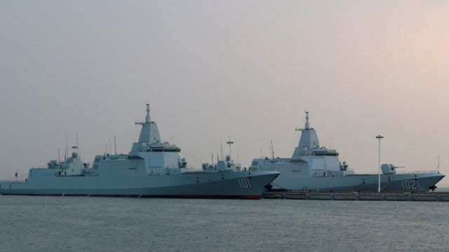
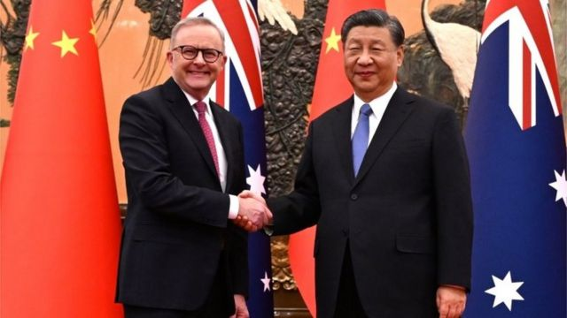

# [World] 澳大利亚指责中国海军使用声呐脉冲 致澳方潜水员受伤

#  澳大利亚指责中国海军使用声呐脉冲 致澳方潜水员受伤

> 图像来源，  Getty Images
>
> 图像加注文字，中国近年一直在加强其军事建设（资料图片）

**澳大利亚指控中国海军在一起国际水域相遇事件中使用声呐脉冲，导致澳方潜水员受伤。**

澳大利亚国防部长称，在本周较早前于日本附近海域的一次相遇中，一艘中国战舰采取了“不安全而不专业”的行动。

当时，中国战舰靠近一艘澳大利亚护卫舰之际，潜水员正在清理澳方船舰推进器上的渔网。

澳国防部长理查德·马尔斯（Richard Marles）指，之后中国战舰发出危险的声呐脉冲。

他在周六（11月18日）的一份声明中说，这一举动“给澳大利亚潜水员造成安全风险，后者被迫立即上水”。

马勒斯称，潜水员受了可能由声呐造成的轻伤。

“澳大利亚期望所有国家，包括中国，以专业和安全的方式运作其军队，”他说。

该声明指，澳大利亚的远程护卫舰图文巴号（HMAS Toowoomba）当时已经就意图在常规海上通道中进行潜水作业进行过沟通，并且使用了国际认可的讯号。

中国政府目前未有就事件置评。

根据位于伦敦的潜水医疗咨询委员会（Diving Medical Advisory Committee）指，高强度的水下声响 有可能造成潜水员“眩晕、听力受损或其他伤害”  。

报道中的事件发生于上周二（11月14日）的日本专属经济区。马尔斯表示，图文巴号当时正在进行支持联合国制裁令的相关作业，但未有透露更多细节。

本月较早前，澳大利亚总理安东尼·阿尔巴尼斯（Anthony Albanese）破冰 出访中国  ，并为两个太平洋大国之间的关系取得“重大进展”而大唱赞歌。

不过，紧张气氛仍然存在，特别是在安全事务上。澳大利亚已经对中国在亚太地区日益强势的态度表达了关注。

堪培拉近日已经加强了与美国的军事联系，并且大幅调整了其防务姿态，以应对来自中国的潜在威胁。

> 图像来源，  EPA
>
> 图像加注文字，阿尔巴尼斯（左）于本月较早前访问中国并与习近平会面，是自2016年以来首个出访中国的澳洲领导人

