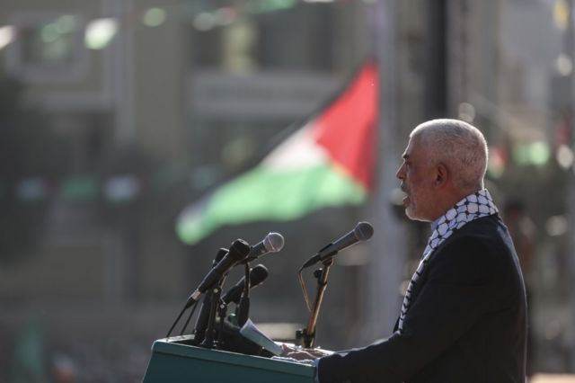
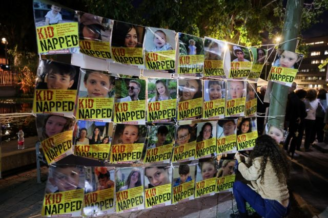
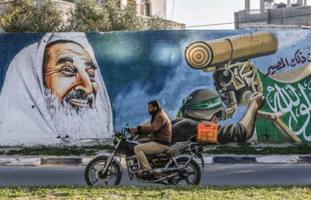
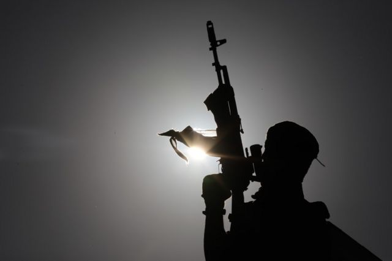
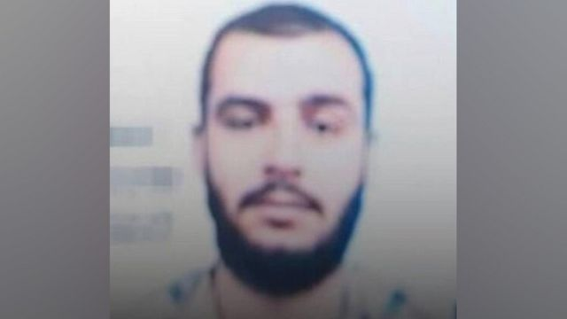
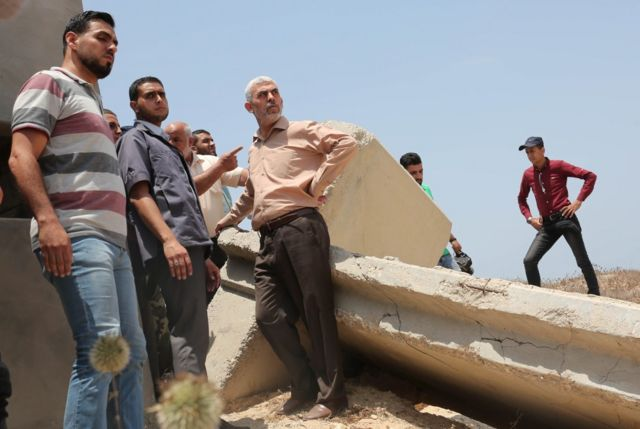

# [World] 叶海亚·辛瓦尔：谁是哈马斯领导人?

#  叶海亚·辛瓦尔：谁是哈马斯领导人?

  * 弗兰克·加德纳（Frank Gardner） 
  * BBC安全事务记者 

> 图像来源，  Getty Images
>
> 图像加注文字，叶海亚·辛瓦尔，2022 年

**叶海亚·辛瓦尔失踪了。当成千上万的以色列军队在无人机、电子窃听设备和线人的支持下，试图寻找他的下落时，这并不奇怪。**

辛瓦尔有着引人注目的雪白头发和乌黑的眉毛，是加沙地带的政治派别哈马斯的领导人，也是以色列的头号通缉犯之一。

以色列认为他和其他人应对10月7日对以色列南部的袭击负责，那次袭击造成大约1200人死亡，200多人被绑架。

“叶海亚·辛瓦尔是指挥官……他已经死了，”以色列国防军发言人丹尼尔·哈加里少将（Rear Admiral Daniel Hagari）在10月初宣布。

以色列国防军参谋长赫兹·哈勒维（Herzi Halevi）说:“这次可恶的袭击是辛瓦尔策划的。他和他手下的都是行尸走肉。”

这其中包括穆罕默德·德伊夫(MohammedDeif)，他是哈马斯军事派别伊兹丁·卡桑旅(Izzedineal-QassamBrigades)的神秘领导人。

欧洲外交关系委员会(ECFR)高级政策研究员休·洛瓦特(HughLovatt)认为，德伊夫是策划10月7日袭击的幕后主使，因为这是一次军事行动，但辛瓦尔“很可能是策划和影响袭击的组织成员之一”。

以色列认为，辛瓦尔实际上是哈马斯领导人伊斯梅尔·哈尼亚(Haniyeh)之后的第二号人物，他和他的保镖躲在加沙地下的某个隧道里，因为害怕信号被追踪和定位，他没有和任何人联系。

> 图像来源，  Getty Images
>
> 图像加注文字，特拉维夫集会上展示的以色列儿童人质肖像。

##  成长和被捕

61岁的辛瓦尔俗称阿布·易卜拉欣(AbuIbrahim)，出生于加沙地带南端的汗尤尼斯难民营。他的父母来自阿什凱隆(Ashkelon)，但在巴勒斯坦人称之为“大灾难”(al-Naqba)的战争之后成为难民。

他在汗尤尼斯男子中学接受教育，然后在加沙伊斯兰大学获得阿拉伯语学士学位。

华盛顿近东政策研究所的研究员埃胡德·雅里（Ehud Yaari）说，当时，汗尤尼斯是支持穆斯林兄弟会的“堡垒”。雅里在监狱里采访了辛瓦尔四次。

雅里说，这个伊斯兰组织“是年轻人在贫穷的难民营里去清真寺的大规模运动”，后来对哈马斯也具有同样的重要性。

1982年，19岁的辛瓦尔第一次因“伊斯兰活动”被以色列逮捕，1985年再次被捕。也就是在这个时候，他赢得了坐轮椅的哈马斯创始人谢赫·艾哈迈德·亚辛（Sheikh Ahmed Yassin）的信任。

特拉维夫国家安全研究所(InstituteforNationalSecurityStudies)高级研究员科比•迈克尔(KobiMichael)表示，两人变得“非常非常亲密”。迈克尔还说，与该组织精神领袖的这种关系后来使得辛瓦尔在运动中产生了“光环效应”。

1987年哈马斯成立两年后，他建立了该组织令人畏惧的内部安全组织al-Majd。那时他才25岁。

Al-Majd因惩罚那些被指控犯有所谓道德罪行的人而臭名昭著——迈克尔说他的目标是出售“性录像带”的商店——以及追捕并杀死被怀疑与以色列勾结的人。

雅里说，他对涉嫌与以色列合作的“野蛮杀戮”的行为负有责任。“其中一些是他用自己的双手完成的，他为此感到自豪，并向我和其他人谈论这件事。”

根据以色列官员的说法，他后来承认，为了惩罚一名可疑的告密者，他让这名嫌疑人的兄弟把他活埋了，用勺子而不是铲子完成了这项工作。

雅里说：“他是那种能把追随者和粉丝聚集在他周围的人，还有很多人只是害怕他、不想和他发生任何争斗。”

1988年，辛瓦尔据称策划绑架并杀害两名以色列士兵。同年，他被捕，被以色列以谋杀12名巴勒斯坦人的罪名定罪，并判处无期徒刑。

> 图像来源，  Getty Images
>
> 图像加注文字，描绘已故哈马斯精神领袖谢赫-艾哈迈德-亚辛的壁画。

##  监狱岁月

从1988年到2011年，辛瓦尔成年后的大部分时间——超过22年——都是在以色列监狱里度过的。在狱中的日子，其中一些时间被单独监禁，似乎使他变得更加激进。

雅里说：“他用武力无情地巩固了自己的权威。”他把自己定位为囚犯中的领袖，代表他们与监狱当局谈判，并在囚犯中执行纪律。

一份以色列政府对辛瓦尔入狱期间的评估称，他的性格“残忍、权威、有影响力，具有不同寻常的忍耐力、狡猾、善于操纵，知足常乐……即使在监狱里，也能在其他囚犯中间保守秘密……有能力带领人群”。

亚里对辛瓦尔的评价是，在他们见面的时间里，他是一个精神病患者。他说：“(但是)说辛瓦尔是一个精神病患者，这是一个错误，因为那样你就会错过这个奇怪而复杂的人物。”

雅里说，他“极其狡猾、精明——一个知道如何开启和关闭一种个人魅力的人”。

当辛瓦尔告诉他必须摧毁以色列，并坚称巴勒斯坦没有犹太人的容身之地时，“他会开玩笑说，‘也许我们会把你当作例外’”。

在监禁期间，辛瓦尔已经能说一口流利的希伯来语，阅读以色列报纸。雅里说，辛瓦尔总是喜欢和他说希伯来语，尽管雅里说一口流利的阿拉伯语。

“他试图提高自己的希伯来语水平，” 雅里说。“我认为他想从一个希伯来语说得比监狱长还高级的人身上获益。”

辛瓦尔于2011年获释，作为一项协议的一部分，1027名巴勒斯坦和以色列阿拉伯囚犯获释，以换取一名以色列人质，即以色列国防军士兵吉拉德·沙利特(GiladShalit)。

沙利特在被哈马斯高级军事指挥官辛瓦尔的兄弟等人绑架后被囚禁了五年，辛瓦尔自此呼吁绑架更多的以色列士兵。

到目前为止，以色列已经结束了对加沙地带的占领，哈马斯赢得了选举，然后通过将其对手亚西尔·阿拉法特(YasserArafat)的法塔赫党(Fatahparty)的许多成员从高层建筑的顶部扔下去，消灭了该党。

> 图像来源，  Getty Images
>
> 图像加注文字，2021 年，辛瓦尔在集会上发表讲话时，一名枪手守卫舞台。

##  残酷的纪律

迈克尔说，当辛瓦尔回到加沙时，他立即被接受为领导人。这在很大程度上与他作为哈马斯创始成员的声望有关，他在以色列监狱里牺牲了这么多年。

但同时，“人们只是害怕他——这是一个用手杀人的人，”迈克尔说。“他非常残忍、好斗，同时又很有魅力。”

“他不是一个演说家，”雅里说。“当他对公众讲话时，就像黑帮里的人一样。”

亚里补充说，辛瓦尔在离开监狱后立即与伊兹丁·卡桑旅和参谋长马尔万·伊萨结成联盟。

2013年，他被选为加沙地带哈马斯政治局的成员，并于2017年成为该组织的负责人。

辛瓦尔的弟弟穆罕默德也继续在哈马斯中发挥积极作用。他声称，在2014年被哈马斯宣布死亡之前，他躲过了几次以色列的暗杀。媒体报道称他可能还活着，活跃在哈马斯的军事派别，藏在加沙地下的隧道里，甚至可能参与了10月7日的袭击。

辛瓦尔以残忍和暴力著称，因此被称为“汗尤尼斯屠夫”。

“他是一个执行残酷纪律的人，”雅里说，“哈马斯的人都知道，他们现在仍然知道——如果你不服从辛瓦尔，你就会有生命危险。”

据说，2015 年，一位名叫马哈茂德-伊什蒂维（Mahmoud Ishtiwi）的哈马斯指挥官被控挪用公款和同性恋，他被拘留、折磨并杀害。

2018年，在对国际媒体的一次简报中，他表示支持数千名巴勒斯坦人突破分隔加沙地带与以色列的边界围栏，这是抗议美国将其大使馆从特拉维夫迁至耶路撒冷的一部分。

同年晚些时候，他声称自己躲过了西岸忠于敌对的巴勒斯坦权力机构（PA）的巴勒斯坦人的暗杀。

然而，他也曾表现出务实的一面，支持与以色列暂时停火、交换囚犯以及与巴勒斯坦权力机构和解。 迈克尔说，一些反对者甚至批评他过于温和。

> 图像加注文字，穆罕默德-辛瓦尔

##  与伊朗关系密切

以色列国防和安全部门的许多人认为，将辛瓦尔从监狱释放作为囚犯交换的一部分是致命的错误。

以色列人觉得他们被误导了，误以为给哈马斯提供经济激励和更多的工作许可，他们就会失去战争的欲望。当然，这是灾难性的误判。

雅里说:“他认为自己注定要解放巴勒斯坦——他不关心改善加沙的经济状况和社会服务。这不是他的问题。”

2015年，美国国务院正式将辛瓦尔列为“特别指定的全球恐怖分子”。2021年5月，以色列空袭了他在加沙地带的家和办公室。在2022年4月的一次电视讲话中，他鼓励人们用任何可能的手段攻击以色列。

分析人士认为，他是哈马斯政治局与其武装派别卡桑旅联系在一起的关键人物。卡桑旅领导了10月7日对以色列南部的袭击。

10月14日，以色列军方发言人理查德·赫克特中校称辛瓦尔为“邪恶的代言人”。他补充说:“那个人和他的整个团队都在我们的视线之内。我们会找到那个人的。”

辛瓦尔也与伊朗关系密切。一个什叶派国家和一个逊尼派阿拉伯组织之间的伙伴关系并不明显，但双方都有一个共同的目标，就是结束以色列国，并从以色列的占领中“解放”耶路撒冷。

他们已开始携手合作。伊朗为哈马斯提供资金、训练和武器，帮助其增强军事能力，并积累了数千枚火箭弹，用于袭击以色列城镇。

辛瓦尔在 2021 年的一次演讲中对伊朗的支持表示感谢。“如果没有伊朗，巴勒斯坦的抵抗力量就不会拥有现在的能力。”

但洛瓦特表示，杀死辛瓦尔对以色列来说更像是一场“公关胜利”，而不会对运动产生实际影响。

非国家组织往往像九头蛇的头目一样运作——一个行动指挥官或名义上的领导人被撤职，很快就会被另一个人取代。他们的继任者有时缺乏同样的经验或信誉，但该组织仍设法以某种形式自我重生。

“显然，他将是一个损失，”洛瓦特表示，“但他将被取代，而且已经有相应的机构来取代他。”这不像杀死本拉登。哈马斯内部还有其他高级政治和军事领导人。”

也许更大的问题仍然是——当以色列结束其铲除哈马斯的军事行动时，加沙会发生什么，谁将最终负责?

他们能否阻止它再次成为攻击以色列的发射台，从而引发我们现在看到的那种大规模报复和破坏?

_乔恩·凯利（Jon Kelly）补充报道_

> 图像来源，  Getty Images
>
> 图像加注文字，2017 年，辛瓦尔（中）在埃及边境。

