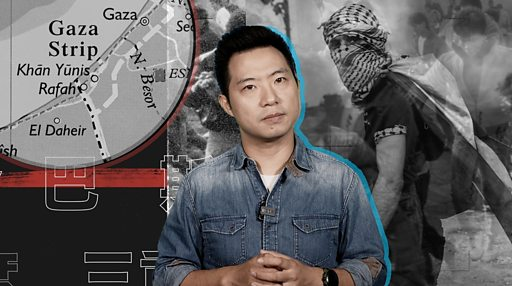

# [World] 以色列vs巴勒斯坦：中国态度的三重考量

#  以色列vs巴勒斯坦：中国态度的三重考量

**以色列vs巴勒斯坦：中国态度的三重考量**

_**如果您不方便观看视频，以下是视频脚本全文：**_

“因提法达”（Intifada）——阿拉伯语中“起义”一词的音译，在巴以问题上，特指巴勒斯坦人反抗以色列的大规模暴动。

2023年10月7日，哈马斯对以色列发动袭击。支持巴勒斯坦者，称之为第三次“因提法达”；以色列及其支持者，则视其为“恐怖活动”，以色列随即发动强势反击。

距离上一次“因提法达”，已经过去差不多20年，再次审视以巴关系的国际环境，多了一个新变量——中国。

那么，中国在以巴问题上，究竟态度如何？背后有哪些考量？又能给这个纷乱的地区带来什么？

BBC中文的陈岩采访不同背景专家，试图回答这些问题。

哈马斯发动袭击之初，中国的表态很模糊，并未点名谴责哈马斯。

这一操作与乌克兰战争爆发后，北京的态度类似，表面上采取了中立的态度，但在以色列和其盟友看来，不谴责哈马斯，就是在反对以色列。

很快随着以色列对加沙地带的反攻，中国方的态度开始明晰，总结下来就三点：

  * 以色列行为已超越自卫范围，应停止对加沙民众的集体惩罚 
  * 局势发展到今天的地步，根本原因是巴勒斯坦人民权益被长期漠视 
  * 只有“两国方案”完全落地，中东地区才能迎来真正的和平 

与对俄乌战争反应不同的是，这一次中国明确表示，“将继续站在和平公道一边，支持巴勒斯坦人民维护自身民族权利的正义事业。”

那么问题的关键来了，中国为什么会采取这种态度？

总结下来，三个原因。

##  第一个原因：历史渊源

中国官方对中巴两国关系定位很高——“中国是最早支持巴勒斯坦民族抵抗运动并承认巴解和巴勒斯坦国的国家之一。”

1964年五月，巴勒斯坦解放组织成立。第二年就在北京设立了享有外交机构待遇的办事处。

1988年11月，巴勒斯坦宣布在其控制着约旦河西岸地区成立巴勒斯坦国，中国几乎在第一时间宣布与巴勒斯坦建交。

巴勒斯坦解放组织已故的著名领导人阿拉法特，曾经14次访问中国。其继任者，巴勒斯坦总统阿巴斯自2005年以来五次访华，其中三次是在习近平上台后。

需要区分一下，巴勒斯坦实际上一分为二：

  * 在约旦河西岸，巴解组织为合法政府，受到国际社会承认。阿巴斯是总统，也是中国主要交往对象。 
  * 在加沙地带，哈马斯于2007年夺取控制权，该组织被以色列及其盟友列为“恐怖组织”，也是这次袭击的发动者。 

相比之下，其实以色列与中国的历史渊源更久远——在1933年至1941年期间，逾2万犹太人为了躲避大屠杀逃往了上海，得以幸存。

这份历史渊源，使以色列早在1950年就承认中华人民共和国，是中东首个。但朝鲜战争爆发，中国和以色列建交也被搁置，直到冷战结束，1992年中以才正式建交。

##  第二个原因：国内政治

中国有3000万穆斯林人口，尤其在新疆。

面临北京称的“分裂主义，极端主义和恐怖主义”，“三股势力”的挑战，包括“东突厥斯坦伊斯兰运动”，以及“东突解放组织”等，总部位于海外，被中国视为“恐怖组织”。

对于中国而言，如果跟穆斯林世界闹僵，那么这些挑战就会大得多。分析人士认为，现在几乎没有什么穆斯林国家支持新疆的分裂势力，就是中国在国际问题上“偏袒”穆斯林国家的结果。

比较近期的例子是，今年6月，巴勒斯坦总统阿巴斯访华，双方提高两国关系层级，至战略伙伴关系，而阿巴斯在中国关心的几乎所有问题上都表态支持。

比如阿巴斯明确表示，新疆问题不是人权问题，而是反暴恐、去极端化和反分裂，他反对西方国家以新疆问题为“借口”干涉中国内政。

##  第三个原因：中国对新秩序的诉求

1945年二战结束，有历史学家将这一年称为“零年”，意思是现代世界的开始——在此之前，世界秩序取决于实力，强可以凌弱。

二战的惨烈结果使战胜者决定建立一套规则体系，保障弱国和个人的权利。

不过这一秩序运行了近80年，却依然脆弱。比如，此次哈马斯对以色列袭击致上千人死亡，而以色列轰炸加沙造成数以万计平民死亡。批评者称，为何欧美国家不顾及巴勒斯坦的人权，去阻止以色列？

近年， 中国快速崛起，于是就有冲动寻求符合自身利益的秩序安排。那么中国想要什么样的世界秩序 ？

简单来说，就是一种“更少互相干预”的秩序，各个国家“各扫门前雪”，这种环境更适合威权统治者生存，中国经常说“互不干涉”、“相互尊重”，都是基于这种诉求。

换言之就是“主权优先”，而非“人权优先”。

基于这种秩序，一国不能以自己的人权标准干预另一国，而西方国家认为人权是超越主权的普世价值。

对于众多阿拉伯国家，乃至相当多的穆斯林国家，中国的这种诉求很有吸引力，中国也希望团结这些新兴国家，构建新的国际秩序。而这些国家几乎无一不是站在巴勒斯坦一方。

再看以色列背后的英美等国，则是现有世界秩序的维护者，也是中国最大的战略对手。

基于这一点，中国在中东，乃至俄乌问题上的选择了巴勒斯坦和俄罗斯。

##  中国在以巴问题上会起到什么作用？

采访过程中，两种观点浮现出来：

一方认为，中国不会真正主动推进巴勒斯坦地区和平，因为中东长期处于混乱给中国与西方的竞争带来战略好处，这些区域乱局将极大地消耗民主世界的注意力和资源。

另一方认为，中国几乎是全球唯一一个同时与巴勒斯坦、以色列、伊朗、埃及、沙特等中东国家都保持相对友好关系的主要国家，而且中国离中东较远，不易与域内国家产生战略冲突。在和谈中有机会扮演“中间人”的角色。

很难预知哪种可能性会成真。但最后我们不妨回顾历史上珍贵的一刻——

1995年11月9日，巴解组织领导人阿拉法特秘密前往以色列。

五天前，以色列总理拉宾遇刺身亡，阿拉法特冒险前去慰问拉宾的遗孀莉亚·拉宾，这是他第一次访问以色列。

两年前，在克林顿政府斡旋下，他和拉宾缔结《奥斯陆协议》，被视作巴以和平的里程碑。

在拉宾的家里，阿拉法特摘下他标志性的头巾，握着莉亚的手，他说自己和拉宾共同缔造的是“勇者的和平”。

确实，对于包括中国在内的各方而言，有时候，推动和平比发起战争更需要勇气。

