# [World] 亨利·基辛格逝世：影响半个世纪全球事务的争议外交家

#  亨利·基辛格逝世：影响半个世纪全球事务的争议外交家

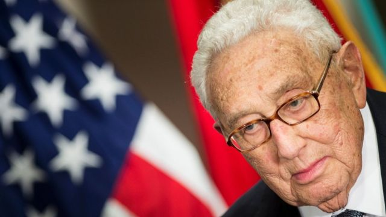

> 图像来源，  Getty Images

**美国前国务卿、著名外交家亨利·基辛格（Henry Kissinger，季辛吉）逝世，终年100岁。**

他曾在尼克松（Nixon，尼克逊）和福特政府担任美国最高外交官及国家安全顾问。

他创办的政治咨询公司基辛格事务所（ Kissinger Associates）发布声明称，这位出生于德国的前外交官在康涅狄克州的家中去世。

在数十年的政治生涯中，基辛格在美国外交政策上扮演了关键、有时是具有争议性的角色。

基辛格协会的声明未有说明他去世的原因。

1923年出生于德国的基辛格，在1938年来到美国，当时他举家逃离纳粹德国。

他于1943年成为美国公民，并在美国陆军服役三年，及后又反情报兵团（Counter Intelligence Corps）服役。

他在哈佛大学获得学士、硕士及博士学位，之后在该校教授国际关系。

1969年，时任总统理查德·尼克松（Richard Nixon，尼克逊）任命他为国家安全顾问，这一职位赋予了他在美国外交政策上的巨大影响力。

作为尼克松政府时期以及之后杰拉尔德·福特（Gerald Ford）总统任期内的国务卿，基辛格领导了对中国的外交努力，助力谈判结束了1973年以色列与诸邻国的赎罪日战争（Yom Kippur War，即第四次中东战争），在后来结束越南战争的《巴黎和平协约》（Paris Peace Accords）中，他也发挥了关键作用。

在美中关系正常化的历史性进程中，他的角色也至关重要。

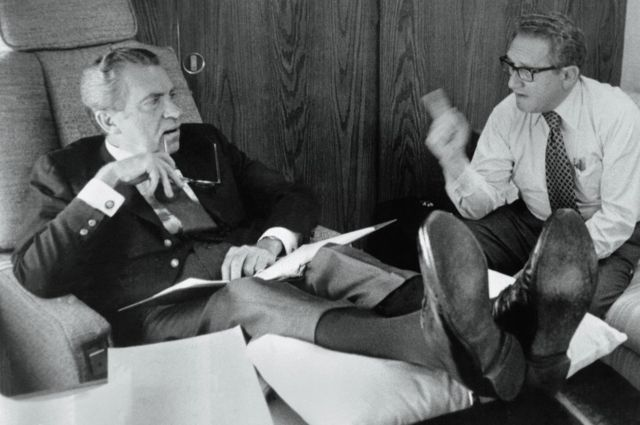

> 图像来源，  Getty Images
>
> 图像加注文字，基辛格与尼克松。

##  争议外交家

对于基辛格的政治生涯，人们的评价褒贬不一。

作为外交关系中“现实主义”的忠实践行者，他一方面被授予诺贝尔和平奖，另一方面又被直斥为战争罪犯。

作为美国国家安全顾问和国务卿，他积极推行了缓和政策，从而改善了与苏联及中国的关系。

他的穿梭外交帮助结束1973年阿拉伯和以色列的冲突；《巴黎和平协约》的谈判也使美国得以摆脱越战的长久梦魇。

但是他的路线在支持者口中是“实用政治”，在批评者口中却被斥责为不道德。

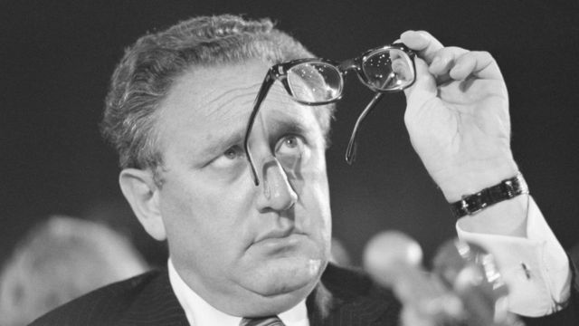

> 图像来源，  Getty Images
>
> 图像加注文字，基辛格以一心一意通过实用政治为美国寻求利益著称，政治生涯不乏争议。

多年来也不乏对基辛格的激烈批评。

有人指责他将美苏竞争置于人权之上，并且在世界多地支援高压政权，包括智利的奥古斯托·皮诺切特（Augusto Pinochet）政权。

有人指责他至少是默许了智利推翻左派政府的血腥政变，对于阿根廷军队对人民发动的“肮脏战争”也视而不见。

1973年，他与北越的黎德寿（Le Duc Tho）一同获授诺贝尔和平奖，但后者拒绝接受。

在听说基辛格获得诺贝尔奖后，喜剧演员汤姆·莱勒（Tom Lehrer）就曾有过著名的宣言：“政治讽刺已经过时了。”

该次争议性的奖项导致诺贝尔奖委员会的两名成员辞职。

基辛格在1977年离开政府服务，但继续充当一位活跃的公共事务评论员。美国总统和议员常常会征求他的意见。

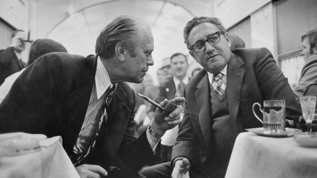

> 图像来源，  Getty Images
>
> 图像加注文字，水门事件后，卡特总统仍然任命基辛格为国务卿。

他还服务于多家公司的董事会，也是外交政策和安全事务论坛的常客，此外还撰写了21部著作。

基辛格于今年5月年届100岁，而且即使在晚年仍保持活跃。今年七月，他出人意料地前往北京与中国国家主席习近平进行了一次会面。

如今，他留下相伴将近50年的妻子，以及两个来自前一段婚姻的子女和五个孙辈。

##  早年：逃离纳粹德国

海因茨·阿尔弗雷德·基辛格（Heinz Alfred Kissinger）于1923年5月27日出生于巴伐利亚的一个犹太中产阶级家庭。

他们一家等到很晚的一刻才逃离纳粹的迫害，但还是在1938年来到了纽约的德裔犹太社区。

少年时代的“亨利”天性害羞，从没有改掉他的口音，而且终生保持着对足球的热爱。

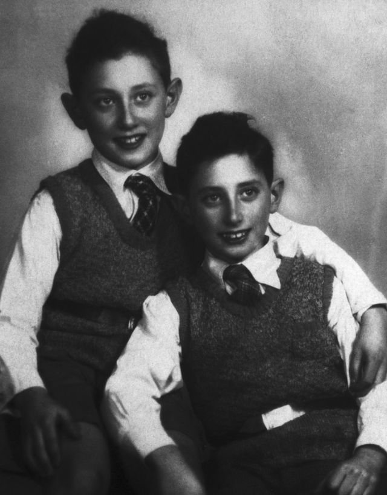

> 图像来源，  Getty Images
>
> 图像加注文字，11岁的亨利·基辛格和他的弟弟沃尔特在一起。

他在夜校读高中，白天则在一家剃须刷工厂工作；原本打算学会计，却被征召进入了军队。

在那里，他被编入步兵连，才智和语言能力得以在军事情报上发挥作用。基辛格亲历了二战期间的重大战役突出部之役（Battle of the Bulge，又称“阿登战役”），然后还顺理成章地掌管一座被攻占的德国小镇——当时他的军阶仅为二等兵。

战争接近尾声时，他加入了反情报部门。这位23岁的年轻人被委派率领一个小组，追捕前盖世太保官员，拥有拘留和逮捕嫌疑犯的绝对权力。

##  “小型核战争”理论

回到美国后，基辛格在哈佛大学学习政治学，在学术阶梯上逐步攀升。

1957年，他出版了一本书《核战争与外交政策》（Nuclear War and Foreign Policy）——当中认为有限度的核战争是可赢的。借助反怀疑主义的语调，他声称“战术性”和“战略性”地使用新系列小型导弹，或许是合理的。

这本书使他受到了关注。基辛格由此走上了功成名就之路；而他的“小型核战争”理论至今仍然有影响力。

他成了纽约州州长及总统候选人纳尔逊·洛克菲勒（Nelson Rockefeller）的助手。当理查德·尼克松在1968年入主白宫时，基辛格被提名要职：国家安全顾问。

那是一种复杂的关系。总统感觉在国际关系上要依赖基辛格的建议，但同时又倾向于不时发表反犹太言论，对美国犹太人也抱有怀疑。

此时的冷战正值高潮：几乎造成末日的古巴危机刚刚得到解决，美军仍深陷越战泥潭，俄罗斯也刚刚入侵过布拉格。

但是，尼克松和基辛格有意缓解与苏联之间的紧张关系：重新启动了缩减两国各自核武器规模的谈判。

##  中国的“老朋友”

与此同时，通过周恩来总理，与中国政府的对话窗口也打开了。这改善了美中关系，并将外交压力放到了苏联领导层的头上——他们正对中国这个巨大的邻国感到恐惧。

据说，担任国家安全顾问时的基辛格一开始对中国并不感兴趣，但是在尼克松的授意下，他在1971年两次出访北京——其中第一次是秘密进行，由此开启了美中关系正常化的进程。

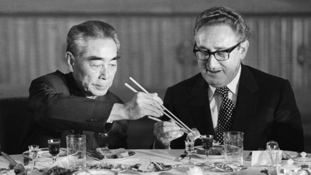

> 图像来源，  Getty Images
>
> 图像加注文字，在1971年两次出访北京——其中第一次是秘密进行，由此开启了美中关系正常化的进程。图为1971年在北京人民大会堂举行的国宴上，中国总理周恩来为基辛格夹菜。

他当时就与周恩来会面，从美中关系中最棘手的议题——台湾问题——开始谈起。

他曾经提议让台湾和中国分别成为联合国成员。在经过漫长讨论和周恩来拒不妥协之下，台湾失去了联合国席位，华盛顿同意只承认一个中国——北京领导的中华人民共和国，并同时承诺会在台湾受到攻击上给予军事支持。

基辛格的努力直接促成了1972年尼克松的历史性访华。当时他会见了周恩来和毛泽东，结束了23年的外交孤立和敌对状态。

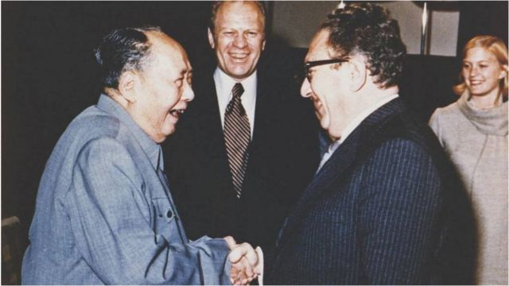

> 图像来源，  Reuters
>
> 图像加注文字，1975年访问北京时，毛泽东和基辛格握手，福特总统（中）当时站在身旁看着。

两国的全面外交关系正常化在1979年才得以完成，但是基辛格谈判下形成的“战略性模糊”政策被美国奉行至今，直至近年支持强硬路线的美国政客开始寻求逐步改变。

在之后的年月里，基辛格共到访中国100次，最近的一次是在今年7月，在北京与中国国家主席习近平会面。

此时的基辛格已年届100岁，加上到访中国100次，中国媒体引述习近平指，两个“一百”加在一起令他的访华“具有特殊意义”。

新华社引述习近平指，在毛泽东、周恩来和尼克松、基辛格等人“以卓越的战略眼光作出中美合作的正确抉择，开启了中美关系正常化进程，既造福了两国，也改变了世界”。

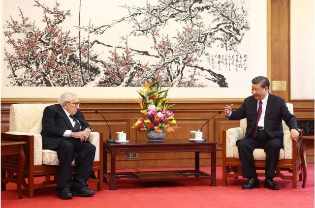

> 图像来源，  Getty Images
>
> 图像加注文字，2023年7月20日，中国国家主席习近平（右）在北京会见美国前国务卿基辛格。

周四（11月30日），中国外交部发言人汪文斌表示，习近平已就基辛格的逝世向美国总统拜登表达了慰问。

中国官方媒体在周四称基辛格为“中国人民的老朋友”，称他是见证中美关系发展的“活化石”。

##  越南

就在基辛格参与寻求与中国重构关系的同时，美国也正试图令自己从越战中脱身。

“光荣的和平”是尼克松一项核心竞选承诺；而基辛格早就断定，美国的任何军事胜利都是毫无意义的——因为他们无法“造就一个在我们最终撤军后还能存活下去的政治现实”。

他开始了与北越的谈判，但是又同意尼克松暗中对中立国柬埔寨进行轰炸——以图剥夺共产党部队的人员和物资。

这一政策造成了至少5万名平民死亡；而这个国家由此出现的动荡也导致了柬埔寨内战和波尔布特（Pol Pot）政权的残暴统治。

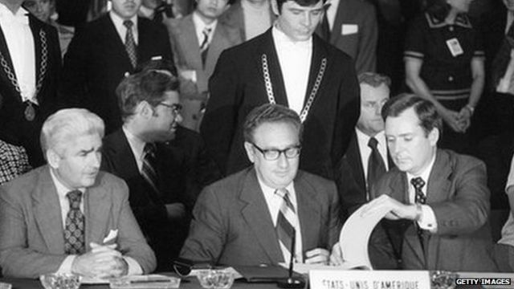

> 图像来源，  Getty Images
>
> 图像加注文字，1973年基辛格参与越战和平协议谈判。

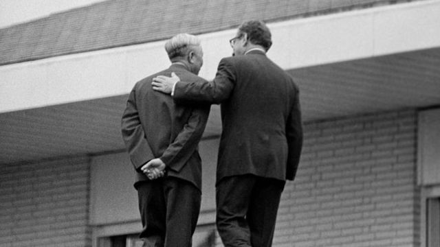

> 图像来源，  Getty Images
>
> 图像加注文字，1973年，他与北越的黎德寿（Le Duc Tho）一同获授诺贝尔和平奖，但后者拒绝接受。

在巴黎与越共进行一系列磨人的谈判过程中，此时已是国务卿的基辛格协商了美军从南越撤退的事宜。

这令他获得诺贝尔和平奖，北越的黎德寿也一同获奖——这一决定遭到了和平活动人士的猛烈抨击。

基辛格“怀着谦卑之心”接受了这一奖项，并将奖金捐献给冲突中阵亡美国军人的孩子。两年后，当共产党军队推翻南越时，他试图将奖金退还。

##  实用政治

在1973年阿拉伯与以色列的战争爆发后，他的穿梭外交带来了停火。

尼克松在白宫的秘密监听系统记录了时任以色列总理梅尔夫人（Golda Meir，梅厄）热情洋溢地感谢他和基辛格善待她的国家。

但是在她离开后，录音带却披露了更为黑暗的实用政治。基辛格和尼克松都没有打算向苏联施压，以让俄罗斯的犹太人可以在以色列寻求过上新生活。

“让犹太人从苏联移民不是美国的外交政策目标，”基辛格说，“而如果他们在苏联把犹太人关进毒气室，也不是美国关心的问题。它或许是个人道主义问题。”

然而，马克思主义者萨尔瓦多·阿连德（Salvador Allende）当选为智利总统，则确实令美国感到担忧。这个新政府支持古巴，并将美国公司国有化。

美国中央情报局（CIA）在智利进行了秘密行动，试图帮助反对派团体推翻这个新政府。基辛格主持了授权该行动的委员会。

“我不明白我们为什么要袖手旁观，看着一个国家因为对人民不负责而变成共产国家，”他说，“这些问题对智利选民来说太重要了，不能由了他们自己去决定。”

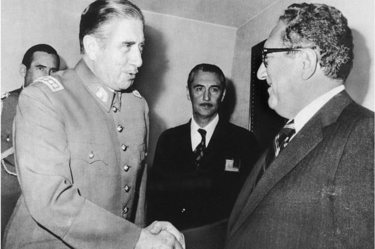

> 图像来源，  Getty Images 515114332. No fee.
>
> 图像加注文字，1976年，基辛格与皮诺切特将军举行会晤。

最终，军方介入了；阿连德在一场暴力政变中死去，皮诺切特将军夺取了政权。他的很多士兵原来都曾收了美国中央情报局的钱。

在日后多年里，基辛格本人遭到多个法庭的追审，调查了军事政权下侵犯人权和外国公民死亡的事件。

一年后，因水门事件倒台的理查德·尼克松泪流满面地离开白宫，基辛格亲眼见证。尼克松的继任者吉拉尔德·福特将他留在了国务卿的位置上。

他向1960年代单方面宣布独立的前英国殖民地罗德西亚白人少数政府施压，让他们放弃权力，但又被指无视阿根廷军政府令批评者“失踪”的做法。

##  权力是最好的春药

在1977年离任开政府办公室之后，争议依旧跟随着他：哥伦比亚大学曾邀请他担任教授，但由于学生的抗议而被撤销了。

他成了吉米·卡特（Jimmy Carter）和比尔·克林顿（Bill Clinton）外交政策的强力批评者，声称这两名总统在中东战争和平进程上的操之过急。基辛格认为，这只能是一小步一小步地实现。

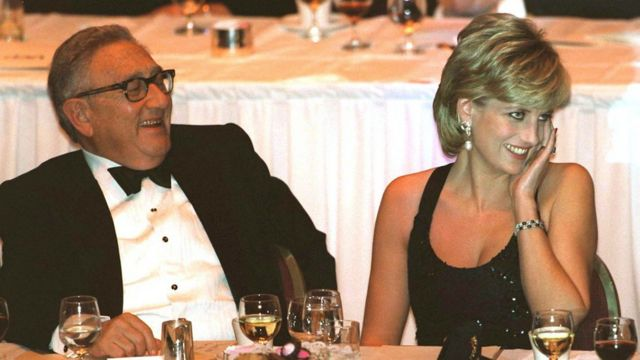

> 图像来源，  Getty Images
>
> 图像加注文字，基辛格在全球拥有广泛的人脉和影响力（图为基辛格和戴安娜王妃）。

在“9/11”事件后，乔治·W·布什（George W Bush，乔治·布希）请他主持对纽约和华盛顿袭击的调查，但是几个星期后他被迫辞职——他拒绝透露一份他咨询机构的客户名单，也不回答有关利益冲突的问题。

他曾与小布什总统和副总统迪克·切尼（Dick Cheney）开会，为他们2003年入侵伊拉克的政策提供建议。他告诉他们：“胜利镇压叛乱，是唯一的退出策略。”

始终影响力巨大的他，在2017年唐纳德·特朗普（Donald Trump）当选总统后也曾向他进行过外交事务简报——他提的各种建议中，包括接受弗拉基米尔·普京（Vladimir Putin）对克里米亚的占领。

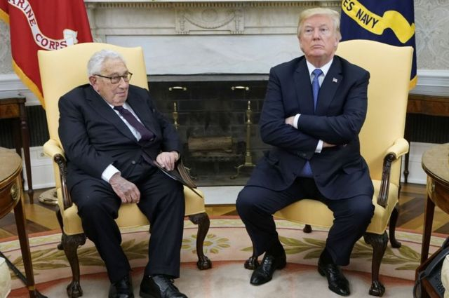

> 图像来源，  Getty Images
>
> 图像加注文字，基辛格曾向入主白宫的特朗普给予建议

不过，到2023年他年届100岁时，他已经改变了对乌克兰的看法。在俄罗斯入侵后，他认为泽连斯基总统的国家应该在获得和平之后加入北约。

亨利·基辛格有着广泛的人脉，并且总是保持着机智。他喜欢说一句话：“权力，是最终极的春药。”

作为一个非凡的人物，他在上个世纪很多最关键的事件期间，都处在权力的中心。

令很多人恼火的是，对于一心一意为美国追求利益，并极力维护这个他的归化国的生活方式，他从来不感到歉疚。

他曾宣称：“一个在外交政策上要求道德完美的国家，将会既得不到完美，也得不到安全。”

