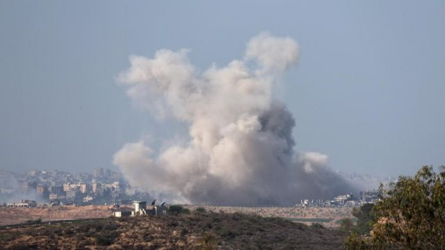

# [World] 以巴冲突：加沙停火为何戛然而止？

#  以巴冲突：加沙停火为何戛然而止？

  * 奥利弗·斯洛（Oliver Slow ） 
  * BBC新闻 

> 图像来源，  EPA

**周五（12月1日）上午，以色列和哈马斯之间停火协议七天后嘎然而止，战火重燃。双方释放人质和囚犯工作及加沙地带所急需的人道主义援助也遭停。**

以下是围绕最新事态发展的一些关键问题。

##  停火为何终止？

在当地时间 07:00（格林尼治标准时间05:00），停火结束前一小时，以色列国防军（IDF）报告称，靠近加沙地带附近的社区拉响了警报，随后以色列国防军称拦截了一枚来自加沙的火箭弹。

一小时后，以色列军方称，战斗已经恢复，并指责哈马斯违反了协议条款。

以色列国防军随后表示，其战斗机正在袭击哈马斯在加沙地带的目标。

不久后，以色列总理本雅明·内塔尼亚胡(BenjaminNetanyahu)说，哈马斯“没有履行今天释放所有女性人质的义务，并向以色列公民发射了火箭弹”。

然而，哈马斯将战火重燃归咎于以色列，称其拒绝“接受释放其他人质的所有提议”。

哈马斯在一份声明中说，“占领国事先决定恢复罪恶的侵略”，并指责美国总统拜登 “继续在加沙地带实施犹太复国主义战争罪行”，“为以色列开了绿灯”。

在长达一周的停火期间，内塔尼亚胡一直受到压力，特别是来自其政府中右翼分子的压力，要求他重启战争。以色列不断明确表示，一旦协议结束，它就会重启战争。

尽管如此，达成新协议的希望仍然存在。迄今为止，卡塔尔在停火谈判中发挥了至关重要的作用，该国周五证实，会谈仍在继续，“目的是恢复停火”。

##  加沙的情况如何？

在战火重燃的七个小时内，隶属哈马斯的加沙卫生部称，已有60多人丧生，而在停火前已有近1.5万名巴勒斯坦人丧生。

轰炸开始后，联合国儿童基金会的詹姆斯·埃尔德（James Elder）在加沙南部一家医院接受了BBC的采访，他形容当时的情况 “非常可怕”。

他说，“对人们来说太可怕了，你可以从他们脸上看到恐惧。” 他还说，他所在的医院附近遭到了一次袭击。

他形容停火的结束是“每个人实在害怕的噩梦。”

停火前，以色列的军事行动是针对对哈马斯 在10 月 7 日发动的的致命袭击进行了报复，加沙地带遭到了大规模破坏。

以色列声称使用了超过 1万枚炸弹和导弹，BBC 的分析发现，加沙近 9.8万栋建筑可能遭到破坏，其中大部分集中在北部。

袭击还导致严重人道主义危机。援助机构得以利用战斗暂停的时间运送重要援助物资，但据报道，他们到达的许多地区都遭到了破坏。

##  接下来会发生什么？

尽管谈判仍在继续，希望能达成新的协议，但目前战争显然已经重启。

在加沙地带北部，尤其是加沙城周围，在激战数周之后，以色列军方现在似乎将大部分注意力集中到了南部，据报道，对那里的空袭又开始了。

以色列国防军还绘制了一张加沙地图，将加沙分为 2000 多个区域，并称该地图将用于帮助加沙人民躲避未来的战斗。以色列国防军说，将地图划分为不同区域是为了让人们“在必要时从特定地点安全撤离”。

战火重燃的同时，以色列战机在加沙南部最大城市汗尤尼斯以东和以北地区投放了传单与地图链接。传单没有提到任何有编号的街区，但有一条阿拉伯语信息告诉四个有名字但没有编号的地区的居民“立即撤离，前往拉法的避难所”。

在战火重燃之前，美国国务卿布林肯会见了以色列官员，他坚称下一阶段的战争必须确保平民受到保护。

他说，他已告诉以色列政府，必须避免巴勒斯坦人进一步大规模流离失所，避免对医院、发电站和供水设施等重要基础设施造成破坏。

##  停火期间发生了什么？

在七天停火期间，哈马斯同意从加沙释放 110 人，其中包括 78 名以色列妇女和儿童。

作为协议的一部分，以色列监狱也释放了 240 名巴勒斯坦人。他们被指控犯有一系列罪行，包括投掷石块、煽动、谋杀未遂等。

许多获释的巴勒斯坦人并未被判定有罪，而是在候审期间被还押候审。一些人说，他们在 10 月 7 日袭击事件后受到虐待和集体惩罚。以色列说，所有囚犯都是依法拘留的。

据估计，约有 140 名以色列人质仍被关押在加沙。

