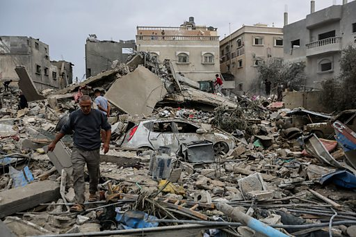

# [World] 以巴冲突：以色列向加沙南部发动地面进攻

#  以巴冲突：以色列向加沙南部发动地面进攻

**以巴冲突：以色列向加沙南部发动地面进攻**

以色列军方负责人表示，以色列在加萨（加沙）南部的地面行动已经开始，其攻势将不会亚于在以色列在加萨北部的进攻。

以色列国防部发言人称，地面部队正将进攻扩展到加萨地带的所有哈马斯中心。

一名以色列总理顾问告诉BBC，以色列正在尽最大努力避免平民伤亡。

哈马斯卫生部表示，自以色列和哈马斯爆发最新冲突以来，加沙已有15500人丧生。为期一周的停火结束后，以色列恢复了对加萨的大规模轰炸。

汗尤尼斯的居民称这是迄今为止最猛烈的袭击。以色列当局表示，哈马斯领导层成员就躲藏在该市，数十万人在战争初期逃离北部战事后，一直在这里避难。

与此同时，在以色列占领的约旦河西岸，暴力事件也在不断升级。

