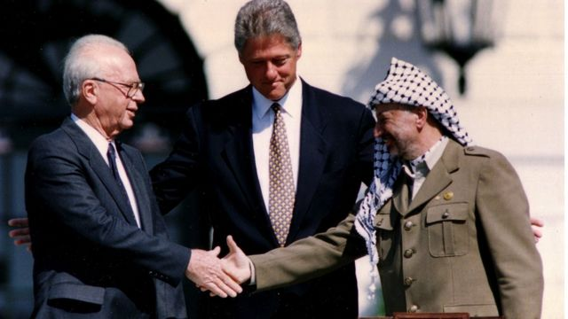
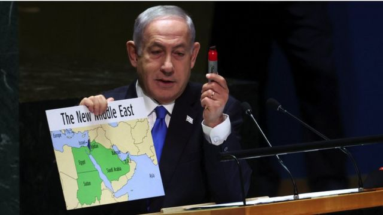
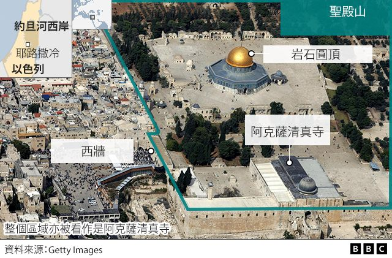
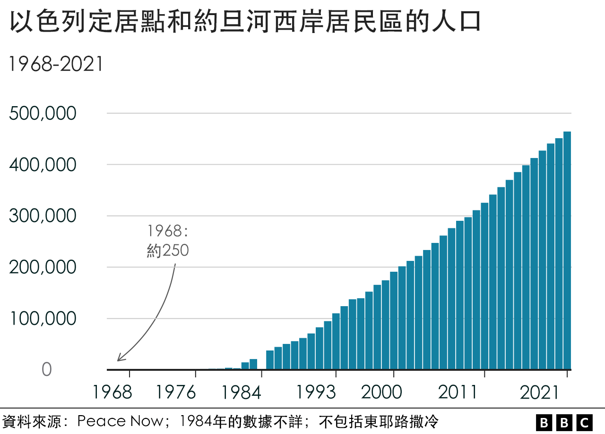

# [World] 两国方案：以色列和巴勒斯坦的和平进程是否能重回正轨

#  两国方案：以色列和巴勒斯坦的和平进程是否能重回正轨

  * 马丁·阿瑟尔（Martin Asser）、拉米斯·阿塔勒比（Lamees Altalebi）、保罗·库西亚克（Paul Cusiac） 
  * BBC阿拉伯语部记者 

> 图像来源，  Reuters
>
> 图像加注文字，在美国总统克林顿的斡旋下，巴勒斯坦民族解放运动领袖阿拉法特（右）与以色列总理拉宾（左）握手一幕成为历史性的一刻。

**哈马斯袭击以色列，随后以色列轰炸加沙并继而展开地面入侵行动，这一切似乎不太可能预示着终结以巴冲突的协议将达成。但是，“两国方案”的支持者认为，10月以来的暴力事件，反而奇迹般地推进了这个进程。**

10月7日的恐怖事件发生前两周，以色列总理本雅明·内塔尼亚胡（Benjamin Netanyahu）出现在联合国大会（UN General Assembly）上，宣布以色列和其阿拉伯邻国之间“和平新时代”的曙光即将到来。

内塔尼亚胡观察到，过去25年中，“所谓的专家”以“他们的方式”来主导，想与以色列和未来的巴勒斯坦谈判一个在约旦河和地中海之间共享土地的“两国方案”，却并没有带来“任何一项和平条约”。

内塔尼亚胡说：“在2020年，按照我所支持的做法……立刻就取得了惊人的突破。四个月内达成了四项和平协议，还是和四个阿拉伯国家！”

这些就是所谓的《亚伯拉罕协议》（Abraham Accords），它由特朗普政府斡旋。而此前该政府的以巴和平倡议和一连串由美国斡旋的协议遭遇了一样的命运。

**2020年《阿伯拉罕协议》（2020 Abraham Accords）：**

  * 9月15日 - 以色列与阿联酋关系正常化协议及巴林与以色列关系正常化协议 
  * 12月22日 - 以色列与摩洛哥关系正常化协议 
  * 12月24日 - 以色列与苏丹关系正常化协议 

**以前的以色列与阿拉伯世界协议：**

  * 1979年3月26日 - 《埃及和以色列和平条约》 
  * 1993年9月13日 - 《奥斯陆一号协议》（以色列与巴勒斯坦解放组织） 
  * 1994年10月26日 - 以色列与约旦和平条约 
  * 1995年9月24日 - 《奥斯陆二号协议》（以色列与巴勒斯坦解放组织） 

以色列总理说，《阿伯拉罕协定》的势头将会说服巴勒斯坦人放弃他们“摧毁以色列的幻想，并最终拥抱真正和平的道路”。

然后，他举起一幅“新中东”的地图，它暗示——巴勒斯坦将投降，两国方案将不复存在。

> 图像来源，  Reuters
>
> 图像加注文字，内塔尼亚胡对以色列和阿拉伯邻国的和平愿景中没有巴勒斯坦政府——他在地图上已经表明这一点。

与此同时，拜登政府被认为在以色列与巴勒斯坦问题上花费的精力比过去七位美国总统中的任何一位都更少。

今年2月，美国国务院在有关“两国方案”的措辞中称其感觉“遥远”，但是美国“致力于保持一线希望”。这一政治公式在9月安东尼·布林肯与以色列和巴勒斯坦领导人通电话时甚至完全没有被提及。

很多事情已经改变了。

“美国仍然相信，最佳的可行路径——也是唯一的路径——就是‘两国方案’，”美国国务卿11月3日在以色列表示。

但是，25年前阻止和平方案出现的矛盾与障碍，现在只是变得更加复杂。

##  和平希望是如何破灭的？

1993年，在挪威斡旋下，以色列和亚瑟·阿拉法特（Yasser Arafat）的“法塔赫运动”（Fatah）领导的“巴勒斯坦解放组织”（PLO）进行秘密谈判之后，建立了“两国方案”的大致框架。

然而，所谓的“奥斯陆进程”从来没有达到其逻辑上的终点，并且留下一系列比以往更加难以解决的问题。

以土地换和平的协议，令巴勒斯坦自治政府（PA）开始在1967年战争中由以色列占领的土地上实施自治权。

但是，军事占领和犹太人定居点活动仍然持续，所谓的“永久地位问题”被搁置到了以后的谈判中。

其中包括在1948年第一次阿拉伯- 以色列战争和1947年联合国投票划分之后成为以色列的地带上，那些巴勒斯坦难民的地位问题。以色列在1967年吞并了东耶路撒冷，这成为另一个难题，两方都认为圣地太重要，不能让步。

经过多年的外交戏码，这些问题终于在2000年由克林顿总统主持的戴维营闭门峰会上得到解决，但是时任以色列总理埃胡德·巴拉克（Ehud Barak）和巴勒斯坦自治政府主席阿拉法特却无法弥合分歧。

每个人都把失败归咎于别人。以色列和美国官员表示，阿拉法特拒绝了他所能得到的最慷慨协议。巴勒斯坦人则称之为骗局，远未达到他们的要求，比如在东耶路撒冷设立首都等。

批评者认为，以色列早就实现了压制其主要对手的目标。那么为什么还要放弃它已经投入如此多资源的领土，尤其是当巴勒斯坦人口稠密地区的安全控制权已经委托给了巴勒斯坦权力机构。

阿拉法特是在一个弱势地位进行谈判，而美国调解人与以色列的关系可以说比历史上任何国家之间的关系都要密切。

在通往“两国方案”的道路上，还有其他重要因素被证明了是不可逾越的。

1987年成立于加沙的伊斯兰抵抗运动组织——“哈马斯”（Hamas）不同意其“法塔赫”对手在和平协议上的让步，并且从1994年以来，找到了足够的机会通过自杀式炸弹袭击来破坏谈判。

宗教定居者也钻了空子，在他们眼中由上帝许给他们的土地上扩大和加强犹太人的存在感。

> 图像来源，  Reuters
>
> 图像加注文字，2000年的戴维营谈话未能令以巴达成共识。

##  《奥斯陆协议》之后发生了什么？

2000年，被称为“第二次巴勒斯坦大起义”（Second Intifada）的运动爆发后，以色列的政治重心明显向右移动了。

作为《奥斯陆协议》推动力量的以色列工党逐渐沦为无足轻重的政党，而支持定居点的右翼不同派别则占据主导地位。

請稍等

选民们寄望于右翼利库德集团的阿里尔·沙龙（Ariel Sharon）——这个阿拉法特的坚定对手，来将他们带出混乱局面。

叛逆的巴勒斯坦民众则面对着以色列的强大军事力量，同时沙龙的内阁建立了将巴勒斯坦人和以色列及约旦河西岸一些定居点隔离的屏障。阿拉法特直到他在2004年去世前不久都被困在拉姆安拉。

更加出人意料的是，沙龙在加沙地区150万巴勒斯坦居民中移走了数千名定居者，将军队重新部署到周边地区。四个孤立的约旦河西岸定居点也被疏散。

“脱离接触”计划衍生的后果是巨大的，将人口从拥挤严重的巴勒斯坦地区分离开来，其目的是确保犹太人在以色列领土上的多数派地位。

沙龙的高级顾问向一名记者表示，这是给终结政治谈判注入了“所需的毒物”。

然而，此举分裂了利库德集团，也孤立了定居点的支持者。这一切没有阻吓住沙龙，他组建了一个新党，准备参加2006年选举。

在投票前几周，沙龙脑出血昏迷，令我们无人了解到在约旦河西岸是否也有类似的计划。如果有的话，只有沙龙有能力将其实施。

阿拉法特的继任者马哈茂德·阿巴斯（Mahmoud Abbas）谴责“脱离计划”是对《奥斯陆协议》原则的背叛，而哈马斯在加沙的代表却将其视为抵抗的胜利。

但在埃及的合作下，以色列加强了对加沙的封锁，当地暴力升级事件频发，武装分子袭击以色列，火箭炮向以色列发射，以方则通过轰炸和入侵行动压制抵抗。

与此同时，在约旦河西岸，哈马斯正在演变。

請稍等

哈马斯参加了2006年巴勒斯坦自治政府的立法机构选举，对法塔赫未能实现巴勒斯坦独立或在没有腐败的情况下透明治理感到失望的选民，令哈马斯取得了多数席位。

国际社会向哈马斯施压，要求其遵守之前巴勒斯坦自治政府的承诺，停止暴力并承认以色列，但哈马斯并不打算这样做。

哈马斯用武力将巴勒斯坦权力机构驱逐出加沙，导致加沙作为一个武装抵抗中心，从法塔赫统治下致力于和平协议却没有太多和平希望的约旦河西岸分裂开来。

但是，有迹象却显示哈马斯内部有不同态度，表明有可能将来进行政治接触，比如提议长期停火，并建议可以在以色列1967年占领的领土上建立一个国家。

然而哈马斯并没有改变其宪章，仍然要求废除以色列。而以色列方面则继续扩大在约旦河西岸的定居点规模和人口。

随着时间推移，哈马斯还利用了加沙的监管不严建立起了军事能力，得到黎巴嫩真主党等盟友的支持，形成了所谓的“抵抗轴心”。

##  新范例

10月7日及其后续的事件，将长久以来的以巴问题重新摆到了全球面前，而同时一些新的因素也受到了关注。

在以色列一方，广泛认为哈马斯必须被摧毁，尽管这会对加沙地带的平民造成影响。

右翼的内塔尼亚胡支持者中间的讨论包括了永久驱逐加沙人口。从巴勒斯坦一方看来，这将会是另一个“浩劫日”——它本是指1947年末的几个月到1949年初，当时在后来成为以色列的土地上，约70万巴勒斯坦人成为了难民。

以色列左派害怕内塔尼亚胡的政策将不可避免地形成一个单一的种族隔离国家，而消除哈马斯会恢复二元的制衡，而不是哈马斯、巴勒斯坦自治政府和以色列三方实体。这使得“两国方案”重新成为可能。

前工党成员、作家阿夫拉哈姆·伯格（Avraham Burg）向BBC表示，以色列人和巴勒斯坦人需要时间从“一场巨震”中恢复过来，但是他相信，他们最终会选择“两国方案”，这是唯一能长期停止流血的选项。

“只要是会最终承诺长期和平的政治模式，都会被大多数以色列人采纳，”他说。

正在加沙经历着狂轰滥炸，居民区暴力升级以及约旦河西岸军队压境的巴勒斯坦人，或者那些正在电视和社交媒体上看着这一切的人们，或许考量会不一样。

阿拉伯世界研究与发展组织（AWRAD）在10月31日至11月7日对加沙和约旦河西岸居民进行了一项民意调查，当中发现68%的受访者表示，他们对“两国方案”的支持度下降了。

巴勒斯坦人也意识到国际上对他们事业的支持度似乎在增加。一项路透/益普索（ Reuters/Ipsos ）民调发现，美国年轻人对以色列的支持程度不及先前几代人，40岁以下的受访者当中，有40%表示美国应该做一个中立的调解者。

对于受到和平使者华盛顿保护的以色列来说，2023年的事件是否会造成比过去30年来都更大的压力，目前仍言之过早。

然而，对于那些仍然期待和平的巴勒斯坦人来说，以没有结论的谈判来给未来的巴勒斯坦国家争取更多时间的局面，已经回不去了。

“如果他们想要认真对待这件事，”一位专门研究冲突解决方案的学者达拉尔·伊里卡特（Dalal Iriqat）说，“就必须有切实的行动，首先要确定以色列的边界并结束占领。”

“如果他们一直重复美国那种对和平进程的美好修辞，但是没有行动，那是行不通的。”

