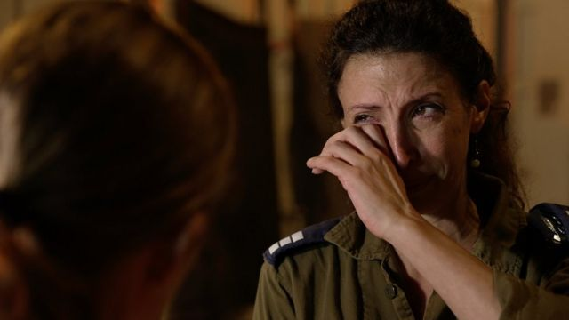
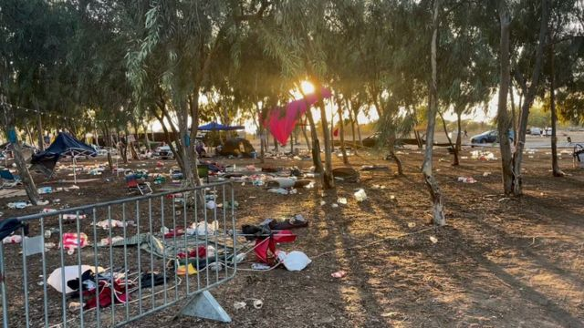
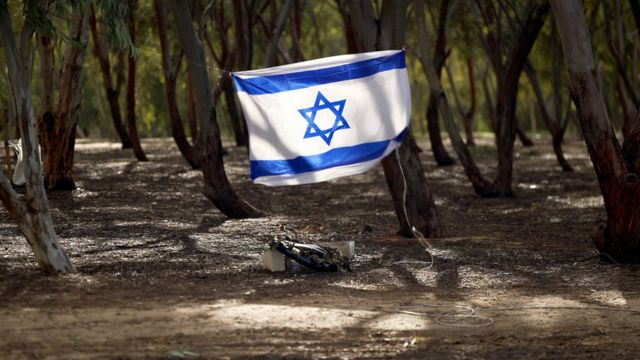
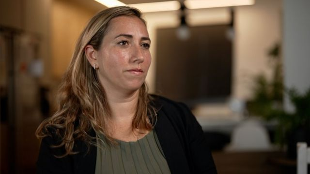
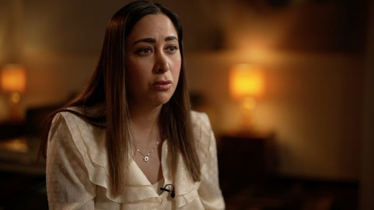
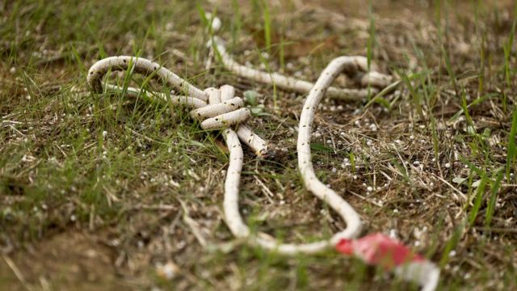
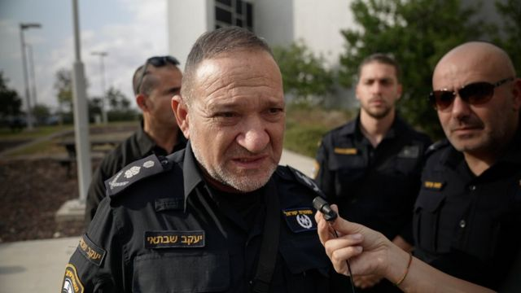

# [World] 以巴冲突：强奸、肢解、焚尸……BBC获悉这些在哈马斯袭击期间的暴行

#  以巴冲突：强奸、肢解、焚尸……BBC获悉这些在哈马斯袭击期间的暴行

  * 露西·威廉姆森（Lucy Williamson） 
  * 中东事务记者，发自耶路撒冷 

> 图像来源，  BBC/Nik Millard
>
> 图像加注文字，玛雅安上尉接受BBC访问时说：“我们看到各个年龄的女性……我们看到那些瘀伤，检查割伤和裂口，我们就知道她们是受到性侵害了”。

**根据BBC目睹和听到的证据，哈马斯在今年10月7日袭击期间曾实施强奸、性暴力和肢解女性的行为。**

**（** **警告：以下报道包含对性暴力和强奸极度具体的描述。** **）**

几个参与收集和辨认袭击中死者的人士告诉我们，他们看到了很多显示性侵的迹象，包括骨盆骨折、淤青、切割和撕裂的伤口，而受害者年龄从儿童和青少年到老年长者不等。

以色列警方向记者展示的“超新星音乐节”现场目击者的视频证词片段中，详细描述了一个受害者遭轮奸、肢解和处决的过程。

由哈马斯在袭击当天拍摄的裸体和满身鲜血的女性视频，以及事后在现场拍摄的尸体照片，表明女性是攻击者的性目标。

相信得以幸存下来讲述自己故事的受害者数量很少。

她们生命的最后时刻，只能是通过幸存者、收尸人员、停尸房工作人员以及袭击现场的影像所拼凑出来。

警方私下向记者展示了来自“超新星音乐节”袭击现场一名女性的一段可怕的作证录像。

她描述了自己看到哈马斯武装分子对一名妇女进行轮奸并肢解，然后最后一名施袭者在继续对她进行强奸的同时向她头部开枪。

> 图像来源，  BBC/Nik Millard
>
> 图像加注文字，哈马斯武装分子在10月7日闯入“超新星音乐节”活动现场，杀害了数百人。

视频中，被称为“证人S”的女性忆述施袭者抓起受害者，并传给下一个施袭者的过程。

“她当时还活着，”证人说，“她后背在流血。”

然后她详细描述了那些男人在侵害过程中将受害者的一些身体部位割下来。

“他们切下她的胸部，丢在街上，”她说，“他们还拿它来玩。”

然后她说，受害者被传给了另一个身穿制服的男子。

“他插入了她，然后在完事之前向她头部开枪。他甚至还没有提上裤子；他一边开枪一边射精。”

我们从音乐节现场一名男性目击者口中得知，他听到了“人们被谋杀、强暴和斩首的噪音和尖叫声”。

我们曾问他在如何无法看到的情况下确定他听到的尖叫声代表的是性侵而不是其他形式的暴力时，他说在他当时听见的时候就相信，只能是强奸。

他通过一家支援组织发表的声明当中形容那是“非人”的行为。

“有些女性是在死前被强暴，有些是在受伤时被强暴，还有一些在恐怖分子强奸她们一动不动的身体时，已经死了，”他在声明中说，“我很想去帮助，但是我什么都做不了。”

> 图像来源，  BBC/Dave Bull
>
> 图像加注文字，以色列人仍未从10月7日的哈马斯袭击中恢复过来。

警方称，他们有“多名”目击者讲述性侵事件，但是不愿进一步说明具体有多少个。我们采访他们的时候，他们尚未问讯到任何幸存的受害者。

以色列的女性赋权部长古兰（May Golan）向BBC表示，少数几个强暴与性侵的受害者在袭击中幸存，而且现在全部都在接受精神治疗。

“但是非常、非常少。大多数都被残暴地杀害了，”她说，“她们无法出来讲述——跟我、跟政府或媒体任何人都不能。”

哈马斯拍摄的视频包括一名女性，被手铐铐住、被掳为人质时手臂上有割伤，裤子上渗着大片血。

其他视频中，有女性被武装分子带走时似乎是裸体或半裸体状态。

袭击发生后出现的多张照片显示，有些女性尸体从腰部以下裸体，或者内裤被扯到一边，双腿张开，外阴和腿有外伤迹象。

“感觉好像是哈马斯从伊拉克的所谓‘伊斯兰国’（ISIS），还有波斯尼亚的案例中学会了如何将女性的身体变作武器，”希伯来大学戴维斯国际关系研究院（Davis Institute of International Relations）的法律专家埃尔卡雅姆-莱维博士（Dr Cochav Elkayam-Levy）说。

“仅仅知道这些细节就令我颤栗，他们知道如何对女性下手：切割她们的器官、残害她们的下体、强奸。知道这些真是可怕。”

> 图像来源，  BBC/Dave Bull
>
> 图像加注文字，埃尔卡雅姆-莱维博士：“感觉好像是哈马斯从伊拉克的所谓'伊斯兰国'（ISIS），还有波斯尼亚的案例中学会了如何将女性的身体变作武器。”

“我至少和三名因为看到这些强暴而导致精神状况不良从而入院的女孩交谈过，”古兰部长告诉我说，“她们当时装死，然后目睹了一切。她们无法承受这件事。”

以色列警察局长雅各夫·沙夫泰（Yaacov Shabtai）表示，很多袭击的幸存者都很难讲述经历，他认为其中一些人永远不会为他们看过和经历过的事情作供。

“有18名年轻男女因为无法正常生活而进入了精神病医院就医，”他说。

据报道，另一些人还有自杀倾向。其中一个在幸存者身边工作的人向BBC透露，有一些人已经自杀了。

大部分证据来自袭击事件后被派去现场的志愿收尸人员，以及那些在尸体被送到舒拉陆军基地（Shura）后负责进行身份确认的工作人员。

宗教组织“扎卡”（Zaka）的一名尸体收检义工向我描述了酷刑和肢解的证据。他说，有一名孕妇被杀前子宫被撕开，腹中的胎儿被刺穿。

BBC无法独立核实这一说法，而以色列媒体报道对一些在哈马斯袭击后担任义工的志愿者证词提出质疑。

另一个名叫纳赫曼·迪克斯泰纳（Nachman Dyksztejna）的志愿者提供了书面证词，称自己在贝埃里居民区（Be'eri）见过两具腿脚被绑在床上的女性尸体。

“其中一个是被人用刀插入阴部，所有内脏都被摘走了，”他的证词这样说道。

他说，在音乐节现场的小型避难所“堆满了女人。她们的上身衣服被撕破，下半身完全裸露。成堆成堆的女人……当你近距离观察她们的头部时，会看到每一个人的脑袋上都被直射过一枪。”

志愿者在袭击现场收集了数以百计的尸体。

> 图像来源，  BBC/Dave Bull
>
> 图像加注文字，古兰：“在头五天，在以色列境内仍然有恐怖分子，到处都是成百上千的尸体。”

调查人员承认，在袭击发生后那几天的混乱里，一些地区仍是活跃的战区，仔细记录犯罪现场或者进行法医取证的机会很有限，甚或已错过。

“在头五天，在以色列境内仍然有恐怖分子，”古兰说，“到处都是成百上千的尸体。它们被焚烧，没有了器官，它们完全被肢解。”

“这是一场大规模伤亡事件，”警方发言人迪恩·埃尔斯顿（Dean Elsdunne）在新闻简报会上向记者表示。

“首要的是要确认受害者身份，而不一定是犯罪现场调查。人们都在等候亲人的消息。”

在舒拉军事基地，对送来的尸体进行辨认的工作人员为调查人员提供了其中一些最关键的证据。

这些证据出自基地上一个用帐篷和冷藏集装箱临时建成、用来为尸体确认身份的集散中心。

我们到访时，医院的那些小堆车和铁架上放着的卡其色担架，整齐地排在装着尸体的集装箱前面；泛灯照射下，轮班工作人员身上的白色塑料连体服被照得半透明。

战斗机在头顶呼啸而过，淹没了蝉鸣。以色列对加沙的轰炸还在继续。

这里的团队告诉我们，他们从送来的尸体上看见明显的强奸和性暴力证据，包括持续暴力虐待导致的骨盆骨折。

“我们看到各个年龄的女性，”法医团队的一名预备役人员玛雅安上尉（Captain Maayan）向BBC表示，“我们看到强奸受害者。我们看到经历暴力侵害的女性。我们有病理学家，我们看到那些瘀伤，检查割伤和裂口，我们就知道她们是受到性虐待了。”

我问她，她处理的尸体当中，有多大比例显示出这种迹象。

“很多，”她说，“各个年龄的女性和女孩都很多。”

> 图像来源，  BBC/Dave Bull
>
> 图像加注文字，音乐节现场地上留下的袭击物件。

受害者的数量很难确定，部分原因是由于尸体的状态。

“肯定是有很多，”另一位要求我们只用她名字艾薇加伊尔（Avigayil）的现役士兵说，“很难判断。我处理过不少被烧焦的尸体，我不知道她们事前经历过什么。还有些尸体没有了下半身——我也不知道她们是否被强奸过。但要说明显遭受过强奸的女性？够多了。多不胜数。”

“有时候我们只有尸体的一小部分，”埃尔卡雅姆- 莱维博士告诉我说，“可能是一根手指、一只脚或手，他们要尝试识别。有人被烧成了灰，什么都不剩……我想说，我们永远不会知道到底有多少个案例。”

私下里，一些参与这项工作的人会提到“几十”个受害者，但很快就提醒说，证据仍在收集和对接当中。

以埃尔卡雅姆-莱维博士领导、负责收集性犯罪证词的公民委员会呼吁国际社会承认10月7日发生的事件是系统性的侵害，已构成反人类罪。

“我们看到了明显的套路，”她告诉我，“所以这不是偶然的，也不是随机的。他们带着明确的命令而来。那就是……以强奸作为种族灭绝。”

艾薇加伊尔同意，那此送到舒拉基地的尸体上所发生过的暴力行为，有相似之处。

“当中有套路，来自同一个地方的女性，受到的对待方式是相似的，”她说。

“可能有一组女性，以某种方式被强奸，而我们在她们的尸体上看到相似之处；然后有另一组没有被强奸，但是被人以完全相同的方式多次开枪射击。所以看起来是不同的恐怖分子小组采用了不同的残忍手段。”

“这是一次有预谋的系统性事件，”警察局长雅各夫·沙夫泰告诉记者说。

> 图像来源，  BBC/Dave Bull
>
> 图像加注文字，警察局长雅各夫·沙夫泰：“10月7日之后那天早晨醒来后的以色列，已经不是同一个国家了”

参与调查的以色列网络犯罪部门人员大卫·卡茨（David Katz）向记者表示，现在要证实性暴力是这次袭击计划中的一部分，还为时过早，但是从哈马斯袭击者手机上所提取的数据显示，“一切都是有系统的”。

“要现在说我们已经可以证明的话，会有点武断……但那里发生过的所有事情都是系统性地进行的，”他说，“没有一件事是偶然的。强奸是系统性的。”

以色列政府指出，他们声称在哈马斯武装分子身上找到的文件，似乎证明性暴力是有计划的这一观点。该政府发布的一些被俘武装分子的审讯录像似乎显示，他们供述称女性因此成为目标。

上星期，联合国妇女署（UN Women）发出声明，“明确谴责哈马斯的残暴袭击”，并且对“多番描述指袭击中有基于性别而实施的暴行和性暴力感到担忧”。

在声明发表前，埃尔卡雅姆-莱维博士曾表示，国际女性权益组织对于她的支持呼吁反应太慢。

“这是人类所知记录最全的暴行，”她告诉我说。

“10月7日之后那天早晨醒来后的以色列，已经不是同一个国家了，”警察局长雅各夫·沙夫泰说。

在这些女性所遭遇的所有恐怖当中，舒拉基地的玛雅安上尉说，最难过的时刻是当她看到“她们睫毛上的睫毛膏，或是她们那天早上戴上的耳环”。

我问，作为一个女性，这令她有什么感受。

“恐怖，”她回答说，“这让我们感到恐怖。”

_**斯嘉丽·巴特（Scarlett Barter）补充报道**_

