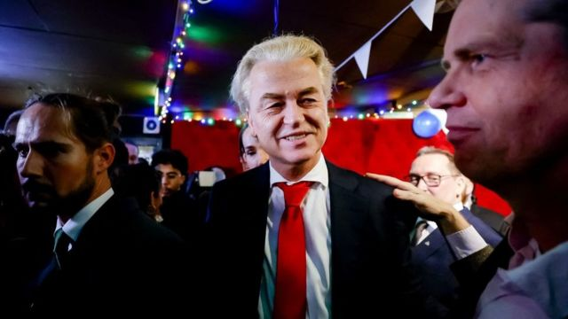
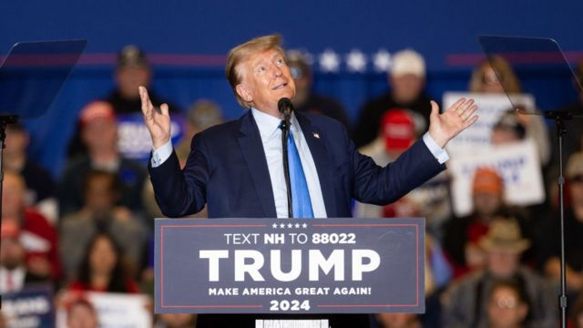
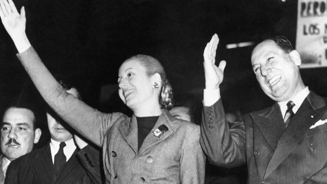
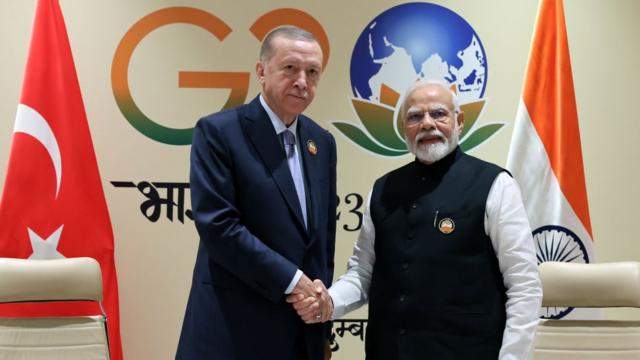
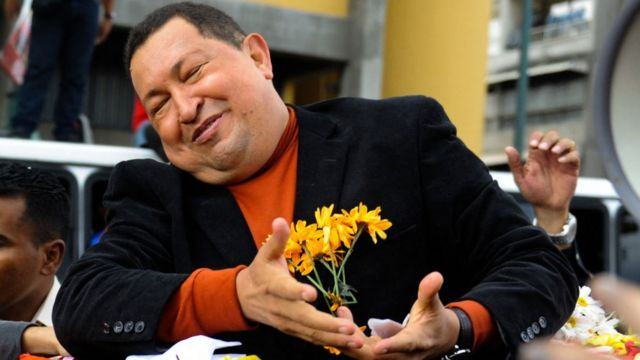

# [World] 民粹主义还在进一步席卷全球？它对民主构成威胁吗？

#  民粹主义还在进一步席卷全球？它对民主构成威胁吗？

  * 塞琳·吉里特（Selin Girit） 
  * BBC国际部 

> 图像来源，  Getty Images
>
> 图像加注文字，阿根廷政客哈维尔·米莱被广泛视为民粹主义者，但是当上总统后，他会兑现竞选时的承诺吗？

**“变革的风已经来了！”匈牙利总理维克托·欧尔班（Viktor Orban）在看到最近的荷兰选举结果之后这样评论道，而美国前总统唐纳德·特朗普（Donald Trump）则说，哈维尔·米莱（Javier Milei）将“让阿根廷再次伟大”。**

阿根廷极右翼政治素人米莱和荷兰的反伊斯兰主义政客海尔特·维尔德斯（Geert Wilders）的选举胜利相映成趣。

二人都被贴上了“民粹主义者”的标签，而他们的成功也受到志趣相投的政客吹捧，但是，这个术语到底是什么意思？

##  什么是民粹主义？

在政治学中，民粹主义是这样一种观念，即社会被分成了两个对立的群体：“纯粹的人民”和“腐败的精英”，这是根据《民粹主义：牛津通识读本》（Populism: A Very Short Introduction）一书的作者卡斯·穆德（Cas Mudde）解释的概念。

他说，民粹主义主张，政治应该是人民总体意志的表达。

《民粹主义：政治理论中的关键概念》（Populism: Key Concepts in Political Theory）的作者本杰明·莫菲特（Benjamin Moffitt）认为，这种现象可能会表现为一种意识形态、一种组织模式、一种表现风格、一种传播方式，或是就是人们说话的方式，但是他说，“所有这些不同的争论都围绕人民与精英之间的分裂”。

“民粹主义者会以人民的名义去说话，将精英看作是社会当中的根本问题。”

> 图像来源，  Getty Images
>
> 图像加注文字，荷兰极右翼政客维尔德斯的胜选令众多欧洲政治观察者惊讶。

尽管民粹主义被广泛与极右派联系在一起，但是也有左翼的民粹主义，最有代表性的可能是委内瑞拉前领导人乌戈·查韦斯（Hugo Chavez）。他曾表示：“我不是一个个体——我是人民”。

穆德将民粹主义描述为一种“薄中心意识形态”（thin-centred ideology）——它只处理政治议程中的一部分，而对于什么是最好的经济或政治体系并没有意见。

“大多数成功的民粹主义者都将民粹主义与另一种意识形态——即所谓的主意识形态——相结合，后者就会处理这些关键问题，”他说。

“一般来说，大多数右翼民粹主义者会将民粹主义与某种形式的本土主义结合起来，而大多数左翼民粹主义者会将民粹主义与某种形式的社会主义结合起来。”

##  民粹主义领袖的特征

在其著作《什么是民粹主义？》（What is Populism?）中，普林斯顿大学政治学教授扬-沃尔纳·穆勒（Jan-Werner Müller）强调，民粹主义领导人声称代表统一的“人民意志”。

“令民粹主义者脱颖而出的是，他们声称自己是‘真正的人民’或者‘沉默大多数’的唯一代表，”他说。

“因此，他们将其他所有争夺权力的竞争者都贬为是根本上不合法的。他们坚称，其他人根本就是‘腐败’和‘不老实’。”

> 图像来源，  Getty Images
>
> 图像加注文字，学者认为，特朗普是“右翼民粹主义者的绝佳范例”。

在这方面，美国前总统特朗普被认为是当代最突出的民粹主义者之一。

正如特朗普的言论所显示的那样，民粹主义者与敌人（通常代表着当前的制度）对抗，旨在“抽干沼泽”或者对付“自由派精英”。

民粹主义者常常把自己包装为“强人”，通常是集反移民、威权主义立场于一身，并作出传统政治家往往会避免作出的、不切实际的承诺。

他们可能更青睐直接全民公投、总统令或者行政命令，作为“把事做成”的工具，而不是依靠更为复杂、涉及到立法者和司法机关的民主方式。

本杰明·莫菲特指出，还有其它一些与典型的民粹主义领导人相关的特征。

一种是“粗鲁的举止”，或者表现出与典型的政客不一样的行为方式——这是特朗普总统以及最近阿根廷的米莱所采取的一种打法。后者在集会上保证要削减开支时，令人印象深刻地拿起一把链锯表演。

另一种则是“持续制造危机”——而且总是以攻击者的姿态出现。

“总是有某种不幸即将来临，并且只有他们才知道如何解决。”莫菲特描述说。

##  民粹主义领袖的最佳例子

阿根廷的胡安·多明戈·庇隆（Juan Domingo Peron）常被作为民粹主义者的鼻祖来举例。他于1974年去世，但是他的名字仍然影响着他所在国家的政治和阿根廷社会中的核心分歧：你是庇隆主义者还是反庇隆主义者？

> 图像来源，  Getty Images
>
> 图像加注文字，胡安·庇隆和夫人艾薇塔的政治生涯至今仍影响着阿根廷的政治，以及该国社会中的核心分歧。

12月10日，另一位常被描述为民粹主义者的人将掌管该国政权，他是哈维尔·米莱。

他蓬乱的头发、狂野的热情和时常古怪的行为令他获得了“疯子”的绰号。

他承诺进行急剧的变革，包括放弃本国货币比索，改用美元，“炸毁”中央银行以及整个裁撤一些政府部门。

“拉丁美洲是民粹主义运动的灯塔，”欧洲民粹主义研究中心的伊姆达特·奥纳（Imdat Oner）说，“左翼民粹主义者乌戈·查韦斯是一个绝佳例子。他作为一个局外人进入政界，改变了委内瑞拉两党鼎立的体系，直到去世前他还执掌着政权。”

但是，在莫菲特看来，民粹主义是一种全球性现象。他以特朗普为例，称他为“右翼民粹主义者的绝佳范例”。

> 图像来源，  Getty Images
>
> 图像加注文字，土耳其总统埃尔多安与印度总理莫迪也常被视为民粹主义者。

“当今世界最成功的民粹主义者——至少在选举和集权的意义上来说——很可能是印度总理纳伦德拉·莫迪（Narendra Modi），”莫菲特说。

“印度的一切政治都在围绕着莫迪展开。他已经成功建立起了人民与精英的分裂，这还带有宗教内涵，以印度教教徒为‘真正的人民’——于是这里面还存在着本土主义的情绪，”他说。

土耳其的雷杰普·塔伊普·埃尔多安（Recep Tayyip Erdogan）也经常被称为民粹主义政客。

“他会把自己描绘成一个勇敢的弱势方；他永远都是那个来自伊斯坦布尔艰苦社区卡森柏沙（Kasimpasa）的街头斗士，勇敢地对抗着土耳其共和国老派的凯末尔主义建制者，”米勒教授在他的书《一再崛起的民粹主义》（The Rise and Rise of Populism）中写道。

荷兰的海尔特·维尔德斯、匈牙利的维克托·欧尔班、法国的玛丽娜·勒庞（Marine Le Pen）、委内瑞拉的尼古拉斯·马杜罗（Nicolas Maduro）和英国的鲍里斯·约翰逊（Boris Johnson）等也都常常被视为民粹主义者。

但是，卡斯·穆德却不认为巴西的雅伊尔·博尔索纳罗（Jair Bolsonaro）是民粹主义者，因为他反对的只是政治建制派中的左翼，而不反对其右翼。

##  对民主的威胁？

穆德指出，在人民主权和多数决定原则等最狭义的意义上，民粹主义是民主的，因为它希望政治反映“人民的意志”。

“然而，在根本上，它和自由主义民主的核心理念是对立的：这个理念是多元主义，即社会是由不同利益和价值观的多元人群构成，而且所有这些都是合法的。”他补充说。

> 图像来源，  Getty Images
>
> 图像加注文字，已故的查韦斯被认为是拉美民粹主义者的典型

穆勒教授主张，如果民粹主义者拥有足够的权力，他们最终会建立一个威权政府，排斥所有不被认为是适当属于“人民”的群体。

在穆菲特教授看来，这种对他者的针对 ，就是全球民粹主义者会彼此共鸣的原因之一，特别是在很多人所称的“多重危机时期”。

“环境危机、持续的金融泡沫……能够大手一挥提出简单的解决方案，能够在巨大危机的时刻针对某个敌人，这很重要，”他说。

“民粹主义者通常会将法官、媒体、独立机构等视为阻隔人民声音的障碍。在这种意义上，它对民主是一种威胁，但是将其描画成唯一的威胁，却是没有意义的，”莫菲特补充说，“它之所以吸引人是有原因的。”

“很难否认，民粹主义现在已经是主流政治的一部分。它不会消失。就个人而言，我认为它是21世纪标志性的政治现象。”

