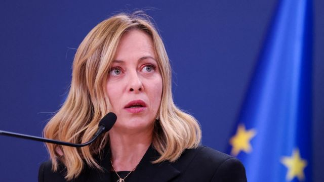
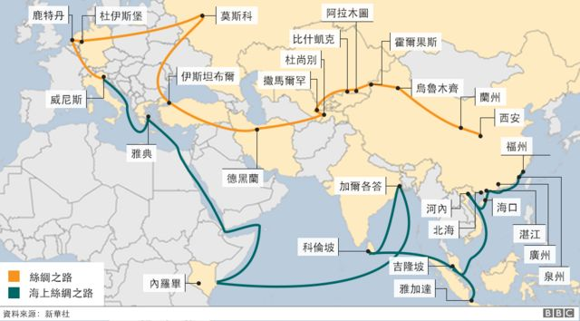

# [World] 一带一路：G7唯一参与国意大利正式退出

#  一带一路：G7唯一参与国意大利正式退出

> 图像来源，  Reuters
>
> 图像加注文字，意大利总理梅洛尼长期以来一直反对意大利参与“一带一路”倡议。

**意大利政府证实将退出中国的旗舰项目“一带一路 ”倡议。**

意大利总理乔治亚·梅洛尼（Giorgia Meloni）的政府通知中国政府，意大利将在年底截止日期前停止参与“一带一路 ”倡议。

该倡议是中国最雄心勃勃的贸易和基础设施项目之一，意大利是唯一一个在2019年签署该倡议的七国集团国家。

此举当时遭到了美国和其它国家的严厉批评。

该倡议由中国国家主席习近平于2013年发起，目标是在亚洲和欧洲投资约1万亿美元（7940亿英镑；9250亿欧元），包括新建和升级铁路和港口等，旨在连接中国与欧洲和亚洲其他地区。

但该倡议从一开始就被美国批评为“债务陷阱外交”的典范。华盛顿称，中国计划涉及到的一些大型项目将难以为继，各国无力为其提供资金，这为中国政府实现自己的目标提供了筹码。

> 图像加注文字，"一带一路"被许多评论家比作中国的第二次开放和中国的马歇尔计划，甚至被认为是中国的外交杰作。

意大利是18 个欧盟成员国中签署“一带一路”倡议最多的国家，欧盟成员国的项目集中在欧洲大陆的东部和南部。

除非意大利在今年年底前通知中国退出，否则该国的成员资格将于明年3月自动延期。

梅洛尼此前称，前政府加入“一带一路”倡议的决定是“严重错误”，并表示有意退出。

但意大利政府强调，尽管有此举动，意大利仍在寻求与中国保持良好关系。

习近平曾承诺，2019 年将在意大利投资200亿欧元，但目前只实现了其中一小部分。

意大利去年对华出口额为164亿欧元，而2019年为130亿欧元。

相比之下，同期中国对意大利的出口从317亿欧元增至575亿欧元。

中国与欧盟成员国法国和德国的贸易额要高得多，尽管这两个欧元区最大经济体不是“一带一路”倡议的成员。

自去年上任以来，梅洛尼一直在努力推行比其前任更亲西方、更亲北约的外交政策。

梅洛尼此举是在周四欧盟委员会主席冯德莱恩（Ursula von der Leyen）与习近平举行峰会之前做出的。在会晤期间，冯德莱恩预计将警告中国国家主席遏制向欧盟供应包括太阳能电池板和电动汽车在内的廉价商品。

