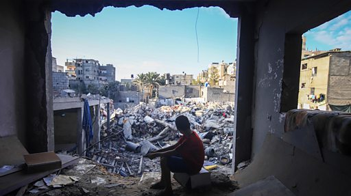

# [World] 以巴冲突：亲历加沙之战的国际机构医生分享自己眼中的战乱与悲剧

#  以巴冲突：亲历加沙之战的国际机构医生分享自己眼中的战乱与悲剧

**以巴冲突：亲历加沙之战的国际机构医生分享自己眼中的战乱与悲剧**

以巴冲突爆发时，“无国界医生”组织的急诊科医师洪上凯在加沙前线提供人道医疗服务，他上个月平安撤离到台湾。身处同一团队的菲律宾护理师达尔文也安全撤离到了菲律宾。他们在加沙期间和撤离的过程中，目睹空袭不断、物资短缺、还有无人机的轰鸣的日常，深刻感受到战火无情以及和平的重要。

“知道可以离境的当下是放松的，可是真的离境到埃及后，那种放松的感觉就消失了，反而是很严重的罪恶感。”回到和平世界的洪上凯回忆到。他将这种感觉形容为“幸存者的罪恶感”，“你认识的人，甚至对你非常好的人，他们还困在里面……”

国际社会对这场战争的对错意见分歧，洪上凯说，要去完整地理解，做出是非判断非常困难。“这件事情太复杂了，你不要急着做出结论。我们现在要想的是怎样尽快让人质被释放。”

“我有时会哭，”达尔文说，“最终的受害者是那里的平民。”

BBC中文采访了这两位刚刚撤出战地的医护人员，听听他们的故事和对于这场战争的见解。

