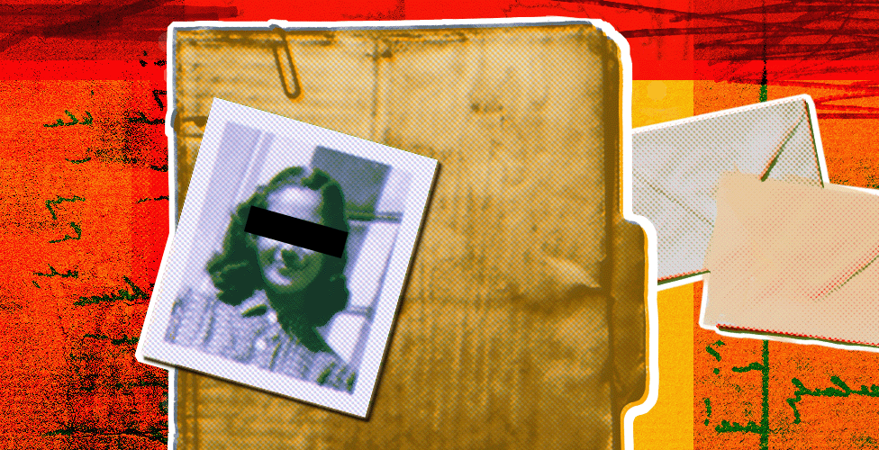
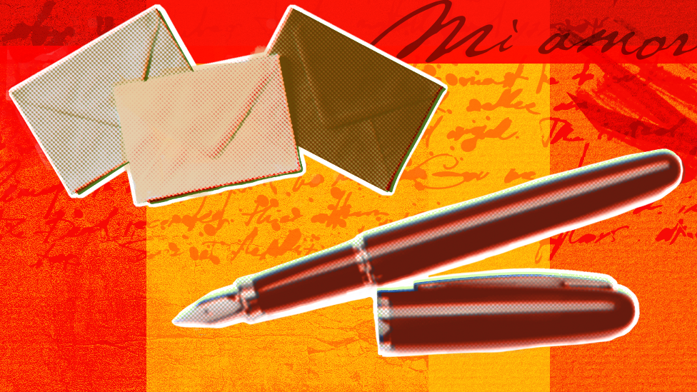

# [World] 禁忌之恋：数百封没有抵达的西班牙与摩洛哥跨国情书

#  禁忌之恋：数百封没有抵达的西班牙与摩洛哥跨国情书

  * 亚瑟·阿塞拉夫（Arthur Asseraf） 
  * 剑桥大学历史学家 

> 图像来源，  Getty/BBC

**一批在几十年前被没收的由西班牙女性写给摩洛哥男子的信件，揭示了殖民时代禁忌之恋的历史。**

“你什么时候回西班牙？”这句听起来有些绝望的恳求被小心翼翼地写在纸上，这表明它对卡梅拉（Carmela）来说是多么重要。

“告诉我，你没有在看其他的女人。”1944年她在格拉纳达写道。

但是，这封信的收件人却没能读到这些文字，卡梅拉的跨国情书未能到达目的地摩洛哥（Morocco）。

相反，它最终出乎意料地来到西班牙档案馆的深处，藏于数百封西班牙妇女与摩洛哥男子之间含情脉脉的信息中。

这批邮件是在1930年代至1950年代之间被没收的，它们记录了被禁止的亲密关系。

几十年来，西属摩洛哥殖民当局系统性地没收了这些邮件。

信中满是激情洋溢的文字。一位来自瓦伦西亚的女士写道：“我为你疯狂……我就像一个好色之徒。”

有些信件中还附有照片。在一封又一封的信中，夹杂着几十幅女性的肖像，她们梳着完美的发型，摆姿势提醒远方的恋人她们的样子。其中一位发来了一张她骑自行车的照片，这是她无忧无虑的日常生活写照。

所有这些文件都被认真负责的官僚用信封整齐地归档，然后被遗忘在日常行政文件中。

这些信件积满了灰尘，直到被学者何塞普·路易斯马特奥·迪埃斯特（Josep LluísMateo Dieste）和尼韦斯·穆里尔·加西亚（Nieves Muriel García）发现并出版。

> 图像来源，  Getty/BBC

每封信都包含了对一段完整恋情的诱人一瞥，但它们也展现了这些恋情所面临的打压。西班牙官员想尽一切办法使两人的关系无疾而终。

正如1937年一项指令所指出的：“作为一般规则，必须防止摩洛哥士兵与西班牙女性结婚。”

自1912年以来，西班牙一直声称对摩洛哥的部分领土拥有主权，将其作为保护国，与法国一起将摩洛哥一分为二。

来自柏柏尔人群体的战士们对此进行了抵抗。最著名的是在1921年至1926年漫长而血腥的里夫战争（Rif War）中，西班牙军队被阿卜杜克里姆·哈塔比（Abdelkrim al-Khattabi）率领的部队消灭。

为了应对这一挑战，西班牙政府增加了在摩洛哥的军队数量，并招募了数千名摩洛哥人在其军队服役。

到1930年代，从大西洋海岸的艾西拉（Asilah）一直到东部与阿尔及利亚接壤的边界，该国北部的狭长地带实际上由西班牙管理，其行政中心设在得土安（Tetouan）。

1936年，弗朗西斯科·佛朗哥（Francisco Franco）将军正是在这片领土上的军事基地发动了一场反共和政府的政变，从而引发了西班牙内战。

随着战争愈演愈烈，突然间，成千上万应征加入西班牙军队的摩洛哥男子被送往大洋彼岸的西班牙，与佛朗哥的部队并肩作战。

除了军队，学生、商人和其他工人也加入了他们的行列，并最终在全国各地的城市和更偏远的农村地区安家落户。

毕竟，与许多欧洲的殖民地不同的是，摩洛哥离西班牙只有一步之遥——在直布罗陀海峡最窄处，摩洛哥海岸距离伊比利亚半岛南端仅14公里（8.5英里）。

无论走到哪里，摩洛哥男人都会遇到西班牙女人。

在萨拉曼卡（Salamanca），一位名叫孔查（Concha）的妇女遇到了驻扎在附近的摩洛哥士兵纳萨尔（Nasar）。

她疯狂地爱上了他，并于1938年写信给他的上级，请求允许她嫁给他。但对西班牙殖民当局来说，这种接触绝对是被禁止的。

他们对孔查表示厌恶，称她又老又丑，“胖得像河马，还有点跛行”。

他们怀疑纳萨尔之所以表现出兴趣，只是因为孔查碰巧拥有一栋房子，这正是唤醒他“火山之爱”的原因。

正如1937年的命令所指出的，官方命令“尽可能多地设置困难”来阻止这些恋情，“而不是公开禁止”。

事实上，由于佛朗哥政权依赖于摩洛哥士兵的忠诚，他们并未将这种恋情明确定为非法。相反，他们制定了一系列手段，使这种恋情在实践中成为不可能。

例如，如果发现一名妇女与一名摩洛哥男子有书信往来，他们就会禁止她进入摩洛哥。

很多情况下，他们还会禁止这名摩洛哥男子进入西班牙，使他们的恋情变得不可能。

1948年，有人截获了萨拉戈萨（Zaragoza）的卡门（Carmen）写给她在摩洛哥的情人阿卜杜萨拉姆（Abdeselam）的一封信。得土安当局立即禁止两人过境。

在信中，卡门告诉了他女儿的消息，这名儿童长大后将再也见不到父亲。但官员们对这名儿童无动于衷。

为什么他们如此轻视这些恋情？部分原因在于独裁政权的保守意识形态。佛朗哥政府极度厌恶女性，严格控制女性流动，并限制她们就业。

它还将自己视为天主教的捍卫者。出于宗教原因，与穆斯林男子结婚的妇女被视为“失去信仰”。

但最大的一个原因是官方所说的“种族声望”（prestigio de raza）。

为了继续殖民统治，西班牙必须被视为优于摩洛哥。

由于政府将婚姻理解为女性对男性的从属关系，任何跨越殖民鸿沟的婚姻都会使西班牙女人屈从于摩洛哥男人。

如果这一点为人所知，就会破坏殖民统治的基础。

相比之下，西班牙男子与摩洛哥妇女之间的恋情在摩洛哥非常普遍，但并没有引起如此广泛的审查，因为这些恋情在亲密的范围内再现了更大的社会权力结构，而不会对殖民统治构成威胁。

这并不是西班牙特有的现象：对欧洲女性与殖民地男性恋爱的恐惧在欧洲殖民政府中很普遍。

在邻近的法属地区，官员们也对这种恋情的政治后果表达了相似的反对。

荷属东印度与英属印度的殖民政府认为欧洲女性和殖民地男性之间的恋情比欧洲男性和殖民地女性之间的恋情更具威胁性，并对其进行管理。

虽然阻止这种恋情的措施从不支持到完全禁止不尽相同，但基本规则是一致的——此类关系是一种威胁。

然而，这些信件揭示了在殖民社会的表层之下，两种人的邂逅是很常见的，其导致了一系列的关系：友谊、追求、性关系和婚姻。

打开这些书信令人激动——这是一扇窗口，让我们得以了解官方文件很少提及的生活。但它也令人不安，因为大多数信件从未到达目的地。这感觉就像对个人隐私的侵犯，因为这些人从未选择过将自己的信件收录到这份档案中。

当摩洛哥于1956年独立时，位于得土安的保护国政府关门了，其档案大多被遗忘。

最终，这些信件大多被放在马德里附近的埃纳雷斯堡（Alcalá de Henares）大学城的档案馆里，就像西班牙在非洲的大部分殖民历史一样被遗忘。

尽管最近出版了其中的一些信件，但它们的故事仍然鲜为人知，而这个被遗忘已久的档案馆也还没有揭开它所有的秘密。

_**亚瑟·阿塞拉夫（Arthur Asseraf）博士是现代法国、北非和地中海历史学家。**_

_**绘图：马特·托马斯（Matt Thomas）**_

